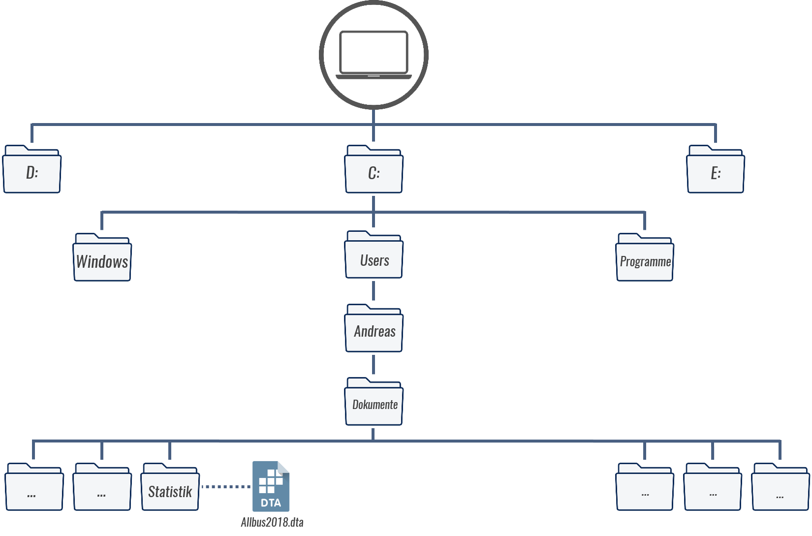
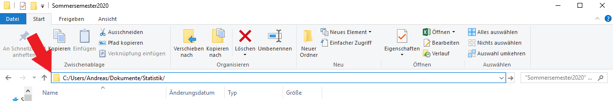
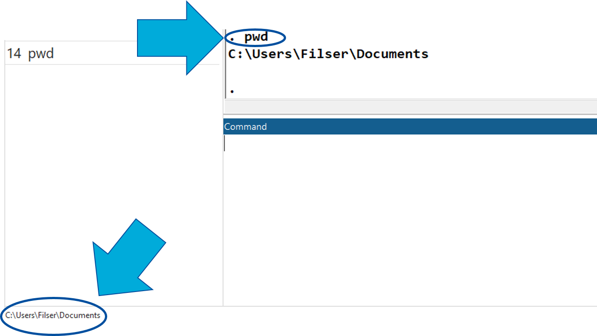
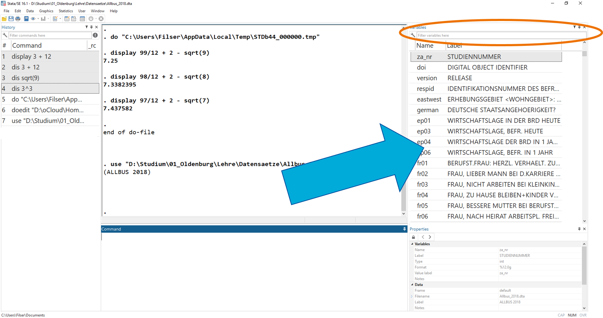
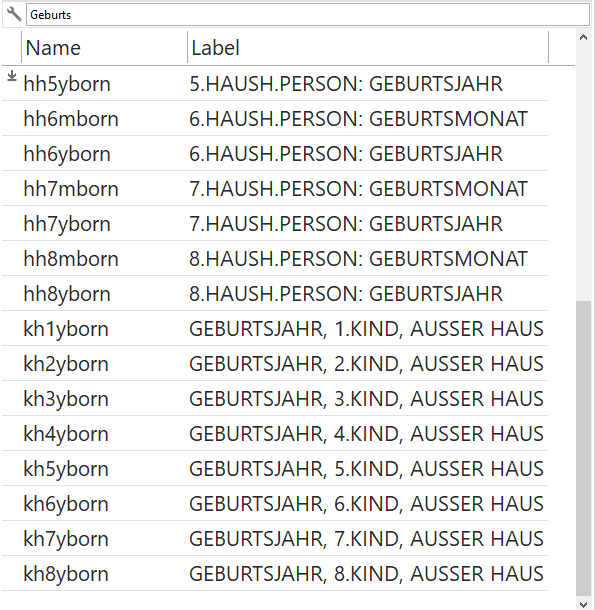
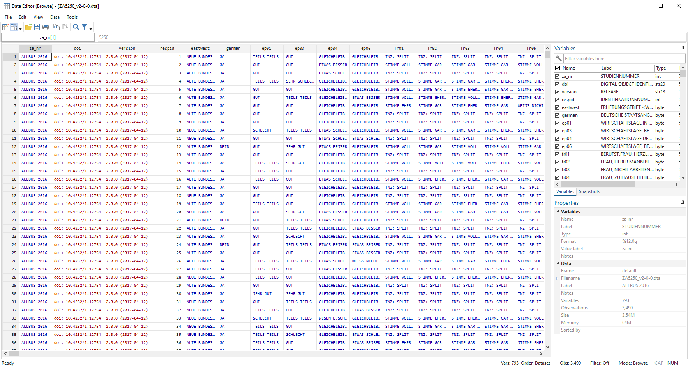
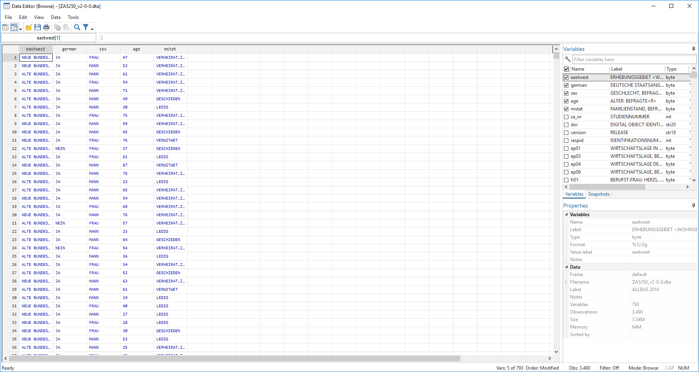

# Einstieg in Stata {#Stata1}

```{r setup1, echo = F, message=F, warning = F}
# .libPaths("D:/R-library")
knitr::opts_chunk$set(collapse = TRUE)
knitr::opts_chunk$set(dpi=800)
library(Statamarkdown)
stataexe <- "C:/Program Files (x86)/Stata13/StataSE-64.exe"
knitr::opts_chunk$set(engine.path=list(stata=stataexe))
```

Hier sehen wir die Startansicht von Stata:
```{r screenshot, fig.cap= "Startansicht Stata16", echo = F,out.width = "90%",fig.height= 4.5, fig.align="center"}
knitr::include_graphics("01_Stata2.png")
```
Die Standardansicht von Stata besteht aus mehreren Fenstern:

  (1) Kommandos/Befehle
  (2) Ergebnisse
  (3) Variablenübersicht
  (4) Übersicht zu den geladenen Daten
  (5) Befehlshistorie


## Taschenrechner

In das Befehlsfeld (1) können wir Kommandos eingeben, z.B. eine Berechnung durchführen. Dazu geben wir zunächst den Befehl `display` und dann die gewünschte Rechnung ein und drücken dann Enter. Der Befehl wird dann im Ergebnisfenster gespiegelt und darunter das Ergebnis ausgegeben:

```{r screenshot_tr, echo = F,out.width = "90%",fig.height= 4.5, fig.align="center"}
knitr::include_graphics("01_Stata3b.png")
```

Wir können `display` auch mit `dis` abkürzen. 

## Darstellung in diesem Skript

Eingaben und Ergebnisse werden im weiteren Skript so dargestellt:
```{stata s_input, eval=FALSE}
display 3 + 12
```
```{stata s_input2, echo=F}
display 3 + 12
display 3 + 12
```


```{stata s_input3, eval=FALSE}
display sqrt(9)
```

```{stata s_input4, echo=F}
dis sqrt(9)
dis sqrt(9)
```

## DoFile Editor

Zwar funktioniert die direkte Eingabe in das Befehlsfeld, allerdings werden wir im Laufe dieser Woche sehr viel längere und komplexere Befehle kennenlernen. Für solche Anwendungen werden in Stata sog. DoFiles angelegt. Darin können Befehle entworfen und für eine spätere Verwendung abgespeichert werden. Um ein DoFile zu öffnen geben wir entweder `doedit` in das Befehlsfeld ein oder klicken auf das Feld "New Do-file-Editor" rechts oben:

```{r screenshot_dof_open, echo = F,out.width = "40%",fig.height= 3.5, fig.align="center"}
knitr::include_graphics("01_Stata_openDO.png")
```
Es öffnet sich ein neues Fenster:
```{r screenshot_dof_opened, echo = F,out.width = "90%",fig.height= 4.5, fig.align="center"}
knitr::include_graphics("01_Stata5_dofile.png")
```

In diesem sog. Do-File-Editor können wir Befehle entwerfen. Wenn wir diese dann durchführen möchten, markieren wir die entsprechenden Zeilen und drücken STRG + D. Die ausgeführten Befehle werden wieder im Ergebnisfenster gespiegelt und jeweils darunter die Ergebnisse angezeigt:
```{r screenshot_dof_run, echo = F,out.width = "90%",fig.height= 4.5, fig.align="center"}
knitr::include_graphics("01_Stata7_dofile_done2.png")
```

Das DoFile können wir speichern, um es später wieder aufzurufen. Wichtig ist dabei, der gespeicherten Datei die Endung ".do" zu geben, also zum Beispiel "01_Montag.do". Diese DoFiles können dann einfach ausgetauscht werden, um später daran weiter zu arbeiten oder Analysen für Dritte nachvollziehbar zu machen.
```{r save1,echo = F, out.width = "60%",fig.height= 3, fig.align="center"}
knitr::include_graphics("01_Stata7_dofile_done_save.png")
```

## Datensätze laden

Das ist aber alles soweit sehr unspektulär - es gibt schönere und günstigere Taschenrechner. Die eigentliche Stärke von Stata ist aber die Analyse von Datensätzen. Diese müssen zunächst eingelesen werden. Im einfachsten Fall liegen die Daten als Stata-Datensatz (mit der Endung `.dta`) vor und wir können die Daten wie folgt einlesen:

```{stata readin, eval = F}
cd "C:/Users/Andreas/Dokumente/Statistik/"
use "ZA5250_v2-0-0.dta"
```

Der Einlesevorgang besteht also aus zwei Befehlen: zuerst geben wir `cd` den Pfad an, unter welchem der einzulesende Datensatz zu finden ist. Natürlich hängt der Dateipfad aber ganz davon ab, wo Sie den Datensatz gespeichert haben, hier ist es "C:/Users/Andreas/Dokumente/Statistik/":

```{r,echo = F, out.height="60%",out.width="60%", fig.align="center"}

```
Um den Pfad des Ordners herauszufinden, klicken Sie bei Windows in die obere Adresszeile im Explorerfenster: 
```{r,echo = F, out.height="85%",out.width="85%", fig.align="center"}

```

In iOS (Mac) finden Sie den Pfad indem Sie einmal mit der rechten Maustaste auf die Datei und unter Informationen den Reiter "Ort" wählen.

Wir haben zwei Möglichkeiten zu das aktuelle Arbeitsverzeichnis überprüfen: wir sehen das aktuelle Arbeitsverzeichnis im Stata-Fenster links unten oder wir geben `pwd` ein:
```{r,echo = F, out.height="60%",out.width="60%", fig.align="center"}

```


Wir können diese beiden Schritte natürlich auch einfach kombinieren und den gesamten Pfad nach `use` angeben:
```{stata readin2, eval = F}
use "C:/Users/Andreas/Dokumente/Statistik/ZA5250_v2-0-0.dta"
```

Wenn das funktioniert hat, dann sehen wir im Fenster rechts eine Variablenübersicht:
```{r datensatz_eingelesen, echo = F,out.width = "90%",fig.height= 4.5, fig.align="center"}

```
In dieser Variablenübersicht können mit Hilfe des Suchfelds (oranger Kreis) auch nach Variablen suchen:
```{r variablen_suche, echo = F,out.width = "40%",fig.height= 2.5, fig.align="center"}

```

## Überblicksbefehle

Mit `describe, short` bekommen wir einen Überblick zu den eingelesenen Daten:
```{stata desc1,eval = F}
describe, short
```
```{stata desc_actual, echo = F, collectcode=F}
set linesize 200
use "D:\oCloud\Home-Cloud\Lehre\Methodenseminar\ZA5270_v2-0-0.dta", clear
describe, short
```
Hier wurde also ein Datensatz geladen, welcher 3477 Fälle/Zeilen (`obs`) und 708 Variablen/Spalten (`vars`) enthält. 
(Wir können den Befehl auch als `d,s` abkürzen)

Mit `browse` bekommen wir eine Übersicht des Datensatzes:
```{stata browse1, eval = F}
browse
```
```{r browse_window, echo = F,out.width = "90%",fig.height= 4.5, fig.align="center"}

```

Wenn wir nur einige Variablen betrachten möchten, hängen wir diese einfach `browse` an:
```{stata browse2, eval = F}
browse eastwest german sex age mstat
```
```{r browse_window2, echo = F,out.width = "90%",fig.height= 4.5, fig.align="center"}

```

Wir können den `describe` Befehl auch nutzen, um Informationen zu einer Variable zu erhalten. Dazu hängen wir einfach eine oder mehrere Variablen an `describe` an:
```{stata des_var, eval=FALSE}
describe pv01
```

```{stata des_var1, echo = F, collectcode=F}
set linesize 200
use "D:\oCloud\Home-Cloud\Lehre\Methodenseminar\ZA5270_v2-0-0.dta", clear
describe pv01
```
Wir können dabei `describe` mit `d` abkürzen:
```{stata des_var3, eval=FALSE}
d pv01 age sex
```

```{stata des_var4, echo = F, collectcode=F}
set linesize 200
use "D:\oCloud\Home-Cloud\Lehre\Methodenseminar\ZA5270_v2-0-0.dta", clear
describe pv01 age sex
```

Wenn wir einen neuen Datensatz aus dem Speicher löschen wollen, dann können wir dies mit `clear`.


## Übungen {#U1}

+ Führen Sie folgende (oder beliebige andere) Taschenrechneraufgaben mit Stata durch:
  + 2 * 4
  + 2 / 8
  + 2 ^ sqrt(4) + 5

+ Laden Sie die Datensätze aus ILIAS herunter!

+ Wechseln Sie mit Hilfe des cd Befehls das Arbeitsverzeichnis!
  + In welchem Arbeitsverzeichnis befinden Sie sich aktuell?
  + In welchem Ordner haben Sie die Datensätze aus ILIAS abgelegt?
  + Navigieren Sie Stata mit `cd` in eben diesen Ordner, in dem die Datensätze abgelegt sind!

+ Lesen Sie den Allbus 2018 in Stata ein.
  + Sie finden den Allbus 2018 in ILIAS.
  + Wie viele Fälle hat der Datensatz?
  + Unter welchem Variablennamen ist der Familienstand der Befragten ablegt?
  + Wie viele Variablen und wie viele Fälle enthält der Datensatz?
  + Öffnen Sie das Überblicksfenster!
  + Unter welchem Variablennamen ist die Information abgelegt, in welchem Bundesland die Befragten wohnen?

