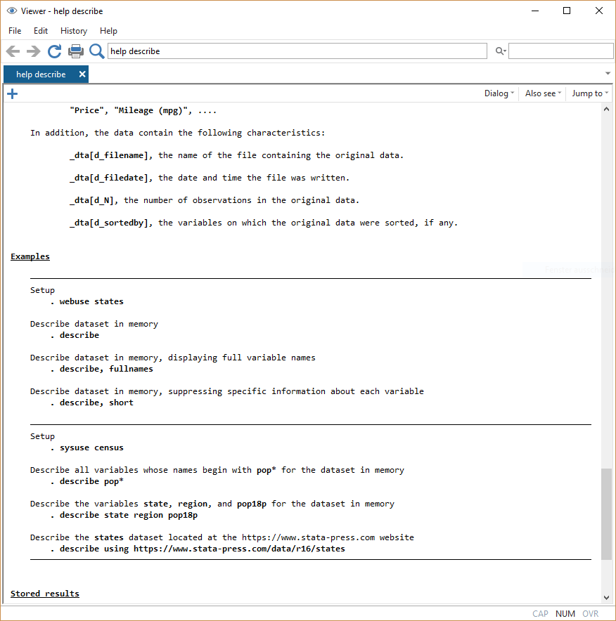
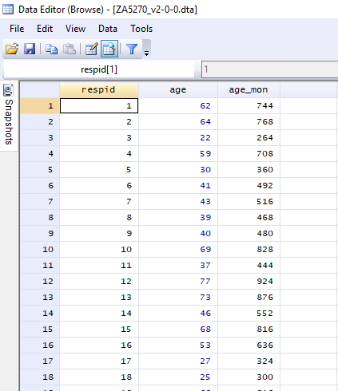
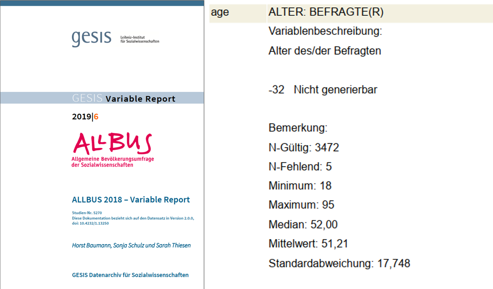

# Arbeiten mit Datensätzen in Stata {#Stata2} 

```{r setup2, echo = F, message=F, warning = F}
.libPaths("D:/R-library4")
knitr::opts_chunk$set(collapse = F)
library(Statamarkdown)
# # options(width = 200) # 157
# # "C:/Program Files/Stata16/StataSE-64.exe"
stataexe <- "C:/Program Files (x86)/Stata13/StataSE-64.exe"
knitr::opts_chunk$set(engine.path=list(stata=stataexe))
```

Nachdem wir uns in Stata etwas umgesehen haben, können wir uns jetzt dem eigentlichen Arbeiten mit Datensätzen zuwenden.
```{stata tab_su1, eval = F}
cd ....
use "Allbus2018.dta"
```

## Vorab: Befehlsstruktur & Hilfe

Ganz nebenbei haben wir in Kapitel 1 bereits die ersten Stata-Befehle verwendet. Bevor wir jetzt aber tiefer einsteigen nochmal einmal allgemein:

Die grundsätzliche Struktur von Stata-Kommandos ist immer `befehl variable, optionen`. Zunächst geben wir also immer an, was passieren soll - bisher war das eben zum Beispiel eine Beschreibung (`describe`) einer Variable: 
```{stata commands1, eval = F}
describe sex
```
```{stata commands2, echo = F}
set linesize 100
qui use "D:\oCloud\Home-Cloud\Lehre\Methodenseminar\Allbus2018.dta", clear
describe sex
```
Diese können wir mit der Option `simple` abändern. Optionen werden nach einem `,` angegeben:

```{stata commands1s, eval = F}
describe sex, simple
```

```{stata commands2s, echo = F}
set linesize 80
qui use "D:\oCloud\Home-Cloud\Lehre\Methodenseminar\Allbus2018.dta", clear
describe sex, simple
```

Befehle ohne Variable beziehen sich immer auf den gesamten Datensatz, bei `describe` bekommen wir damit dann eine Übersicht zum Datensatz:
```{stata commands3, eval = F}
describe, short
```

```{stata commands3show, echo = F}
set linesize 80
qui use "D:\oCloud\Home-Cloud\Lehre\Methodenseminar\Allbus2018.dta", clear
describe, short
```

Mit `help` bekommen wir eine Hilfeseite angezeigt, hilfreich sind dabei vor allem die Beispiele ganz unten:
```{stata help_desc, eval = F}
help describe
```

```{r help_ansicht, echo = F,out.width = "40%",fig.height= 2.5, fig.align="center"}

```

Kommandos in Stata sind zeilenbasiert. D.h. alles was zu einem Kommando gehört, muss in der gleichen Zeile stehen. Umgekehrt wird auch alles, was in einer Zeile steht als Teil des Kommandos verstanden:
```{stata rowbased, eval = F}
describe pv01 age sex, short
```

```{stata rowbased1, echo = F}
set linesize 80
qui use "D:\oCloud\Home-Cloud\Lehre\Methodenseminar\Allbus2018.dta", clear
describe pv01 age sex, short
```

Funktioniert nicht:
```{stata rowbased2, eval = F}
d pv01 age 
sex
```
```{stata rowbased2b, echo = F}
set linesize 80
qui use "D:\oCloud\Home-Cloud\Lehre\Methodenseminar\Allbus2018.dta", clear
d pv01 age 
sex
```

Mit `///` können wir Zeilen verknüpfen:
```{stata rowbased3, eval = F}
d pv01 age /// 
sex
```
```{stata rowbased3b, echo = F}
set linesize 80
qui use "D:\oCloud\Home-Cloud\Lehre\Methodenseminar\Allbus2018.dta", clear
d pv01 age ///
sex
```

Außerdem können wir mit `//` Kommentare in unsere DoFiles einfügen. `//` blendet  alles folgende am Ende der Zeile aus:
```{stata comment, eval = F}
d pv01 age sex // dies ist ein kommentar
```
```{stata comment2, echo = F}
set linesize 80
qui use "D:\oCloud\Home-Cloud\Lehre\Methodenseminar\Allbus2018.dta", clear
d pv01 age sex
```

`///` kann auch zum Kommentieren verwendet werden:
```{stata comment3, eval = F}
d pv01 age /// hier kann ein kommentar stehen
sex // hier geht es weiter
```
```{stata comment4, echo = F}
set linesize 80
qui use "D:\oCloud\Home-Cloud\Lehre\Methodenseminar\Allbus2018.dta", clear
d pv01 age /// hier kann ein kommentar stehen
sex // hier geht es weiter
```


## Auszählen & Überblick erhalten

Mit `tabulate` bekommen wir eine Auszählung der Ausprägungen einer Variable. Dies ist wohl der wichtigste Befehl in Stata:
```{stata tab, eval = F}
tabulate sex
```

```{stata tabb, echo = F}
qui use "D:\oCloud\Home-Cloud\Lehre\Methodenseminar\Allbus2018.dta", clear
tab sex
```
Wir sehen hier also, dass `sex` zwei Ausprägungen hat und 1773 Männer und 1704 Frauen enthält.

Für metrisch skalierte Variablen mit deutlich mehr Ausprägungen können wir `tabulate` zwar theoretisch auch verwenden, allerdings wird eine Tabelle hier sehr schnell sehr unübersichtlich:

```{stata tab1, eval = F}
tabulate age
```

```{stata tab1b, echo = F}
set linesize 80
qui use "D:\oCloud\Home-Cloud\Lehre\Methodenseminar\Allbus2018.dta", clear
tab age
```

Für metrische Variablen empfiehlt sich daher `summarize` als Überblicksbefehl:
```{stata su1, eval = F}
summarize age
```

Hier bekommen wir die Anzahl der Beobachtungen (`Obs.`), das arithmetische Mittel (`Mean`), sowie die Minimal- und Maximalwerte ausgegeben (`Min`&`Max`). (zur Standardabweichung `Std. Dev.` kommen wir noch).
```{stata su1b, echo = F}
set linesize 80
qui use "D:\oCloud\Home-Cloud\Lehre\Methodenseminar\Allbus2018.dta", clear
su age
```
`summarize` klappt auch mit mehreren Variablen auf einmal:
```{stata su2, eval = F}
summarize age inc // klappt auch mit mehreren Variablen
```
```{stata su2b, echo = F}
set linesize 80
qui use "D:\oCloud\Home-Cloud\Lehre\Methodenseminar\Allbus2018.dta", clear
summarize age inc // klappt auch mit mehreren Variablen
```


## Neue Variablen erstellen

Natürlich sind wir nicht nur darauf beschränkt, bestehende Variablen anzusehen, sondern wir können auch neue Variablen erstellen. Das geht mit `gen`. Dazu geben wir erst den neuen Variablennamen an und nach `=`, wie die neue Variable bestimmt werden soll:
```{stata gen, echo = T, eval = F }
gen age_mon = age * 12
su age_mon
```

```{stata gen_b, echo = F}
set linesize 80
qui use "D:\oCloud\Home-Cloud\Lehre\Methodenseminar\Allbus2018.dta", clear
gen age_mon = age * 12
su age_mon
```

Wenn wir eine Variable überschreiben möchten, dann müssen wir diese erst mit `drop` löschen, bevor wir sie überschreiben. Würden wir den `gen` Befehl von gerade nochmal verwenden, dann bekommen wir eine Fehlermeldung:
```{stata gen2, eval = F}
gen age_mon = age * 12
```
```{stata gen2_b, echo = F}
set linesize 80
qui use "D:\oCloud\Home-Cloud\Lehre\Methodenseminar\Allbus2018.dta", clear
gen age_mon = age * 12
gen age_mon = age * 12
```
Wir müssen den Namen `age_mon` also erst wieder frei machen, dann funktioniert der Befehl auch:
```{stata, eval = F}
drop age_mon
gen age_mon = age * 12
```

## Bestehende Variablen verändern
Alternativ können wir auch mit `replace` explizit eine bestehende Variable überschreiben:
```{stata rep, eval = F, echo = T}
replace age_mon = age * 12
```

Hier können wir aber nur bestehende Variablen ansprechen, sonst bekommen wir auch hier eine Fehlermeldung:
```{stata replace2, eval = F}
replace age_mon12 = age * 12
```

```{stata replace2b, echo = F}
set linesize 80
qui use "D:\oCloud\Home-Cloud\Lehre\Methodenseminar\Allbus2018.dta", clear
replace age_mon12 = age * 12
```


## gen ist gut, Kontrolle ist besser

Wie gerade gesehen gibt uns Stata aber keinerlei Erfolgsmeldungen. Nach der Bearbeitung oder Neuurstellung von Variablen sollte ein Blick in die Daten folgen. Dazu empfiehlt es sich, wieder auf den `browse` Befehl zurückzugreifen:

```{stata bro_ansicht_cmd, eval = F}
browse respid age age_mon
```


```{r bro_ansicht, echo = F,out.width = "40%",fig.height= 2.5, fig.align="center"}

```

## Fehlende Werte

Wenn wir uns nochmal die Variable `age` ansehen, dann fallen die negativen Altersangaben ins Auge:

```{stata miss1, eval = F}
summarize age
```
```{stata miss1b, echo = F}
set linesize 80
qui use "D:\oCloud\Home-Cloud\Lehre\Methodenseminar\Allbus2018.dta", clear
su age
```

Ein Blick ins Codebuch zeigt, dass es sich hier natürlich nicht um Befragte mit einem negativen Alter handelt. Sondern aufgrund der fehlenden Angaben zum Geburtsdatum lässt sich für manche Befragte das Alter nicht generieren. Für diese Fälle wurde dann -32 als Wert in `age` abgelegt:
```{r age_cdb, echo = F,out.width = "60%",fig.height= 3.25, fig.align="center"}

```

Diese Information müssen wir Stata mitteilen, indem wir -32 als *missing value* überschreiben. Diese *missing value*s werden in Stata mit `.` abgelegt und werden dann für die Berechnung von Mittelwerten usw. ausgeschlossen. Um also -32 als `.` zu überschreiben, können wir zB auf den `replace` Befehl zurückgreifen:

```{stata miss2, eval = F}
summarize age
replace age = . if age == -32
summarize age
```
```{stata miss2b, echo = F}
set linesize 80
qui use "D:\oCloud\Home-Cloud\Lehre\Methodenseminar\Allbus2018.dta", clear
su age
replace age = . if age == -32
su age
```

Wir bekommen von Stata mitgeteilt, dass wir 5 Beobachtungen verändert und auf missing gesetzt haben. Im folgenden `summarize` werden diese fehlden Werte dann ignoriert.

Ein Spezialbefehl für die Überschreibung von bestimmten Werten ist `mvdecode`. Mit `mvdecode` können wir `-32` und `-10` in mehreren Variablen gleichzeitig als missing überschreiben. Zum Beispiel in `dm03`, `dg03` und `isced97`:
```{stata miss3, eval = F}
mvdecode dm03 dg03 isced97, mv(-32 -10)
```
```{stata miss3b, echo = F}
qui use "D:\oCloud\Home-Cloud\Lehre\Methodenseminar\Allbus2018.dta", clear
mvdecode dm03 dg03 isced97, mv(-32 -10)
```

Mit `mdesc` bekommen wir eine Auszählung zu fehlenden Werten. `mdesc` ist allerdings kein Standard-Stata-Befehl, sondern muss extra installiert werden. Das ist allerdings kein größerer Aufwand:
```{stata miss4, eval = F}
ssc install mdesc
```
Anschließend können wir mit `mdesc` die Zahl der missings in `age`, `dm03`, `dg03` und `isced97` ausgeben lassen:
```{stata miss5, eval = F}
mdesc age dm03 dg03 isced97
```
```{stata miss5b, echo = F}
set linesize 80
qui use "D:\oCloud\Home-Cloud\Lehre\Methodenseminar\Allbus2018.dta", clear
qui replace age = . if age == -32
qui mvdecode dm03 dg03 isced97, mv(-32)
mdesc age dm03 dg03 isced97
```

## if Bedingungen und fehlende Werte

Eine häufige Fehlerquelle bei fehlende Werten in Stata ist deren Verhältnis zu `>`. Fehlende Werte werden nämlich von Stata als "unendlich groß" gewertet! Wenn wir uns Befragte mit einem Alter über 92 ausgeben lassen, dann bekommen wir auch diejenigen ohne Altersangabe ausgegegeben:

```{stata list_if, eval = F}
list sex land age if age > 92
```
```{r, eval = F}
      +---------------------------+
      |  sex           land   age |
      |---------------------------|
 126. | MANN        SACHSEN    94 |
 322. | FRAU   RHEINLAND-PF     . |
 353. | MANN   NORDRHEIN-WE    94 |
 556. | FRAU   NORDRHEIN-WE     . |
1342. | FRAU   NORDRHEIN-WE     . |
      |---------------------------|
2135. | FRAU    BRANDENBURG     . |
3130. | MANN         HESSEN     . |
3299. | MANN   RHEINLAND-PF    95 |
      +---------------------------+
```

Es gibt zwei Möglichkeiten, dies zu umgehen: 

+ entweder wir verwenden `inrange` - wobei wir hier eine Obergrenze angeben müssen und außerdem die Untergrenze immer mit eingeschlossen wird. Wenn wir also nur Fälle sehen wollen, die *älter* als 92 sind, dann müssen wir einen Wert über 92 angeben:
```{stata list_if2, eval = F}
list sex land age if inrange(age,92.1,100)
```
```{r, eval = F}
      +---------------------------+
      |  sex           land   age |
      |---------------------------|
 126. | MANN        SACHSEN    94 |
 353. | MANN   NORDRHEIN-WE    94 |
3299. | MANN   RHEINLAND-PF    95 |
      +---------------------------+
```

+ oder wir hängen den `missing()`-Operator an die Bedingung an. Wenn wir diesen mit Hilfe eines `!` verneinen, bekommen wir nur nicht-fehlende Fälle ausgegeben:
```{stata list_if3, eval = F}
list sex land age if age > 92 & !missing(age)
```
```{r, eval = F}
      +---------------------------+
      |  sex           land   age |
      |---------------------------|
 126. | MANN        SACHSEN    94 |
 353. | MANN   NORDRHEIN-WE    94 |
3299. | MANN   RHEINLAND-PF    95 |
      +---------------------------+
```

## keep & drop

Manchmal möchten wir nur bestimmte Beobachtungen im Datensatz behalten. Beispielsweise möchten wir für eine Analyse nur Befragte mit einem Einkommen über 1500 EUR im Datensatz behalten. Dazu können wir `keep` oder `drop` die gewünschten Fälle behalten bzw. die ungewünschten ausschließen:
```{stata keep, eval = F}
use Allbus2018.dta
keep if inc >= 1500
d,s
```

```{stata keepb, echo = F}
set linesize 90
qui use "D:\oCloud\Home-Cloud\Lehre\Methodenseminar\Allbus2018.dta", clear
keep if inc >= 1500
d,s
```

```{stata drop, eval = F}
use Allbus2018.dta
drop if inc < 1500
d,s
```

```{stata dropb, echo =F}
set linesize 90
qui use "D:\oCloud\Home-Cloud\Lehre\Methodenseminar\Allbus2018.dta", clear
drop if inc < 1500
d,s
```

Hinweis: wenn die negativen Werte für `inc` bereits als Missing überschrieben sind, verbleiben diese Fälle im Datensatz! (Sie werden als unendlich groß erkannt!) 

## Labels und if-Bedingungen

Genauso könnten wir auch vorgehen wenn wir nur männliche oder weibliche Befragte im Datensatz behalten möchten. Hier nochmal die Auszählung der Variable `sex`:
```{stata tab3, eval = F}
tabulate sex
```

```{stata tab3b, echo = F}
qui use "D:\oCloud\Home-Cloud\Lehre\Methodenseminar\Allbus2018.dta", clear
tab sex
```

Allerdings sind `MANN` und `FRAU` lediglich *Variablenlabels*. D.h. hier wurden Zahlencodes wieder mit Beschreibungen assoziiert. Wir können diese Labels nicht für `if`-Bedingungen verwenden:
```{stata if_lab, eval = F}
keep if sex == "FRAU"
```
`type mismatch
r(109);
`

Im Hintergrund ist `sex` nämlich eine numerische Variable
```{stata if_lab2, eval = F}
describe sex
```
```{stata if_lab2b, echo = F}
set linesize 90
qui use "D:\oCloud\Home-Cloud\Lehre\Methodenseminar\Allbus2018.dta", clear
describe sex
```
Unter `value label` sehen wir, dass hier das Label `sex` angefügt wurde.

Wir können die eigentlichen Werte in `tabulate` mit der Option `,nol` ausblenden: 
```{stata if_lab3, eval = F}
tabulate sex, nol
```
```{stata if_lab3b, echo = F}
qui use "D:\oCloud\Home-Cloud\Lehre\Methodenseminar\Allbus2018.dta", clear
tabulate sex
```
Wenn wir also nach Frauen filtern möchten, müssen wir den entsprechenden Zahlencode angeben:

```{stata keep_l3, eval = F}
keep if sex == 2
```

Mehr zu labels [hier](#adva)

## Nochmal von vorne: Daten neu laden

Variable gelöscht, die doch nötig ist? Falsch recodiert? Das ist zwar ärgerlich, aber ein riesen Vorteil der DoFile-basierten Datenarbeit mit Stata ist die Reproduzierbarkeit. Wir können einfach nochmal von vorne anfangen. Dazu lesen wir die Original-Daten einfach erneut mit `use` ein. Allerdings ist dann eine Besonderheit zu beachten:

```{stata re_use, eval = F}
use "Allbus2018.dta"
```

`no; dataset in memory has changed since last saved`

Wir müssen erst den existierenden Datensatz mit `clear` löschen 
```{stata, eval = F, echo =T }
clear
use "Allbus2018.dta"
```
oder die `clear` Option für `use` verwenden:
```{stata, eval = F, echo =T }
use "Allbus2018.dta", clear
```

## Speichern

Natürlich können wir unsere Daten auch abspeichern, wenn alles wie gewünscht geklappt hat. Dafür gibt es den Befehl `save`, der analog zu `use` funktioniert. Wenn wir allerdings einfach wieder den Original-Datensatznamen angeben und in der Zwischenzeit Variablen erstellt oder gelöscht haben, dann bekommen wir folgende Fehlermeldung:

```{stata, eval = F}
cd ... 
save "Allbus2018.dta"
```
`file Allbus2018.dta already exists`   
`r(602);`

Wir geben also entweder einen anderen Dateinamen an:
```{stata, eval = F}
save "Allbus2018_neu.dta"
```
Wir können aber auch mit der Option `replace` explizit mitteilen, dass die Datei überschrieben werden soll:
```{stata, eval = F}
save "Allbus2018.dta", replace
```
Damit sind die Originaldaten aber natürlich weg.

## Übungen 2

(@) Laden Sie den Datensatz `Allbus2018` in Stata. 
      + In welcher Variable ist das Geburtsjahr der Befragten abgelegt?
      + Nutzen Sie `summary` für einen Überblick. Hat die Altersvariable negative Werte, die Sie mit `.` ersetzen sollten? 
      + Überschreiben Sie diese negativen Werte mit `.`, um sie so Stata kenntlich zu machen.
      + Erstellen Sie eine neue Variable mit dem Alter der Befragten im Jahr 2020! 
      + Lassen Sie sich das Geburtsjahr und die neu erstellte Variable für die ersten 20 Beobachtungen anzeigen - hat alles geklappt wie es soll?
      + Wählen Sie alle Befragten aus, die nach 1960 geboren wurden und löschen Sie alle anderen aus dem Speicher. 
      + Wie viele Spalten hat der Datensatz nach dieser Veränderung? Wie viele Zeilen? 


(@)  Laden Sie den Datensatz `Allbus2018` in Stata. 
      + Lassen Sie sich mit Hilfe von `tabulate` die Variable `gkpol` anzeigen.
      + Lassen Sie sich die Zahlencodes anstelle der Labels anzeigen.
      + Überschreiben Sie alle Codes für fehlende Angaben mit `.`
      + Lassen Sie sich mit `tabulate` die Häufigkeitsauszählung erneut anzeigen. Hat sich die Fallzahl vorhin verändert?
      + Wie können Sie die fehlenden Werte auch in `tabulate` auszählen lassen? Lassen Sie sich diese Auszählung anzeigen!
      + Löschen Sie alle Beobachtungen von Befragten aus Städten mit 500.000 Einwohnern und mehr aus dem Speicher.
      + Kontrollieren Sie mit einem erneuten `tabulate`-Befehl, ob alle Fälle weg sind. (Denken Sie an die fehlenden Werte!)

(@) Kommentieren Sie ihre bisherigen Befehle mit `//`! Was haben Sie jeweils gemacht? Probieren Sie auch aus, mit `///` einen Befehl über mehrere Zeilen zu verteilen!


<!-- Filter für fehlende Werte -> yborn Missings? -->

## Profi-Übungen 2

Für alle, die noch etwas mehr machen möchten: 

(@)  Laden Sie den Datensatz `Allbus2018` in Stata. 
      + Unter welchem Variablennamen ist das Geburtsjahr abgelegt? Nutzen Sie `lookfor`!
      + Behalten Sie die Befragte, die zwischen 1970 und 1980 geboren wurden im Speicher!
      + Wie hilft Ihnen `inrange` hier weiter?
      


