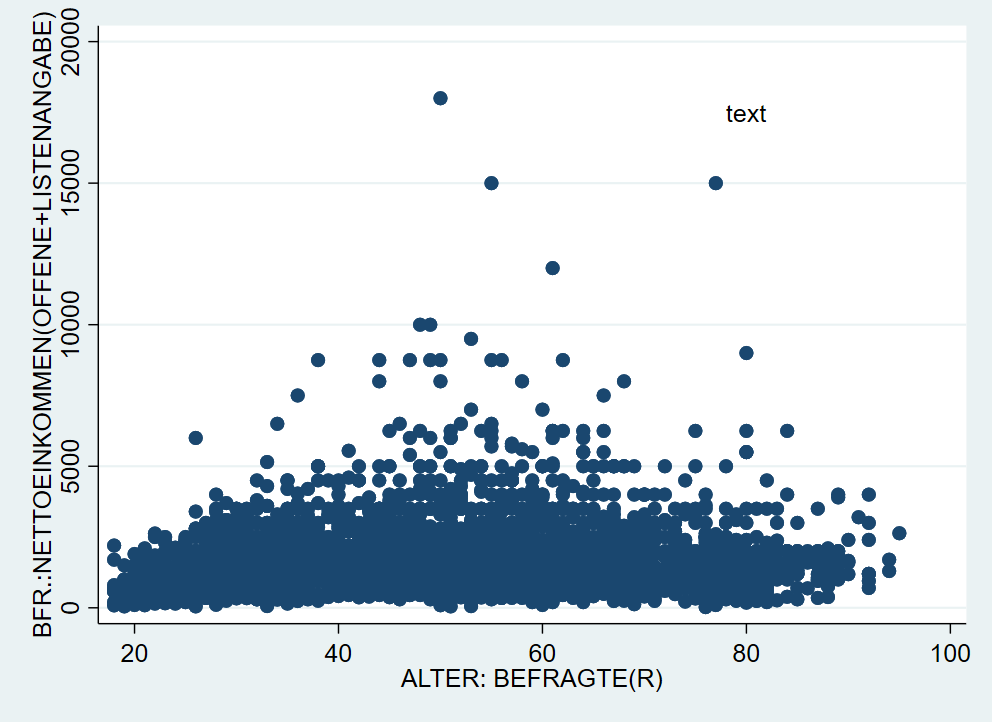

# Datenvisualisierung in Stata {#dataviz} 

```{r setup4, echo = F, message=F, warning = F}
.libPaths("D:/R-library4")
knitr::opts_chunk$set(collapse = TRUE)
library(tidyverse)
library(Statamarkdown)
stataexe <- "C:/Program Files (x86)/Stata13/StataSE-64.exe"
stataexe <- "C:/Program Files/Stata16/StataSE-64.exe"
knitr::opts_chunk$set(engine.path=list(stata=stataexe))
a18 <- readstata13::read.dta13("../Allbus2018.dta",convert.factors = F)
```

Wir starten wie immer mit dem Einlesen eines Datensatzes:
```{stata load, echo = T, eval = F}
cd "..."
use "Allbus_2018.dta", clear
replace inc = . if inc < 0
replace educ = . if educ < 0
replace age = . if age < 0
```

Für Grafiken gilt noch mehr als für alle anderen Aspekte in Stata: ausprobieren und sehen, was passiert! Nachdem in der Regel ja zumindest eine ungefähre Vorstellung existiert, wie die zu erstellende Grafik aussehen soll, sind Grafik-Gallerien ein guter Startpunkt das eigene Trial & Error. Die größte Herausforderung ist häufig, eine Vorstellung zu entwickeln, wie die Darstellung aussehen soll. Daher im Folgenden einige Beispiele für verschiedene Anwendungsfälle. Diese lassen sich ganz grob entlang zweier Fragen einteilen:

+ Soll eine oder mehrere Variablen dargestellt werden? 
+ Was ist das Skalenniveau der darzustellenden Variable(n)?

Grundsätzlich bestehen Grafik-Befehle aus zwei Teilen: dem Befehl `graph` und der Angabe eines Grafik-Typs. 


## Visualisierung einer Variable

### metrische Variablen

Die Verteilung metrischer Variablen (wie z.B. die Einkommensangaben in `inc`) können als Boxplot, Histogramm oder kdensity dargestellt werden. Während Histogramme und K-Density-Plots die Häufigkeit von Ausprägungen innerhalb von Wertebereichen zeigen, fassen Boxplots die Lagemaße zu einer Darstellung zusammen - mehr dazu hier [hier](#boxplot1).

```{stata, eval = F}
graph box inc
histogram inc
kdensity inc
```

```{r dist_plots, echo = F,out.width = "100%",out.height="100%", fig.align="center"}

```


### Kategoriale Variablen {#bar_col}

Die Darstellung einer kategorialen Variable ist häufig eine grafische Übersetzung einer Häufigkeitsauszählung. Insbesondere bieten sich dafür Säulen- und Balkendiagramme an. Beispielsweise könnten wir die Schulabschlüsse der Befragen auszählen. Dazu zählen[^041] wir die `respid`s pro Ausprägung von `educ`[^042], mit `graph bar` bzw `graph bar, horizontal` bekommen wir dann ein Säulen- bw. Balkendiagramm.

[^041]: Daher die Angabe `(count)`.
[^042]: `over(educ)` legt dabei fest, dass innerhalb der Kategorien von `educ` gezählt werden soll.

```{stata, eval = F}
graph bar (count) respid, over(educ)  
graph bar (count) respid, over(educ) horizontal
```

```{r bar_plots, echo = F,out.width = "100%",out.height="100%", fig.align="center"}
knitr::include_graphics("04_bar_plots.png")
```

## Verteilungen vergleichen mit Facetten

In der Regel wollen wir aber Verteilungen vergleichen, wie wir das auch schon in Kapitel 3 mit Hilfe von Tabellen und Kennzahlen getan haben. Hier hilft die Option `by` weiter. Wir hängen an die Befehle von oben einfach `,by (sex)` an, um getrennte Darstellungen für Männer und Frauen zu bekommen:

```{stata, eval = F}
graph box inc, by(sex)
histogram inc, by(sex)
twoway (kdensity inc), by(sex) // zur Bedeutung von twoway gleich mehr
```

```{r dist_plots2, echo = F,out.width = "100%",out.height="100%", fig.align="center"}
knitr::include_graphics("04_dist_plots2.png")
```
Das funktioniert auch für die Säulen- und Balkendiagramme:
```{stata, eval = F}
graph bar (count) respid, over(educ)  by(sex)
graph bar (count) respid, over(educ)  by(sex) horizontal
```

```{r bar_plots2, echo = F,out.width = "100%",out.height="100%", fig.align="center"}

```


***

**[Übung1](#plt1)**

***

## Gemeinsame Verteilung zweier Variablen {#bivar_plot}

### Mosaikplot
Für die gemeinsame Verteilung zweiter kategorialer Merkmale empfiehlt sich ein Mosaikplot. Dafür gibt es aber keinen Standardbefehl in Stata, sondern wir müssen den Befehl `spineplot` erst installieren:

```{stata, eval = F}
ssc install spineplot // Befehl installieren (nur 1x nötig)
spineplot educ  agec
```

```{r mosaic_plot, echo = F,out.width = "80%",fig.height= 4.5, fig.align="center"}
knitr::include_graphics("04_mosaic.png")
```
Ein Mosaikplot stellt die bedingen Häufigkeiten dar: die Breite der Säulen wird durch die Größe der Altersgruppen bestimmt. Die Anzahl der Befragten aus den jeweiligen Kategorien von `educ` bestimmen dann jeweils die Farbanteile innerhalb der Säulen. 


### Streudiagramm

Eine sehr weit verbreitete Darstellung für zwei metrische Variablen ist das sog. Streudiagramm ("scatter plot"), dieses bekommen wir mit `twoway scatter`. Bspw. können wir die gemeinsame Verteilung des Alters und des Einkommens der Befragten so darstellen:

```{stata scatter1,eval = F}
graph twoway scatter inc age
```

```{r scatter_plot, echo = F,out.width = "80%",fig.height= 4.5, fig.align="center"}
knitr::include_graphics("04_twoway1.png")
```

## Weitere `twoway` Grafiken

Eben kam bereits der Befehl `twoway` vor. `twoway` stellt eine ganze Reihe an Darstellungen zur Auswahl, die wir hier nicht besprochen haben. Eine Übersicht zu allen verfügbaren Visualierungen inklusive Beispielbefehlen findet sich beispielsweise [hier](https://www.stata.com/support/faqs/graphics/gph/stata-graphs/) oder [hier](https://www.stata.com/features/example-graphs/).

## Kombinieren von zwei twoway-Grafiken {#twoway_comb}

Eine besonders hilfreiche Funktion ist das Übereinanderlegen mehrer `twoway` Grafiken. Dazu hängen wir die Befehle mit `(scatter ...) (scatter ...)` einfach aneinander. Mit dieser Strategie können wir zwei nach Geschlechtern getrennte Streudiagramme aufeinander legen und so die Punkte farblich unterscheidbar machen:

```{stata scatter_sex, eval = F}
graph twoway (scatter inc age if sex==1) (scatter inc age if sex==2)
```

```{r scatter_sex2, echo = F,out.width = "80%",fig.height= 4.5, fig.align="center"}

```
Hier haben wir also jetzt blaue Punkte für `sex == 1` und rote Punkte für `sex == 2`. Leider sagt uns die Legende aber überhaupt nichts dazu. Dazu kommen wir [gleich](#legend). 


## Gruppierte Boxplots

Auf ähnliche Weise können wir auch Boxplots nebeneinander legen. Auch hier geben wir nach dem Grafikkommando `graph box` die Subgruppen für die jeweiligen Variablen an. Allerdings funktioniert das hier leider nicht direkt mit `if`. Wir müssen stattdessen einen Zwischenschritt gehen und separate Variablen für jede Untergruppe erstellen.[^048]

```{stata box_group, eval = F}
gen inc1 = inc if educ == 1
gen inc2 = inc if educ == 2
gen inc3 = inc if educ == 3
gen inc4 = inc if educ == 4
gen inc5 = inc if educ == 5
graph box inc1 inc2 inc3 inc4 inc5
```

```{r box_group_graph, echo = F,out.width = "80%",fig.height= 4.5, fig.align="center"}

```

[^048]: Das geht auch schneller mit `separate` - siehe Kapitel [11](#adva).6

Das hat den Vorteil, dass wir dann gruppierte Boxplots nach Geschlecht erstellen können, wenn wir zusätzlich `,by(sex)` anhängen:
```{stata box_group2, eval = F}
graph box inc1 inc2 inc3 inc4 inc5, by(sex)
```

```{r box_group_graph2, echo = F,out.width = "80%",fig.height= 4.5, fig.align="center"}

```

***

**[Übung2](#plt2)**

***

## dot charts

Mit `graph dot` lassen sich relativ einfach grafische Übersichten zu deskriptiven Maßzahlen erstellen. Dazu geben wir in Klammern jeweils die gewünschte Statistik an (die Optionen entsprechen denen aus `tabstat`) und dann wie entsprechende Variable. Mit `over()` können wir diese Auswertung zudem nach einer zweiten Variable aufsplitten. Wir können auch mehrere Kennzahlen gleichzeitig angeben:
```{stata dot_graph1, eval = F}
graph dot (p25) age ( mean ) age (p75) age, over(sex)
```

```{r dot_graph2, echo = F,out.width = "80%",fig.height= 4.5, fig.align="center"}

```

## Übungen 4

### Übung 4-1 {#plt1}

(@) Laden Sie den kumulierten Allbusdatensatz (`Allbus_1980-2018.dta`) in Stata und wählen Sie die Befragten aus dem Jahr 2014 aus! Erstellen Sie einen Boxplot, ein Histogramm und einen k-Density-Plot für den BMI der Befragten (`hs18`).  
    + Vergessen Sie nicht, die Missings mit `mvdecode` zu überschreiben oder mit `keep`/`drop` auszuschließen.
    + Erstellen Sie eine weitere Variante dieser Grafiken, welche die Verteilung des BMIs jeweils nach Geschlecht zeigen.
    
(@) Erstellen Sie ebenfalls für die Befragten aus dem Jahr 2014 eine Grafik, welche die Häufigkeit der Befragten aus den alten und neuen Bundesländern (`eastwest`) wiedergibt!  
    + Erstellen Sie sowohl ein Säulen- als auch ein Balkendiagramm!
    + Erstellen Sie eine weitere Darstellung, welche zusätzlich nach dem Geschlecht unterscheidet!

[Zurück zu univariate Grafiken](#bar_col)

### Übung 4-2 {#plt2}

(@) Laden Sie den kumulierten Allbusdatensatz (`Allbus_1980-2018.dta`) erneut und wählen Sie die Befragten aus dem Jahr 2016 aus! Erstellen Sie einen Mosaikplot, welcher die Bildung der Befragten (`educ`) sowie deren Kontakte zu Ausländern bei der Arbeit (`mc02`) abbildet.  
    + Vergessen Sie nicht, die Missings mit `mvdecode` zu überschreiben oder mit `keep`/`drop` auszuschließen.
    + Überprüfen Sie z.B. mit `tabulate`, ob alle negativen Werte ausgeschlossen wurden.
    + Betrachten Sie die Darstellung: welche Merkmalskombination aus `educ` und `mc02` ist die häufigste? Überprüfen Sie ihre Einschätzung mit Hilfe einer Kontingenztabelle (`tab educ mc02`)
    
(@) Laden Sie den Allbus 2018 (`Allbus_2018.dta`) und erstellen Sie einen Boxplot zur Bearbeitungsdauer des Politikquiz!
    + Erstellen Sie einen gruppierte Darstellung, je nachdem ob die Befragten aus den alten und neuen Bundesländern (`eastwest`) kommen! 
    + Splitten Sie diese Darstellung zusätzlich nach dem Geschlecht der Befragten auf!
    
    + Erstellen Sie einen Scatterplot für das Alter `age` und `xt11`, die Bearbeitungsdauer des Politikquiz. Erstellen Sie den Scatterplot so, dass die Befragte aus Ost und West durch unterschiedliche Farben markert sind - so wie es [hier](#twoway_comb) gemacht wurde!

```{r xt11_cdb, echo = F,out.width = "80%",fig.height= 4.5, fig.align="center"}

```

(@) Beschreiben Sie die Verteilung der Variable `xt11` im Allbus 2018 mit Hilfe einer `dot`-Grafik! 
    + Lassen Sie sich den Median, das 25%- und 75%-Quantil anzeigen!
    + Verändern Sie Farben und Formen der jeweiligen Marker mit Hilfe der [unten gezeigten Optionen](#m1opts)!
    + Wie können Sie die Verteilung getrennt nach Bildungsabschlüssen erstellen?
    + Schließen Sie mit `if` ggf. extreme Werte aus!
    
[Zurück zu bivariaten Grafiken](#bivar_plot)

### Weitere Übungen Kap4

(@) Wählen Sie eine der oben erstellten Grafiken aus und
    + verändern Sie den Titel, Untertitel und Achsenbeschriftung, siehe [hier](#title).
    + Verändern Sie die Form/Farben der Punkte, Balken oder Box! Siehe [hier](#mark) und [hier](#color)
    
(@) Verändern Sie die Legende des Scatterplots aus Aufgabe 4 - siehe [hier](#color)

(@) Erstellen Sie eine Alterspyramide für ein Jahr aus dem kumulierten Allbus! Laden Sie dafür den kumulierten Allbus und wählen ein Jahr aus (`tab year` zeigt Ihnen, welche Auswahl sie haben). Vollziehen Sie dann die [hier](#pyramid) gezeigten Schritte nach! Passen Sie Farben, Schrift usw. nach Ihren Vorstellungen an! Sie können anstatt der Altersgruppen auch bspw. die Bildungsgruppen `educ` oder Wohnortgröße `gkpol` verwenden!


## Optionen

Diese grundlegenden Darstellungen können mit Hilfe einer ganzen Reihe an Optionen angepasst werden. Auch hier beschränken wir uns auf die wesentlichsten Optionen. Bei konkreten Fragen hilft oftmals auch eine Google-Suche nach: "stata graph text smaller" o.ä.

### Titel {#title}

Eine klare Beschriftung ist zentraler Bestandteil jeder Datenvisualisierung. Folgende Überschriften stehen uns dazu zur Verfügung: 

```{stata, eval = F}
graph ...., title("Titel") subtitle("Untertitel") xtitle("x-Achsentitel") ytitle("y-Achsentitel") caption("Bildunterschrift")
```

```{r lab, echo = F,out.width = "80%",out.height= "80%", fig.align="center"}
knitr::include_graphics("04_scatter_title.png")
```

Weitere Optionen unter `help title_options`. 

### Achsenbeschriftung

Außerdem können wir die Achsenbeschriftungen verändern - hier ein Beispiel für die x-Achse[^043]

+ `xscale(range(0 100))` $\rightarrow$ x-Achse auf 0-100 ausdehnen
+ `xtick(0 (10) 100 )`  $\rightarrow$ an allen Zehner-Grenzen zwischen 0 und 100, `0(10)100` ist die Abkürzung für `0,10,20,30,40,50,60,70,80,90,100`
+ `xlabel(0 "Null" 10 "zehn" 20 (10) 100)`  $\rightarrow$ Beschriftung der "ticks"

```{stata, eval = F}
graph .... , xscale(range(0 100)) xtick(0 (10) 100 )` xlabel(0 "Null" 10 "zehn" 20 (10) 100) 
```

```{r axis_lab, echo = F,out.width = "80%",out.height= "80%", fig.align="center"}
knitr::include_graphics("04_scatter_axis.png")
```

Mehr Optionen finden sich unter `help axis_label_options`. Bspw. kann man mit `xlabel(..., alternate) ` die Achsenlabels nach oben und unten verschieben.

[^043]: für die y-Achse funktionert das genauso, lediglich mit `yticks` usw.

### Text einfügen 

Wir können mit `text()` auch ein Text auf der Grafik positionieren - wie geben erst die y-Koordinate, dann die x-Koordinate an und dann den gewünschten Text:


```{stata text, eval = F}
graph twoway scatter inc age, text(17500 80 "text")
```
```{r text_pos, echo = F,out.width = "80%",out.height= "80%", fig.align="center"}

```


### Schriftart & Textgröße {#font}

Eine Reihe an Schriftarten stehen für Textangaben zur Verfügung:

```{stata, eval = F}
graph twoway scatter inc age, ///
title("{stSerif:Einkommen {bf:fett} {it:kursiv}}") ///
  subtitle("Text{superscript:hochgestellt}{subscript:tiefgestellt}") /// 
  xtitle("Alter {it:age}") ytitle("{stMono:Einkommen}") ///
  xlabel(0 " {stMono:Null}" 10 "{bf:zehn}" 20 (10) 100) ///
  text(15000 20 "Hier ein Symbol: {&Omega}") xscale(range(0 100))
```
```{r text_opts, echo = F,out.width = "80%",out.height= "80%", fig.align="center"}
knitr::include_graphics( "04_scatter_text_fmts.png")
```

Mehr dazu unter `help graph_text`

Außerdem können wir mit der Option `size` die jeweilige Größe des Textes anpassen, dabei können wir die Größenangaben aus der [Palette](#msymbol_size_overview) verwenden. Mit der Option `angle(90)` können wir außerdem den Text um 90 Grad (und natürlich um jeden beliebigen Wert durch entsprechende Angabe):
```{stata, eval = F}
graph twoway scatter inc age, ///
 title("Text1", size(vsmall)) ///
 subtitle("Untertitel",size(large)) /// 
  xtitle("Alter",size(small)) ytitle("{stMono:Einkommen}",size(vhuge)) ///
  xlabel(0 " {stMono:Null}" 10 "{bf:zehn}" 20 (10) 100 , labsize(tiny) angle(90))
```
```{r text_size, echo = F,out.width = "80%",out.height= "80%", fig.align="center"}
knitr::include_graphics( "04_scatter_text_size.png")
```

Wenn die Option [`over`](#bar_col) verwendet wird, dann müssen die Textoptionen in `over` angegeben werden:

```{stata, eval = F}
graph bar (count) respid, /// 
  over(gkpol,label(labsize(small) angle(90)))
```
```{r text_size_over, echo = F,out.width = "80%",out.height= "80%", fig.align="center"}

```

### Legende {#legend}

Oben hatten wir gesehen, dass die automatische Legende nicht unbedingt aussagekräftig ist. Mit der Option `legend` können wir die Legende beschriften und einen Titel vergeben:

```{stata scatter_sex_leg, eval = F}
graph twoway (scatter inc age if sex==1) (scatter inc age if sex==2), ///
  legend(lab(1 "Männer") lab(2 "Frauen") title("Geschlecht"))
```

```{r scatter_sex_legp, echo = F,out.width = "80%",out.height="80%", fig.align="center"}
knitr::include_graphics("04_scatter_bysex_legend.png")
```

Mit der Option `pos` können wir außerdem die Position der Legende anpassen - wir geben dabei eine Zahl zwischen 0 und 12 an. Die Werte 1-12 entsprechen die Stunden auf einer Uhr, 0 setzt die Legende in die Mitte der Grafik. 

```{stata scatter_sex_leg2, eval = F}
graph twoway (scatter inc age if sex==1) (scatter inc age if sex==2), ///
  legend(lab(1 "Männer") lab(2 "Frauen") title("Geschlecht") pos(9))
```
```{r scatter_sex_leg2p, echo = F,out.width = "80%",out.height="80%", fig.align="center"}
knitr::include_graphics("04_scatter_bysex_legend_pos.png")
```

Weitere Optionen und Beispiele unter `help legend_options`. Mit `legend(off)` kann die Legende auch ausgeblendet werden. 


### Marker {#mark}

Im Stata-Jargon werden die Punkte "marker" genannt. Deren Aussehen können wir mit entsprechenden Optionen ebenfalls verändern. Zum einen können wir mit `msymbol` die Form des Markers verändern, mit `msize` können wir die Größe und mit `mcolor` die Farbe anpassen:

```{stata msym_size , eval = F}
graph twoway scatter inc age, msymbol(D) msize(small) mcolor(sand)
```
```{r msym_size2, echo = F,out.width = "80%",out.height="80%", fig.align="center"}
knitr::include_graphics("04_msym_size.png")
```
Dabei können wir aus einer Reihe an Formen, Größen und Farben wählen:
```{r msymbol_size_overview, echo = F,out.width = "60%",out.height="80%",fig.show='hold', fig.align="center"}
knitr::include_graphics(c("04_msymbol.png","04_msize.png","04_mcolor.png"))
```

In unserem Beispiel vorhin hatten wir die Farben der marker aber genutzt, um die Angaben für Männer und Frauen zu unterscheiden. Hier geben wir dann `mcolor` etc. jeweils innerhalb der Klammern an:
```{stata m_scatter_color, eval = F}
graph twoway /// 
  (scatter inc age if sex==1, mcolor(orange) msize(small)) ///
  (scatter inc age if sex==2, mcolor(sand) msymbol(D) msize(small)), ///
  legend(lab(1 "Männer") lab(2 "Frauen")) 
```
```{r msym_sex, echo = F,out.width = "80%",out.height="80%", fig.align="center"}

```

Mit `mlcolor` und `mlwidth` können wir jedem marker die Farbe und Dicke der Umrandung angeben. Zur Auswahl stehen: `vthin`,`thin`,`medthin`,`medium `,`medthick`,`thick`,`vthick`,`vvthick`,`vvvthick`

```{stata ml_scatter_color, eval = F}
graph twoway /// 
  (scatter inc age if sex==1, mcolor(orange) msize(small) mlcolor(gs3) mlwidth(vthin)) ///
  (scatter inc age if sex==2, mcolor(sand) msymbol(D) msize(small) mlcolor(gs3) mlwidth(vvthin)), ///
  legend(lab(1 "Männer") lab(2 "Frauen")) 
```
```{r ml_scatter, echo = F,out.width = "80%",out.height="80%", fig.align="center"}
knitr::include_graphics("04_ml_sex.png")
```

### marker bei `over` {m1opts}

Möchten wir nur den ersten Marker in einem Dot graph ändern, können wir mit `marker(1,` den ersten Marker auswählen:
```{stata dot_opts1, eval = F}
graph dot (p25) age ( mean ) age (p75) age, over(sex) ///
  marker(1, msymbol(d) mcolor(orange)) ///
  marker(2, msymbol(Oh) mcolor(navy)) 
```

```{r dot_opts2, echo = F,out.width = "80%",out.height="80%", fig.align="center"}

```

### Farben {#color}

Obwohl es um Darstellungen geht, haben wir noch sehr wenig über Farben gesprochen. Neben den oben gezeigten vordefinierten Farben können wir auch Farben als RGB-Codes[^046] angeben und so Farben eigenen Paletten verwenden:

```{stata rgb, eval = F}
graph twoway /// 
  (scatter inc age if sex==1, mcolor("91 37 97") msize(small)) ///
  (scatter inc age if sex==2, mcolor("150 196 134") msymbol(D) msize(small)), ///
  legend(lab(1 "Männer") lab(2 "Frauen"))
```

```{r rgbp, echo = F,out.width = "80%",out.height="80%", fig.align="center"}
knitr::include_graphics("04_col_scatter.png")
```

Farbpaletten sind ein Thema für sich und was gut aussieht ist natürlich subjektiv.... Allerdings gibt es einige Leitlinien, siehe [hier](https://blog.datawrapper.de/beautifulcolors/). Es gibt zahlreiche Möglichkeiten selbst zu erstellen: zB. mit [Adobe Color](https://color.adobe.com/create/color-wheel) oder [Paletton](https://paletton.com/). Außerdem gibt es unzählige Quellen für Farbpaletten: [Instagram](https://www.instagram.com/colours.cafe/) oder [ColorBrewer](https://colorbrewer2.org).

Manchmal ist es ratsam, eine den Markern/Säulen/... eine gewisse Transparenzu geben. Durch anhängen von `%30` können wir bspw. die Deckkraft auf 30% heruntersetzen (je höher die Zahl, desto höher die Deckkfraft):
```{stata rgb_opac, eval = F}
graph twoway ///
  (scatter inc age if sex==1, mcolor("91	37 97 %30") msize(small)) ///
  (scatter inc age if sex==2, mcolor("150 196 134 %30") msymbol(D) msize(small)), ///
  legend(lab(1 "Männer") lab(2 "Frauen"))
```


```{r rgb_opac2, echo = F,out.width = "80%",out.height="80%", fig.align="center"}

```


**Leider gibt es diese Funktion erst ab Stata 15 aufwärts.**

[^046]: RGB steht dabei als Abkürzung für die Anteile der Grundfarben Rot, Grün und Blau an der Mischfarbe. Andere, zB hex Farbcodes können (`#0D173F`), diese können z.B [hier](https://www.color-hex.com/) umgerechnet werden.


Außerdem können wir mit `plotregion(fcolor( ))` und `graphregion(fcolor( ))` die Hintergrundfarben der Grafik und des Koordinatenbereichs anpassen. Mit `region(fcolor( ))` können wir die den Hintergrund der Legende verändern:

```{stata bg_col, eval = F}
graph twoway ///
  (scatter inc age if sex==1, mcolor("91	37 97") msize(small)) ///
  (scatter inc age if sex==2, mcolor("150 196 134") msymbol(D)), ///
  legend(lab(1 "Männer") lab(2 "Frauen") region(fcolor(red))) ///
  plotregion(fcolor(eltblue)) graphregion(fcolor(olive_teal))
```

```{r bg_colp, echo = F,out.width = "80%",out.height="80%", fig.align="center"}

```


#### Boxplots anpassen
Die Farben in Boxplots können wir mit `box` anpassen - bei mehreren Boxen geben wir zuerst eine Zahl an, auf welche Box sich die Optionen beziehen sollen. Die Ausreißer können wir mit `marker` berarbeiten:
```{stata box_color, eval = F}
graph box inc1 inc2 , ///
	box(1, color("orange") blcolor(black)) marker(1, mcolor("purple")  msymbol("Dh") ) ///
	box(2, color("159 97 184") blcolor(navy)) marker(2, mcolor("gs45")  msymbol("Sh") ) 
```
```{r box_color2, echo = F,out.width = "80%",out.height="80%", fig.align="center"}
knitr::include_graphics("04_box_col.png")
```


#### Balken/Säulendigramme anpassen

Für Balkendiagramme ist `bar()` die richtige Option. Mit `fcolor` können wir die Flächenfarbe anpassen, mit `color` die Umrandung.
```{stata bar_color, eval = F}
graph bar (count) respid, over(eastwest) bar(1,fcolor(orange) color(gs4))
```
```{r bar_color2, echo = F,out.width = "80%",out.height="80%", fig.align="center"}
knitr::include_graphics("04_bar_col.png")
```

Leider ist die unterschiedliche Einfärbung von Balken etwas komplizierter, hierzu müssen wir erst mit `collapse` den Datensatz umformen. Siehe [hier](#pyramid).


## export 

Natürlich können wir diese Grafiken auch speichern - entweder einfach über das Speichern-Symbol im Grafikfenster. Oder mit dem Befehl `graph export`, es stehen die üblichen Dateiformate (`png`,`svg`, `jpg`) zur Verfügung. Einfach die gewünschte Endung anhängen, Stata regelt den Rest:

```{stata, eval = F}
graph export "C:/Mein/Projekt/Ordner/meine_grafik.png"
```


### Vorlagen

Eine Alternative ist auf Grafik-Schemata zuzückzugreifen. Beispielsweise wird mit `, scheme(sj)`  die Grafik nach den Vorlage des Stata Journals erstellt:

```{stata theme,  eval = F}
graph twoway scatter inc age , scheme(sj)
```

```{r theme_plot, echo = F,out.width = "80%",out.height="80%", fig.align="center"}
knitr::include_graphics("04_sjtheme.png")
```

Mit `graph query, schemes` wird eine Liste der verfügbaren Schemata angezeigt.


Weitere Optionen bieten zB die [blindschemes](https://www.stata-journal.com/article.html?article=gr0070) von Daniel Bischof. Diese müssen zunächst mit `ssc install blindschemes`  installiert werden und stehen dann zur Verfügung, zB 

Hier noch ein Beispiel mit `plotplain` aus `blindschemes`:
```{stata theme2, eval = F}
ssc install blindschemes
graph twoway scatter inc age, scheme(plotplain) 
```

```{r theme_plot2, echo = F,out.width = "80%",fig.height= 4.5, fig.align="center"}

```


## Anhang & Beispiele zum selbst anpassen

Im Folgenden finden sich nun einige Beispiele mit (sehr) vielen Optionen als Vorlage für eigene Anpassungen. Trial & error wärmstens empfohlen!

### Boxplot

Wie oben gezeigt, muss für gruppierte Boxplots (hier nach Geschlecht) muss die dargestellte Variable zunächst aufgesplittet werden:
```{stata fancy_bpplot_prep, eval=F, results="hide",collectcode=F, eval = F}
cd ""
use "Allbus_2018.dta", clear
replace inc = . if inc < 0
replace age = . if age < 0

egen age_c = cut(age), at(20,35,50,65) // Alter in Gruppen
lab def agec1 20 "20-34" 35 "35-49" 50 "50-64" // Gruppen labeln
lab val age_c agec1
// Einkommen in Männer und Frauen splitten:
gen inc_m = inc if sex == 1
gen inc_f = inc if sex == 2
lab var inc_m "Männer"
lab var inc_f "Frauen"
```


```{stata fancy_bpplot, eval=F, results="hide",collectcode=F, eval = F}
graph box inc inc_f, over(age_c) ///
scheme(lean1) ///
box(1, color("0 41 93")) marker(1, mcolor("0 41 93")  msymbol("o") ) medline(lcolor("204 175 105")) /// optionen box1
box(2, color("146 143 107")) marker(2, mcolor("146 143 107")  msymbol("o") ) /// box2 anpassen
legend(cols(2) pos(12) region(fcolor("249 247 241") lcolor("16 74 138")))  /// Legende
ytitle("{stSerif:Einkommen}{superscript:2018}") b1title("Alter") /// Achsenbeschriftung
title("Einkommen") caption("{bf:Quelle}: Allbus 2018 {it:eigene Berechnungen}",position(5)) /// titel usw.
plotregion(fcolor("252 251 248")) graphregion(fcolor("249 247 241")) // Hintergrundfarben

```


```{r boxplot, echo = F,out.width = "80%",fig.height= 4.5, fig.align="center"}

```

### Scatterplot 

Hier ein angepasster Scatterplot, welcher aus drei überlagerten [`scatter`](#twoway_comb) besteht:

```{stata loadbp, echo=T, results="hide",collectcode=F}
webuse bpwide, clear
```
```{stata titelbild, eval = F}
graph twoway  ///
( scatter bp_before bp_after if agegrp == 1, mc("0 62 81") msymbol(o) ) /// Altersgruppe 1 -> dunkle Punkte
( scatter bp_before bp_after if agegrp == 2, mc("0 125 186") msymbol(d)  ) /// Altersgruppe 2 -> blaue Rhomben
( scatter bp_before bp_after if agegrp == 3, mc("214 210 196") msymbol(s)  ) /// Altersgruppe 3 -> Vierecke
, scheme(lean2) /// Schema
legend(lab(1 "30-45") lab(2 "{stMono:46-59}") lab(3 "60+") lcolor("16 74 138") region(fcolor("249 247 241") lcolor("16 74 138")) pos(6) cols(3)  )  /// legende -> 3 Spalten
xtitle("{stSerif:Blutdruck nachher}") ytitle("{stMono:Blutdruck vorher}") /// Achsenbeschriftung
text(185 172 "Ein Text" "über {stSerif: 2} Zeilen") title("{&Delta}p={stSerif:R}*V") // Textfeld einfügen
```

```{r titelbild_include, echo = F,out.width = "80%",fig.height= 4.5, fig.align="center"}
knitr::include_graphics("04_scatter_manyopts.png")
```


### Bevölkerungspyramide {#pyramid}

Häufig ist die größte Herausforderung, die Daten so umzustellen, dass sie zum gewünschten `graph`-Befehl passen. Ein Beispiel ist die Erstellung einer Bevölkerungspyramide aus den Allbusdaten:

```{r pyra1, echo = F,out.width = "60%",out.height= "60%", fig.align="center"}
knitr::include_graphics("04_pyramid.png")
```

Auch diese Bevölkerungspyramide lässt sich als Stata-Grafik erstellen. Allerdings müssen dazu einige Zwischenschritte durchlaufen, die fortgeschrittene Datenaufbereitung mit `collapse` voraussetzen. Außerdem könnte ein Teil der Aufbereitung mit `separate` abgekürzt werden. Mehr Informationen dazu finden sich am Ende dieses Skripts in Kapitel [11](#adva).

Die grundsätzliche Funktion für die Bevölkerungspyramide ist ein Balkendiagramm mit `graph twoway bar , horizontal`. Die Länge der Balken soll jeweils durch die Anzahl der Fälle in jeder Altersstufe, getrennt nach Geschlecht, bestimmt werden. Dazu müssen wir also zunächst die Anzahl der Befragten pro Alterstufe und Geschlecht bestimmen. Wenn wir den Allbus 2018 laden, haben wir ja einen Datensatz mit einer Zeile pro Person. Was wir jetzt aber benötigen ist eine Variante, in der wir den Datensatz sozusagen "zusammenschieben": wir brauchen jeweils eine Zeile pro Altersstufe und Geschlecht und eine Variable mit der Zahl der Befragten.

```{r, echo =F}
a18 <- haven::read_dta("../Allbus2018.dta")
a18 %>% filter(age>0,sex>0) %>%  group_by(age,sex) %>% count(name = "Anzahl_Befragte") %>% ungroup() %>% slice(1:6) %>% data.frame(.)
```
Um dorthin zu kommen, steht uns der `collapse`-Befehl zur Verfügung:

```{stata pyr1, eval = F}
cd ""
use "Allbus_2018.dta", clear
tab agec
keep if sex > 0
keep if agec > 0
collapse (count) respid , by(sex age)
list in 1/8
```
Unter respid ist jetzt die Zahl der Befragten in der jeweiligen Kombination aus `age` und `sex` abgelegt:
```{r, echo =F}
a18 %>% filter(age>0,sex>0) %>%  group_by(age,sex) %>% count(name = "respid") %>% ungroup()  %>% slice(1:8) %>% data.frame(.)
```
Um verwirrung zu vermeiden, benennen wir `respid` in `total ` um:
```{stata, eval = F}
rename respid Anzahl_Befragte
```
Allerdings möchten wir jetzt die Angaben für Frauen und Männer in getrennte Variablen ablegen.[^049]
```{stata, eval = F}
gen total_m = Anzahl_Befragte if sex == 1
gen total_f = Anzahl_Befragte if sex == 2
list in 1/10
```
[^049]: Eine Abkürzung für diesen Schritt mit Hilfe von `separate` findet sich in Kapitel [11](#adva) 

```{r, echo =F}
a18 %>% filter(age>0,sex>0) %>%  group_by(age,sex) %>% count(name = "total") %>% ungroup() %>% mutate(total_m = ifelse(sex == 1, total,"."),total_f = ifelse(sex == 2, total,".")) %>% slice(1:10) %>% data.frame(.)
```

Jetzt können wir daraus ein Balkendiagramm erstellen, wobei wir zwei `twoway` kombinieren - wie schon beim Scatterplot:
```{stata, eval = F}
twoway( bar total_m age, horizontal )(bar total_f age, horizontal)
```

```{r pyra2, echo = F,out.width = "60%",out.height= "60%", fig.align="center"}
knitr::include_graphics("04_pyramid001.png")
```
Was hier noch fehlt ist, die Umorientierung der Zahlen für die Männer "nach links". Dazu multiplizieren wir `total_m` mit `-1`:
```{stata, eval = F}
gen neg_total_m = -total_m
```
Damit dann verwenden wir `neg_total_m` für die Balken der Männer:
```{stata, eval = F}
twoway( bar neg_total_m age, horizontal )(bar total_f age, horizontal)
```
```{r pyra3, echo = F,out.width = "60%",out.height= "60%", fig.align="center"}
knitr::include_graphics("04_pyramid002.png")
```
Mit `xlabel` und `legend`noch einige Anpassungen, außerdem können wir mit `text` noch Beschriftungen hinzufügen:
```{stata, eval = F}
twoway( bar neg_total_m age, horizontal )(bar total_f age, horizontal) ,xlabel( -40 "40" -30 "30" -20 "20" -10 "10" 0 10(10)40 ) legend(off) text(100 -8 "Männer") text(100 8 "Frauen")
```
```{r pyra4, echo = F,out.width = "60%",out.height= "60%", fig.align="center"}
knitr::include_graphics("04_pyramid.png")
```

Anpassung der Farbe, des Schemas, ...:
```{stata, eval = F}
twoway ///
(bar neg_total_m age, horizontal fcolor("60 117 153")) ///
(bar total_f age, horizontal fcolor("201 255 247")) , /// 
xlabel( -40 "40" -30 "30" -20 "20" -10 "10" 0 10(10)40 ) ///
legend(off) text(100 -8 "Männer") text(100 8 "Frauen") ///
xscale(range(0 50)) xtick(-50 (10) 50 ) ///
scheme(plotplain) xtitle("{stSerif: Anzahl Befragte}") ytitle("{stSerif: Alter Befragte(r)}")
```
```{r pyra_final, echo = F,out.width = "60%",out.height= "60%", fig.align="center"}
knitr::include_graphics("04_pyramid_final.png")
```


### Boxplot  {#boxplot1}

Definition der Bestandteile eines Boxplots: 

+ ggf. Ausreißer
+ unterer Whisker: `q1 - 1.5* IQR`
+ untere Grenze: 1. Quartil 
+ mittlere Linie: Median 
+ obere Grenze: 3. Quartil 
+ oberer Whisker: `q3 + 1.5* IQR`
+ ggf. Ausreißer

Die Box enthält also die zentralen 50% des Wertebereichs.
```{r, boxplot1, echo = F, out.height="75%", out.width="75%", fig.align="center", warning=F,message=F}
.libPaths("D:\\R-library4") 
library(tidyverse)

path <- "D:/oCloud/RFS/" # wo liegt der Datensatz?
a16 <- read.csv(paste0(path,"allbus2016.csv"),sep = ";",header = T,stringsAsFactors = F) # einlesen
ak <- readr::read_delim(paste0(path,"allbus_kumuliert.csv"), delim = ";", col_types = cols(.default = col_double()))
bp_ann_df <- 
  filter(ak,hs16>0) %>% 
  mutate_at(vars(hs16),~ifelse(.<0,NA,.)) %>% 
  summarise(q25 = quantile(hs16,probs = .25),
            q50 = quantile(hs16,probs = .5),
            q75 = quantile(hs16,probs = .75),
            whis1 = q25 - 1.5*(q75-q25) + .5 ,
            whis2 = q75 + 1.5*(q75-q25) - .5) %>% 
  mutate_all(~if_else(. < 0,0,.)) %>% 
  pivot_longer(cols=everything(), values_to = "hs16") %>% 
  mutate(xend1 = ifelse(grepl("whis",name),.015,.4),
         name = case_when(name == "q25" ~ "1. Quartil (25% Grenze)",
                          name == "q50" ~ "Median (50% Grenze)",
                          name == "q75" ~ "3. Quartil (75% Grenze)",
                          name == "whis1" ~ "unterer Whisker",
                          name == "whis2" ~ "oberer Whisker"),
         x = 1)

bp_ann_ausr <- filter(ak,!between(hs16,146,197),hs16>0) %>% select(hs16) %>% mutate(name="Ausreißer",x=1) %>% 
  distinct() %>% group_by(aus=hs16>146) %>% 
  mutate(hs16m=mean(hs16) %>% if_else(.<144,140,.))

  
ggplot(filter(ak,hs16>0), aes(x = 0, y = hs16)) + 
  geom_boxplot() + 
  geom_label(data = bp_ann_df, aes(x = x-.45, y = hs16, label = name), hjust = 0, label.size = .0,fontface="italic", size = 5.25) +
  geom_label(data = bp_ann_ausr, aes(x = x-.45, y = hs16m, label = name), hjust = 0, label.size = .0,fontface="italic", size = 5.25) +
  geom_segment(data = bp_ann_df, aes(x = x-.451, xend = xend1, yend = hs16, y = hs16), color = "#172869",
               lineend = 'butt', linejoin ='bevel',arrow = arrow(length = unit(.025,"npc"), type = "closed")) +
  geom_segment(data = bp_ann_ausr, aes(x = x-.451, xend = .015, yend = hs16, y = hs16m), color = "#172869",
               lineend = 'butt', linejoin ='bevel',arrow = arrow(length = unit(.01,"npc"), type = "closed")) +
  labs(color = "", # legenden-label auf leer
       y = "", # y-Achse labeln
       x="")+ # x-Achse labeln
  theme_void() + 
  theme(axis.text.x = element_blank()) +
  expand_limits(x = c(0,1.1))

```

<!-- ##  Gruppierte Darstellungen  -->
<!-- Neben `,by()` können wir in `graph box` auch  -->
