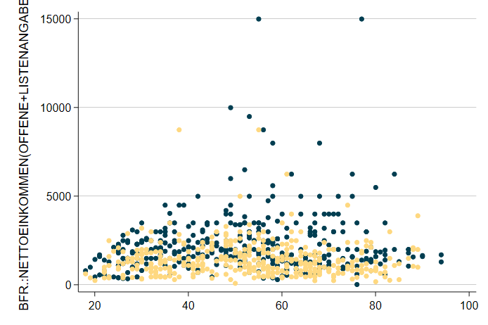
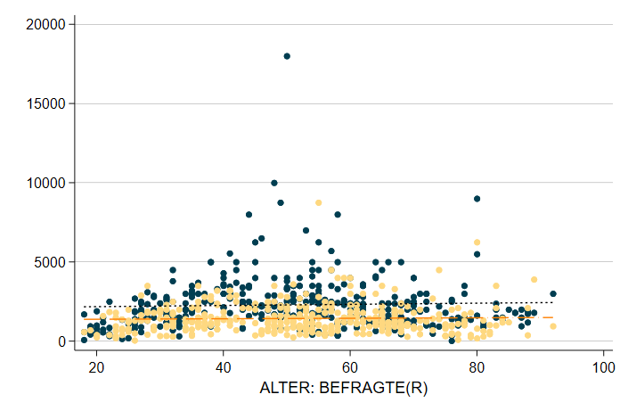
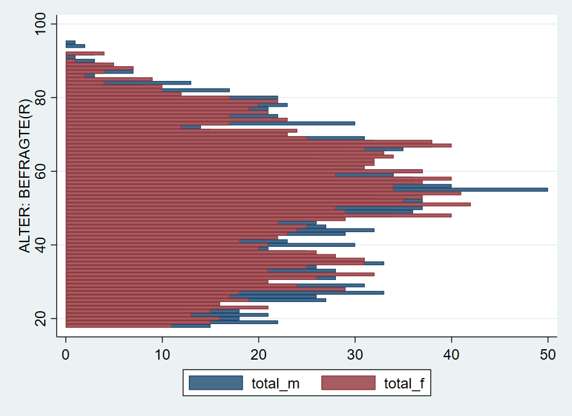

# Datenvisualisierung in Stata {#dataviz} 

```{r setup5, echo = F, message=F, warning = F}
.libPaths("D:/R-library4")
knitr::opts_chunk$set(collapse = TRUE)
library(Statamarkdown)
```

Wir starten wie immer mit dem Einlesen eines Datensatzes:
```{stata load, echo = T, eval = F}
cd "..."
use "Allbus_2018.dta", clear
replace inc = . if inc < 0
replace age = . if age < 0
sample 25 //25% Stichprobe aus den Daten -> läuft schneller
```

Für Grafiken gilt noch mehr als für alle anderen Aspekte in Stata: ausprobieren und sehen, was passiert! Nachdem in der Regel ja zumindest eine ungefähre Vorstellung existiert, wie die zu erstellende Grafik aussehen soll, sind Grafik-Gallerieren ein guter Startpunkt das eigene Trial & Error. Die größte Herausforderung ist häufig, eine Vorstellung zu entwickeln, wie die Darstellung aussehen soll.

Eine Übersicht zu allen verfügbaren Visualierungen inklusive Beispielbefehlen findet sich beispielsweise [hier](https://www.stata.com/support/faqs/graphics/gph/stata-graphs/) oder [hier](https://www.stata.com/features/example-graphs/).


## Grafik-Syntax in Stata

Die Syntax für Graphiken in Stata unterscheidet sich vom dem bisher Kennengelernten. 

### Aufbau 
Grafik-Befehle bestehen aus zwei Teilen: dem Befehl `graph` und der Angabe eines Grafik-Typs. Im folgenden Befehl ist `box` der Grafik-Typ:  

```{stata box1, echo=1, results="hide", eval = F}
graph box inc
graph export "05_box.png", replace
```

```{r box1_plot, echo = F,out.width = "80%",fig.height= 4.5, fig.align="center"}
knitr::include_graphics("05_box.png")
```


### twoway
Beim Grafik-Typ `twoway` muss der sog. Plottyp, spezifiziert werden. Bspw. für ein Streudiagramm mit dem Befehl `scatter`:

```{stata twoway1, echo=1, results="hide", eval = F}
graph twoway scatter inc age
graph export "05_twoway1.png", replace
```

```{r twoway1_plot, echo = F,out.width = "80%",fig.height= 4.5, fig.align="center"}
knitr::include_graphics("05_twoway1.png")
```


### Kombinieren von zwei twoway-Grafiken
`twoway`-Grafiken  können übereinander gelegt werden. So können wir durch Kombination der Plottypen `scatter` und `lfit` ein Streudiagram mit einer Regressionsgerade[^51] kombinieren:
 `graph twoway (scatter inc age) (lfit inc age)`
Eine alternative Schreibweise mit `||` führt zur gleichen Grafik:
`graph twoway scatter inc age || lfit inc age`

```{stata twoway2, echo = F,results="hide",eval = F}
graph twoway (scatter inc age) (lfit inc age)
graph export "05_line_scatter.png", replace
```

```{r twoway2_plot, echo = F,out.width = "80%",fig.height= 4.5, fig.align="center"}
knitr::include_graphics("05_line_scatter.png")
```
 
[^51]: Was das genau ist, werden wir am Donnerstag besprechen. Für den Moment nur so viel: die Gerade gibt den Zusammenhangstrend beider Variablen wieder.

### twoway Varianten

`graph twoway scatter` hatten wir jetzt schon kennen gelernt. Natürlich gibt es aber auch noch weitere Darstellungsformen.

`graph twoway bar` liefert uns ein Säulendiagramm:


Mit der Option `,horizontal` können wir dieses Säulendiagramm in ein Balkendiagramm mit horizontalen Balken verwandeln:

Mit `graph twoway connected` bekommen wir ein Punktdiagramm mit verbundenen Punkten


### Vorlagen
Das Aussehen von Grafiken wird durch sog. Grafik-Schemata beeinflusst. Beispielsweise wird mit `, scheme(sj)`  die Grafik nach den Vorlage des Stata Journals erstellt:


```{stata theme, echo = 1,results="hide", eval = F}
graph twoway (scatter inc age) (lfit inc age), scheme(sj)
graph export "05_line_scatter_theme.png", replace
```

```{r theme_plot, echo = F,out.width = "80%",fig.height= 4.5, fig.align="center"}
knitr::include_graphics("05_line_scatter_theme.png")
```

Mit `graph query, schemes` wird eine Liste der verfügbaren Schemata angezeigt.


Weitere Optionen bieten zB die [blindschemes](https://www.stata-journal.com/article.html?article=gr0070) von Daniel Bischof oder [lean2](https://www.stata-journal.com/sjpdf.html?articlenum=gr0002) von Svend Juul. Beide müssen zunächst mit `ssc install blindschemes` bzw. `net install gr0002_3, from("http://www.stata-journal.com/software/sj4-3")` installiert werden und stehen dann zur Verfügung, zB 

Hier noch ein Beispiel mit `plotplain` aus `blindschemes`:
```{stata theme2, echo = 1,results="hide", eval = F}
graph twoway (scatter inc age) (lfit inc age), scheme(plotplain) legend(cols(2) pos(6))
graph export "05_line_scatter_theme2.png", replace
```

```{r theme_plot2, echo = F,out.width = "80%",fig.height= 4.5, fig.align="center"}
knitr::include_graphics("05_line_scatter_theme2.png")
```

...und `lean2`:

```{stata theme3, echo = 1,results="hide", eval = F}
graph twoway (scatter inc age) (lfit inc age), scheme(lean2) ///
  legend(cols(2) pos(6))
graph export "05_line_scatter_theme3.png", replace
```

```{r theme_plot3, echo = F,out.width = "80%",fig.height= 4.5, fig.align="center"}
knitr::include_graphics("05_line_scatter_theme3.png")
```


### Optionen

Darüber hinaus kann die Grafik mit Hilfe von spezifischen Optionen angepasst werden. 

+ `legend`
  + `pos`
  + labeln

+ Achsenoptionen `xlabel`, `ylabel`, `xtitle`

+ `over`

+ Darstellungstypen
  + Symbole/Linientypen
  +

+ Farboptionen `mcolor`, `lcolor`, `graphregion(color(orange))` 

Optionen von `graph` können Unteroptionen haben oder aus einer Liste von Optionen zusammengesetzt werden. Hier zwei Beispiele: `xlabel(#20, angle(90))` oder `xscale(range(0 300) reverse alt)`.

### Farben

Obwohl es um Darstellungen geht, haben wir noch sehr wenig über Farben gesprochen. 

[Instagram](https://www.instagram.com/colours.cafe/)

[ColorBrewer](https://colorbrewer2.org)

[colorhex](https://www.color-hex.com/)


### Subgruppen

```{stata colored_scatter, echo=1, results="hide", eval = F}
graph twoway  ( scatter  inc age if sex == 1 , mc("0 62 81") msymbol(o) ) ( scatter  inc age if sex == 2 , mc("254 216 128") msymbol(o)  ) ///
, scheme(lean2) legend(off) xtitle("")
```
```{stata colored_scatter_ex, echo=F, results="hide",eval = F}
graph export "05_bunter_scatter.png", replace
```

```{r colored_scatter_print, echo = F,out.width = "80%",fig.height= 4.5, fig.align="center"}

```


```{stata colored_line_scatter, echo=1, results="hide", eval = F}
graph twoway  ( scatter  inc age if sex == 1 , mc("0 62 81") msymbol(o) ) ( scatter  inc age if sex == 2 , mc("254 216 128") msymbol(o)  ) ( lfit  inc age if sex == 1 , lc("black") ) ( lfit  inc age if sex == 2 , lc("orange") msymbol(o)  ) ///
, scheme(lean2) legend(off) xtitle("")
```
```{stata colored_line_scatter_ex, echo=F, results="hide",eval = F}
graph export "05_bunter_line_scatter.png", replace
```

```{r colored_line_scatter_print, echo = F,out.width = "80%",fig.height= 4.5, fig.align="center"}

```

## Beispiele zum selbst anpassen


Hier noch ein Beispiel mit (sehr) vielen Optionen als Vorlage für eigene Anpassungen ([DoFile](#aufb1)):
```{stata fancy_bpplot, eval=F, results="hide",collectcode=F, eval = F}
graph box inc_m inc_f, over(age_c) scheme(lean1) box(1, color("0 41 93")) marker(1, mcolor("0 41 93")  msymbol("o") ) medline(lcolor("204 175 105")) box(2, color("146 143 107")) marker(2, mcolor("146 143 107")  msymbol("o") ) legend(cols(2) pos(12) region(fcolor("249 247 241") lcolor("16 74 138"))) ytitle("{stSerif:Einkommen}{superscript:2018}") b1title("Alter") title("Einkommen") caption("{bf:Quelle}: Allbus 2018 {it:eigene Berechnungen}",position(5)) plotregion(fcolor("252 251 248")) graphregion(fcolor("249 247 241")) 
```


```{r boxplot, echo = F,out.width = "80%",fig.height= 4.5, fig.align="center"}
knitr::include_graphics("05_boxplot.png")
```

Auch die Darstellung auf der Startseite dieses Skripts wurde als Stata-Grafik erstellt:

```{stata loadbp, echo=T, results="hide",collectcode=F}
webuse bpwide, clear
```
```{stata titelbild, eval = F}
graph twoway  (lfit bp_before bp_after) ( scatter bp_before bp_after if agegrp == 1, mc("0 62 81") msymbol(o) ) ( scatter bp_before bp_after if agegrp == 2, mc("0 125 186") msymbol(o)  ) ( scatter bp_before bp_after if agegrp == 3, mc("214 210 196") msymbol(o)  ), scheme(lean2) legend(off) xtitle("")
```

```{r titelbild_include, echo = F,out.width = "80%",fig.height= 4.5, fig.align="center"}
knitr::include_graphics("00_scatter.png")
```

## Abschließende Bemerkungen
Häufig ist die größte Herausforderung, die Daten so umzustellen, dass sie zum gewünschten `graph`-Befehl passen. Ein Beispiel ist die Erstellung einer Bevölkerungspyramide aus den Allbusdaten:


## Bevölkerungspyramide
```{r pyra1, echo = F,out.width = "60%",out.height= "60%", fig.align="center"}
knitr::include_graphics("05_pyramid.png")
```

Auch eine Bevölkerungspyramide lässt sich als Stata-Grafik erstellen. Allerdings müssen dazu einige Zwischenschritte durchlaufen, die fortgeschrittene Datenaufbereitung mit `collapse` voraussetzen. Außerdem könnte ein Teil der Aufbereitung mit `reshape` abgekürzt werden. Mehr Informationen dazu finden sich am Ende dieses Skripts in Kapitel [11](#adva).

Die grundsätzliche Funktion für die Bevölkerungspyramide ist ein Balkendiagramm mit `graph twoway bar , horizontal`. Die Länge der Balken soll jeweils durch die Anzahl der Fälle in jeder Altersstufe, getrennt nach Geschlecht, bestimmt werden. Dazu müssen wir also zunächst die Anzahl der Befragten pro Alterstufe und Geschlecht bestimmen. Wenn wir den Allbus 2018 laden, haben wir ja einen Datensatz mit einer Zeile pro Person. Was wir jetzt aber benötigen ist eine Variante, in der wir den Datensatz sozusagen "zusammenschieben": wir brauchen jeweils eine Zeile pro Altersstufe und Geschlecht und eine Variable mit der Zahl der Befragten.

```{r, echo =F}
a18 <- haven::read_dta("../Allbus2018.dta")
a18 %>% filter(age>0,sex>0) %>%  group_by(age,sex) %>% count(name = "Anzahl_Befragte") %>% ungroup() %>% slice(1:6) %>% data.frame(.)
```
Um dorthin zu kommen, steht uns der `collapse`-Befehl zur Verfügung:

```{stata pyr1, eval = F}
cd ""
use "Allbus_2018.dta", clear
tab agec
keep if sex > 0
keep if agec > 0
collapse (count) respid , by(sex age)
list in 1/8
```
Unter respid ist jetzt die Zahl der Befragten in der jeweiligen Kombination aus `age` und `sex` abgelegt:
```{r, echo =F}
a18 %>% filter(age>0,sex>0) %>%  group_by(age,sex) %>% count(name = "respid") %>% ungroup()  %>% slice(1:8) %>% data.frame(.)
```
Um verwirrung zu vermeiden, benennen wir `respid` in `total ` um:
```{stata, eval = F}
rename respid total
```
Allerdings möchten wir jetzt die Angaben für Frauen und Männer in getrennte Variablen ablegen:
```{stata, eval = F}
gen total_m = total if sex == 1
gen total_f = total if sex == 2
list in 1/10
```
```{r, echo =F}
a18 %>% filter(age>0,sex>0) %>%  group_by(age,sex) %>% count(name = "total") %>% ungroup() %>% mutate(total_m = ifelse(sex == 1, total,"."),total_f = ifelse(sex == 2, total,".")) %>% slice(1:10) %>% data.frame(.)
```

Jetzt können wir daraus ein Balkendiagramm erstellen:
```{stata, eval = F}
twoway( bar neg_total_m age, horizontal )(bar total_f age, horizontal)
```

```{r pyra2, echo = F,out.width = "60%",out.height= "60%", fig.align="center"}

```
Was hier noch fehlt ist, die Umorientierung der Zahlen für die Männer "nach links". Dazu multiplizieren wir `total_m` mit `-1`:
```{stata, eval = F}
gen neg_total_m = -total_m
```
Damit dann verwenden wir `neg_total_m` für die Balken der Männer:
```{stata, eval = F}
twoway( bar neg_total_m age, horizontal )(bar total_f age, horizontal)
```
```{r pyra3, echo = F,out.width = "60%",out.height= "60%", fig.align="center"}
knitr::include_graphics("05_pyramid002.png")
```
Mit `xlabel` und `legend`noch einige Anpassungen, außerdem können wir mit `text` noch Beschriftungen hinzufügen:
```{stata, eval = F}
twoway( bar neg_total_m age, horizontal )(bar total_f age, horizontal) ,xlabel( -40 "40" -30 "30" -20 "20" -10 "10" 0 10(10)40 ) legend(off) text(100 -8 "Männer") text(100 8 "Frauen")
```
```{r pyra_final, echo = F,out.width = "60%",out.height= "60%", fig.align="center"}
knitr::include_graphics("05_pyramid.png")
```


## Anhang


### Aufbereitung für Boxplot {#aufb1}
```{stata, eval = F, echo = T}
use "D:\Studium\01_Oldenburg\Lehre\Datensaetze\Allbus_2018.dta", clear
replace inc = . if inc < 0
replace age = . if age < 0

egen age_c = cut(age), at(20,35,50,65)
lab def agec1 20 "20-34" 35 "35-49" 50 "50-64"
lab val age_c agec1
gen inc_m = inc if sex == 1
gen inc_f = inc if sex == 2
lab var inc_m "Männer"
lab var inc_f "Frauen"
```