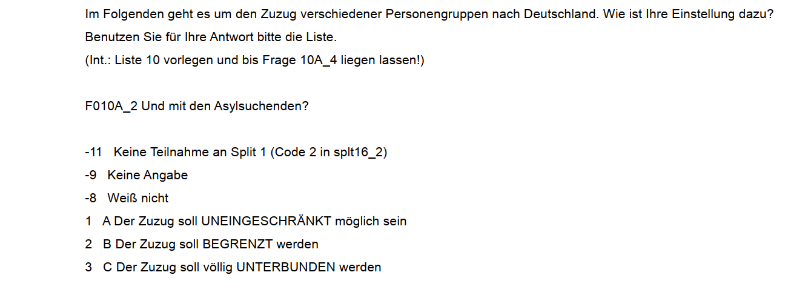
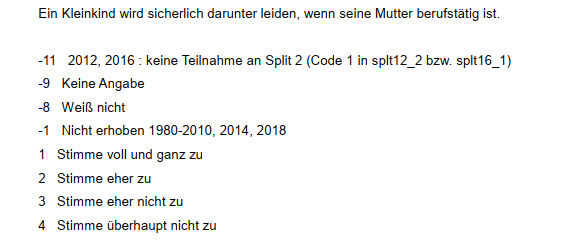
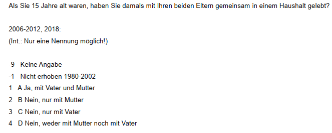

# Zusammenhangsmaße {#zshg}

```{r setup051, echo = F, include=FALSE}
.libPaths("D:/R-library4")
library(patchwork)
library(tidyverse)
options(width = 200)
df <- data.frame(var1 = c(1,2,7,8),
                 var2 = c(2,4,7,6))

library(Statamarkdown)
stataexe <- "C:/Program Files (x86)/Stata13/StataSE-64.exe"
# stataexe <- "C:/Program Files/Stata16/StataSE-64.exe"
knitr::opts_chunk$set(engine.path=list(stata=stataexe))
path <- "D:/oCloud/RFS/"
ak <- readr::read_delim(paste0(path,"allbus_kumuliert_1980-2018.csv"), delim = ";", col_types = cols(.default = col_double())) %>%   mutate_all(~ifelse(.<0,NA,.))
```

Zusammenhänge sind das Herz (fast) aller statistischer Analysen. Im Folgenden lernen wir die Berechnung einer Reihe von Kennzahlen kennen, welche den Zusammenhang zwischen zwei Variablen ausdrücken. Diese variieren zwischen 0 und 1 oder -1 und +1, der Abstand zur Null dient dabei als Indikator für die Stärke des Zusammenhangs - je größer der Abstand zur Null, desto stärker der Zusammenhang:

|  |  |
|:----------|:---------------------------|
| Wert der Kennzahl ($K$) |  Grad des Zusammenhangs |
| $K$ = 0 | Keiner |
| 0,00 ≤ $K$ < 0,05 | Praktisch keiner |
| 0,05 ≤ $K$ < 0,25 | Geringer |
| 0,25 ≤ $K$ < 0,50 | Mittlerer |
| 0,50 ≤ $K$ < 1,00 | Starker |
| $K$ = 1,00 | Perfekter | 


## Metrisch skalierte Variablen {#zshg_met}

Wir sehen uns den (möglichen) Zusammenhang zwischen dem Alter (`age`) und dem BMI (`hs18`) der Befragten an. Dazu schließen wir zunächst die Missings aus und wählen die Befragten aus dem Jahr 2012 aus:
```{stata readin5, eval = F}
cd ""
use  Allbus_1980-2018.dta   
keep if year == 2012
mvdecode age hs18, mv(-32 -13)
```
```{stata readin5b, echo= F}
qui cd "D:\Studium\01_Oldenburg\Lehre\Datensaetze"
qui use  "Allbus_1980-2018.dta",clear
keep if year == 2012
mvdecode age hs18, mv(-32 -13)
```


```{r s07_12, echo = F}
a12 <- ak[ak$year == 2012,] 
a12$hs18[a12$hs18<0] <- NA
a12$age[a12$age<0] <- NA
```

### Korrelationskoeffizient {#cor}
Zur Bestimmung eines Zusammenhangs zwischen zwei metrischen Variablen empfiehlt sich der Korrelationskoeffizient nach Pearson. Dieser ist definiert als die Kovarianz dividiert durch die jeweiligen Standardabweichungen der beiden Variablen und liegt im Intervall [-1,1]. Die Standardabweichung hatten wir in Session 4 kennengelernt, die Kovarianz erfasst die Lage der Datenpunkte relativ zu den Mittelwerten der beiden interessierenden Variablen (liegen Punkte > $\bar{x}$ auch $>\bar{y}$?):

```{r s07_15b, message=F, warning=F, out.height="80%", out.width="80%", echo=F,fig.align='center'}
eq1 <-  substitute(italic(bar(x))) # formel erstellen
eq2 <-  substitute(italic(bar(y))) # formel erstellen

ggplot(a12, aes(x = age, y = hs18)) + 
  geom_point(color ="#29304E") + 
  geom_vline(aes(xintercept = mean(age,na.rm = T)), color = "#19D4EE", size = .75) +
  geom_hline(aes(yintercept = mean(hs18,na.rm = T)),color = "#2473D5", size = .75) +
  geom_text(data = data.frame(age = 53, hs18 = 51), aes(label = as.character(as.expression(eq1)) ),
            label.size = .01, hjust = 0.5, color = prismatic::clr_darken("#19D4EE"), parse = T, size = 4.5) +
  geom_text(data = data.frame(age = 97, hs18 = 28), aes(label = as.character(as.expression(eq2)) ),
             label.size = .01, hjust = 0.5, 
             color = prismatic::clr_darken("#2473D5"), parse = T, size = 4.5) +
  ggthemes::theme_stata() +
  labs(title = "Alter & BMI der Befragten",
       caption = "Quelle: Allbus 2012",
       y = "BMI (hs18)",
       x = "Alter (age)")+
  theme(aspect.ratio = 1)
```
In Stata können wir den Korrelationskoeffizienten mit `corr` berechnen:
```{stata corr1,eval=F}
corr age hs18
```
```{stata corr1b, echo =F}
set linesize 90
qui cd "D:\Studium\01_Oldenburg\Lehre\Datensaetze"
qui use  "Allbus_1980-2018.dta",clear
qui keep if year == 2012
qui mvdecode age hs18, mv(-32 -13)
corr age hs18
```

Es handelt sich also um einen geringen Zusammenhang.


### Regression {#regression}

Regressionsmodelle zeigen uns den (linearen) Trend zwischen zwei Variablen. Hier geht es darum, um wie sich im Durchschnitt `var2` verändert, wenn sich `var1` um eine Einheit erhöht. `var2` ist also unsere abhängige, `var1` unsere unabhängige Variable - wir möchten `var2` mit `var1` vorhersagen. Im Folgenden sehen wir, dass Regressionsmodelle mit `reg` erstellt werden können und wie wir den Output interpretieren können. Falls Sie nochmal mehr zu den Grundlagen erfahren wollten, findet sich [hier](#reg) eine ausführlichere Erklärung. 

Wir betrachten einen kleinen Beispieldatensatz mit lediglich 4 Fällen und zwei metrischen Variablen `var1` und `var2`:
```{stata use_data, eval = F}
use "https://github.com/filius23/Stata_Skript/raw/master/regression_bsp.dta", clear
```

```{r regp1,out.width = "80%",fig.height= 3.5, echo=T, fig.align="center" , echo = F,warning=F,message=F}
m1 <- lm(var2~ var1, data = df)  
df$pred_vorher <- m1$fitted.values
ggplot(df, aes(x = var1, y = var2)) + geom_point(size = 3) +  ggthemes::theme_stata() +
  expand_limits(y=c(0,8),x=c(0,8)) +
  theme(aspect.ratio = 1)
```

Mit Regressionsmodellen können wir lineare Zusammenhänge zwischen zwei metrischen Merkmalen untersuchen. In Stata können wir eine Regression mit dem `reg` Befehl berechnen:

```{stata reg_bsp, eval=F}
reg var2 var1
```

```{stata, collectcode=F, echo = F}
use "regression_bsp.dta", clear
egen mean_var2 = mean(var2)
gen m_abw = var2 - mean_var2
qui reg var2 var1
predict pred_vorher, xb
gen res = var2 - pred_vorher 
gen res2 = res^2
set linesize 90
reg var2 var1
```

Hier steht jetzt eine ganze Menge an Informationen, die wir uns im Folgenden genauer ansehen werden. 

***
Ein positiver Wert unter `Coef.` in der Zeile von `var1` bedeutet, dass unsere Gerade von links nach rechts ansteigt und ein negativer eine fallende Linie bedeuten würde. Der Wert unter `var1` gibt an, um *wieviel sich die Gerade pro "Schritt nach rechts" nach oben/unten verändert*. 

> Die Gerade steigt also pro Einheit von `var1` um `r m1$coefficients[2]`.

Der Wert neben `_cons` gibt uns Auskunft darüber, wie hoch der vorhergesagte Wert für `var2` wäre, wenn `var1` = 0.

> Für `var1` = 0 würden wir `var2` = 2.135135 vorhersagen.

Außerdem erkennen wir unter `R-squared` die [Modellgüte](#r2) unseres Regressionsmodells. $R^2$ gibt die prozentuale Verbesserung der Vorhersgen durch die Gerade aus `reg` im Vergleich zum arithmetische Mittel an. $R^{2}$ bezieht sich auf die Verringerung der [Residuen](#resid2) durch das `reg`-Modell im Vergleich zur Mittelwertregel. 

> Unser Regressionsmodell kann also 84,7\% der Streuung um den Mittelwert erklären. 

Außerdem sehen wir oben links in der Spalte `SS` die ["Sum of Squares"](#quad_res): unter `Total` ist die Summe der quadrierten Abweichungen der beobachteten Werte vom arith. Mittel angegeben (die Abstände zwischen den orangen und schwarzen Punkten: `14.75`). Residual gibt die Summe der Abweichungsquadrate zwischen den beobachteten Werten und den vorhergesagten Werten der Regression (die Abstände zwischen den schwarzen und den blauen Punkten:`2.256..`). 

***

```{r reg_graph,out.width = "80%",fig.height= 3.5, echo=T, fig.align="center" , echo = F,warning=F,message=F}
df$mean_var2 <- mean(df$var2)
ggplot(df, aes(x = var1, y = var2)) + geom_point(size = 3) + ggthemes::theme_stata() +
  geom_hline(aes(yintercept = mean_var2), color = "grey50", size = .75, linetype = "dashed") +
  geom_point(aes(x = var1, y = mean_var2), col = "darkorange", size = 3) +
  geom_segment(aes(x = var1, xend = var1, y = var2, yend = mean_var2), color = "red", size = .65, linetype = "dotted")  +
  geom_smooth(method = "lm", color = "darkblue" , se = FALSE) +
  geom_point(aes(x = var1, y = pred_vorher), color = "dodgerblue3", size = 3) +
  geom_segment(aes(x = var1, xend = var1, y = var2, yend = pred_vorher), color = "dodgerblue3", size = .65, linetype = 1) +
  expand_limits(y=c(0,8),x=c(0,8)) +
  theme(aspect.ratio = 1)
```


### vorhergesagte Werte

Die vorhergesagten Werte aus `reg var2 var1` entsprechen einfach der Summe aus dem Wert neben `_cons` und dem Koeffizienten neben `var1` multipliziert mit dem jeweiligen Wert für `var1`. Wir starten also sozusagen bei `var2`=0  und gehen dann eben x Schritte entlang der Geraden.

```{stata, eval=F}
reg var2 var1, noheader /// noheader macht den Output übersichtlicher
```


```{stata, echo=F}
use "regression_bsp.dta", clear
qui egen mean_var2 = mean(var2)
qui gen m_abw = var2 - mean_var2
qui reg var2 var1
qui predict pred_vorher, xb
qui gen res = var2 - pred_vorher 
qui gen res2 = res^2
qui set linesize 90
reg var2 var1, noheader
```

Vorhergesagte Werte für `var2` werden mit $\widehat{var2}$  bezeichnet - das $\widehat{}$ steht dabei für "geschätzt":

$$\widehat{var2}=\texttt{Intercept} + 0.5811 \times \texttt{var1}$$  
Für die erste Zeile ergibt sich also folgender vorhergesagter Wert: 2.1351+0.5811\*1= `r 2.1351+0.5811*1`

Wir könnten also auch einen vorhergesagten Wert für einen beliebigen Wert von `var1` berechnen, für 5:
```{stata pre_dis}
display 2.1351+0.5811*5
```

Alternativ können wir uns die Tipparbeit auch sparen, indem wir erst `reg` laufen lassen und dann mit `_b` auf die Ergebnisse zugreifen:
```{stata pre_dis2, eval = F}
reg var2 var1
display _b[_cons] + _b[var1] * 5
```
```{stata, echo=F}
use "regression_bsp.dta", clear
qui reg var2 var1
display _b[_cons] + _b[var1] * 5
```


Mit `predict` können wir jeweils die vorhergesagten Werte für die Ausprägungen von `var1` im Datensatz berechnen und in einer neuen Variable `pred_vorher` ablegen:
```{stata, eval = F}
predict pred_vorher, xb
```
Hier wird also gerechnet:

$$2.1351 + 0.5810811 * 1 = 2.716216$$
$$2.1351 + 0.5810811 * 2 = 3.297297$$
$$2.1351 + 0.5810811 * 7 = 6.202703$$
$$2.1351 + 0.5810811 * 8 = 6.783784$$

```{r predx, echo=F}
m1 <- lm(var2~ var1, data = df)  
df$manual_vorhers = 2.1351 + 0.5811 * df$var1
df$pred_vorher <- m1$fitted.values
df %>% select(matches("(var|pred_)"))
```
Die Grafik oben zeigt wie Vorhersagen auf Basis des Regressionsmodells aussehen: Sie entsprechen den Werten auf der blauen Geraden (der sog. Regressionsgeraden) an den jeweiligen Stellen für `var1`. 

***

**[Übung1](#auf_met)**

***

## Ordinal skalierte Merkmale {#zshg_ord}

Ein klassisches ordinales Merkmal ist die Bildung (`educ`):
 
| `educ` | Schulabschluss |
|:----------|:---------------------------------------------------------------------------------|
| `1` | Schule beendet ohne Abschluss
| `2` | Volks-/Hauptschulabschluss bzw. Polytechnische Oberschule (8. oder 9. Klasse)
| `3` | Mittlere Reife, Realschulabschluss bzw. Polytechnische Oberschule (10. Klasse)
| `4` | Fachhochschulreife (Abschluss einer Fachoberschule etc.)
| `5` | Abitur bzw. Erweiterte Oberschule mit Abschluss 12. Klasse (Hochschulreife)

Wir sehen uns den Zusammenhang der Bildung der Befragten mit der Einstellung zum Zuzug von Asylsuchenden (`mi02`) an:

```{r s07_2,echo=F, out.height="80%", out.width="80%", fig.align="center"}

```

Wir sehen uns den (möglichen) Zusammenhang zwischen diesen beiden Merkmalen an. Dazu definieren die negativen Ausprägungen sowie die Kategorien (`7`) "noch Schüler" und (`6`) "anderer Schulabschluss" als Missing, um eine klare ordinale Rangfolge für `educ` zu erhalten (je höher,desto höher der Bildungsabschluss). Wir sehen uns den Zusammenhang für das Jahr 1990 an:  

```{stata educF, eval = F}
cd ""
use  "Allbus_1980-2018.dta",clear
keep if year == 1990
mvdecode educ, mv(-9 6 7)
mvdecode mi02, mv(-9 -8 -7)
```
```{stata educT, echo =F}
qui cd "D:\Studium\01_Oldenburg\Lehre\Datensaetze"
qui use  "Allbus_1980-2018.dta",clear
qui keep if year == 1990
mvdecode educ, mv(-9 6 7)
mvdecode mi02, mv(-9 -8 -7)
```

So sieht die Verteilung zunächst in einer Kreuztabelle aus:
```{stata tabF, eval = F}
tab educ mi02
```

```{stata tabT, echo = F}
set linesize 120
qui cd "D:\Studium\01_Oldenburg\Lehre\Datensaetze"
qui use  "Allbus_1980-2018.dta",clear
qui keep if year == 1990
qui mvdecode educ, mv(-9 6 7)
qui mvdecode mi02, mv(-9 -8 -7)
tab educ mi02
```

Auch hier fragen wir uns jetzt: sind die Werte von `mi02` tendenziell höher oder niedriger bei höheren Werten von `educ`? Allerdings ist hier der Korrelationskoeffizient nicht adäquat, die hier die Abstände zwischen den Kategorien nicht gleichmäßig sind (es handelt sich ja um ordinale Merkmale). Daher müssen hier spezifische Zusammenhangsmaße für ordinale Variablen verwendet werden.

### Spearman- Rangkorrelation {#spear}
Zur Bestimmung eines Zusammenhangs zwischen zwei *ordinal* skalierten Variablen empfiehlt sich der Spearman-Rangkorrelationskoeffizient ($\rho$). Für den Rangkorrelationskoeffizienten werden die Werte der Variablen in Ränge überführt und dann mit diesen Rängen den Korrelationskoeffizient berechnet. Wir können den Rangkorrelationskoeffizienten mit `spearman` berechnen:
```{stata spearmF, eval = F}
spearman educ mi02
```

```{stata spearmT, echo = F}
qui cd "D:\Studium\01_Oldenburg\Lehre\Datensaetze"
qui use  "Allbus_1980-2018.dta",clear
qui keep if year == 1990
qui mvdecode educ, mv(-9 6 7)
qui mvdecode mi02, mv(-9 -8 -7)
spearman educ mi02
```

Es zeigt sich also mit einem Korrelationskoeffizienten von 0.37 ein mittel-starker, negativer Zusammenhang. Das negative Vorzeichen des Zusammenhangs deutet darauf hin, dass mit einer höheren Ausprägung von `educ` tendenziell niedrigere Werte für  `mi02` einher gehen: eine höhere Schulbildung geht mit einer positiveren Haltung gegenüber dem Zuzug von Asylsuchenden einher.

### Konkordanzmaße {#tau}

Ein weiteres Zusammenhangsmaß für ordinale Variablen sind Konkordanzmaße wie Kendall's $\tau$. Hierfür die Werteverhältnisse gezählt, zur Berechnung in Stata können wir `ktau` verwenden:
```{stata tauF, eval = F}
ktau educ mi02
```
```{stata tauT, echo = F}
set linesize 90
qui cd "D:\Studium\01_Oldenburg\Lehre\Datensaetze"
qui use  "Allbus_1980-2018.dta",clear
qui keep if year == 1990
qui mvdecode educ, mv(-9 6 7)
qui mvdecode mi02, mv(-9 -8 -7)
ktau educ mi02
```
Auch hier zeigt sich eine Zusammenhangsstärke in der gleichen Größenordnung wie beim Rangkorrelationskoeffizienten ($\tau_a$ = `-0.2151` und $\tau_b$ = `-0.3350`). Zudem ist auch hier das Vorzeichen negativ: `educ` korreliert negativ mit  `mi02`. Der Wert von Kendall's $\tau_a$ ist deutlich niedriger als von Kendall's $\tau_b$, da hier der Nenner durch die Berücksichtigung *aller* möglichen Paarvergleiche größer wird, der Zähler aber für beide Varianten von Kendall's $\tau$ gleich definiert ist. 

Ein weiteres Maß ist Goodman & Kruskal's $\gamma$, dieses bekommen wir mit der Option `,gamma` in `tab`:
```{stata tauG, eval = F}
tab educ mi02, gamma
```
```{stata tauG2, echo = F}
set linesize 90
qui cd "D:\Studium\01_Oldenburg\Lehre\Datensaetze"
qui use  "Allbus_1980-2018.dta",clear
qui keep if year == 1990
qui mvdecode educ, mv(-9 6 7)
qui mvdecode mi02, mv(-9 -8 -7)
tab educ mi02, gamma
```

Auch Goodman & Kruskal's $\gamma$ deutet auf einen negativen Zusammenhang hin, hier ist die Stärke mit (`-0.5065`) aber deutlich höher. Dies ist auf die Berücksichtigung der Bindungen zurückzuführen: hier werden alle Bindungen ausgeschlossen, also auch Paarvergleiche mit Bindungen nur auf  einer Variable. Es reduziert sich also der Nenner, somit ergibt sich im Ergebnis ein höherer Koeffizient für Goodman & Kruskal's $\gamma$ als für Kendall's $\tau_b$. 


Insgesamt ist also von einem mittleren Zusammenhang zwischen `educ` und `mi02` auszugehen. 

***

**[Übung2](#auf_ord)**

***


## Nominal skalierte Variablen {#zshg_nom}

```{stata nomF, eval = F}
cd ""
use  "Allbus_1980-2018.dta",clear
keep if year == 2014 & dh01 > 0 & dh04 > 0 & aq03 > 0
```
```{stata nomT, echo =F}
set linesize 90
qui cd "D:\Studium\01_Oldenburg\Lehre\Datensaetze"
qui use  "Allbus_1980-2018.dta",clear
keep if year == 2014 & dh01 > 0 & dh04 > 0 & aq03 > 0
```


Unser Beispiel für nominal skalierte Variablen dreht sich um die Frage: *Haben allein lebende Befragte eher ein Haustier als Befragte, die mit weiteren Personen zusammenleben?*
  
Dazu betrachten wir die Variablen `aq03` und `dh01`, später auch noch `dh04`:
  
|  |  |
|:----------|:---------------------------------------------------------------------------------|
| `aq03` | Haben Sie einen Hund oder eine Katze in Ihrem Haushalt? 
| | `1` Ja, Hund  
| | `2` Ja, Katze 
| | `3` Ja, beides 
| | `4` Nein, keines von beiden
| `dh01` | Wohnen außer ihnen noch weitere Personen in diesem Haushalt? 
| |  `1` Ja 
| | `2` Nein, ich lebe allein
| `dh04` | Gesamtzahl der Personen im Haushalt

```{r a14Readin, echo = F, message =F}
a14 <- readr::read_delim(paste0(path,"allbus_kumuliert_1980-2018.csv"), delim = ";", col_types = cols(.default = col_double())) %>%filter(year==2014) %>%  mutate_all(~ifelse(.<0,NA,.))
```


Ausgangspunkt der Zusammenhangsmaße für nominale Merkmale ist die Kontingenztabelle der beiden Variablen:
```{stata ntbF, eval = F}
tab aq03 dh01
```
```{stata ntabT, echo=F}
set linesize 90
qui cd "D:\Studium\01_Oldenburg\Lehre\Datensaetze"
qui use  "Allbus_1980-2018.dta",clear
qui keep if year == 2014 & dh01 > 0 & dh04 > 0 & aq03 > 0
tab aq03 dh01
```


Um diese Tabelle für den Einstieg noch etwas übersichtlicher zu halten, fassen wir die Hunde- und Katzenbesitzer\*innen zusammen. Das geht mit `gen`: wir formulieren darin eine Bedingung und wenn diese zutrifft wird der erste Wert eingesetzt, wenn nicht wird der zweite Wert eingesetzt. Hier fragen wir also ab, ob `aq03` gleich `4` ist - dann wird eine `0` eingesetzt, ansonsten eine `1`:
```{stata gen_nomF, eval = F}
gen aq03b = (aq03 == 4) if !missing(aq03)
list aq03 aq03b in 1/10, nol
```
```{r, echo = F}
a14$aq03b <- ifelse(a14$aq03 == 4, 0,1)
data.frame(a14[1:10,c("aq03","aq03b")])
```
Die daraus resultierende Kontingenztabelle ist schön übersichtlich:
```{stata, crstabF, eval =F}
tab aq03b dh01
```

```{stata, crstabT, echo =F}
set linesize 90
qui cd "D:\Studium\01_Oldenburg\Lehre\Datensaetze"
qui use  "Allbus_1980-2018.dta",clear
qui keep if year == 2014 & dh01 > 0 & dh04 > 0 & aq03 > 0
qui mvdecode aq03 dh01 dh04, mv(-32 -9)
qui gen aq03b = (aq03 == 4)
tab aq03b dh01
```

$\rightarrow$ Wie viele Personen leben also allein und haben kein Haustier?[^053]   
  
[^053]: 579 Personen leben allein und ohne Haustier.

### Odds Ratio {#OR}

Die Odds Ratio geben das Verhältnis der bedingten Häufigkeiten an. Wir berechnen in beiden Spalten (also getrennt nach Haushaltsgröße) jeweils die Odds, dass ein\*e Befragte\*r ein Haustier besitzt (also `aq03b = 1`). Odds sind dabei immer das Verhältnis $\frac{interessierende\;Ausprägung}{alle\;anderen\;Ausprägungen}$. Dann setzen wir die Chancen ins Verhältnis zueinander:
  
```{r, echo = F}
odds_ht_mpHH <- 968/1784 # linke spalte 
odds_ht_allein <- 115/579 # rechte spalte
# odds_ht_allein / odds_ht_mpHH
# odds_ht_mpHH / odds_ht_allein 
```

  
$$\text{Odds Haustier in MP-HH} = \frac{968}{1784} = 0.5426009$$
$$\text{Odds Haustier allein} = \frac{115}{579} = 0.1986183$$
$$\text{Odds Ratio Haustier MP vs. allein} = \frac{0.5426009}{0.1986183} = 2.731878$$
$$\text{Odds Ratio Haustier allein vs. MP HH} = \frac{0.1986183}{0.5426009}=0.3660486$$
**Interpretation:**   
  
+ Alleinlebende Befragte haben im Vergleich zu Befragten, die mit anderen Personen zusammen wohnen, die `r round(odds_ht_allein / odds_ht_mpHH,3)`-fache Chance Haustiere zu haben.
+ Befragte, die mit anderen Personen zusammen wohnen, haben im Vergleich zu alleinlebenden Befragten die `r round(odds_ht_mpHH / odds_ht_allein,3)`-fache Chance Haustiere zu haben.


Odds Ratios sind aber auch aus "größeren" Tabellen berechenbar - zB können wir auch die exakte Haushaltsgröße `dh04` sowie die detaillierten Kategorien zum Haustierbesitz (`aq03`) verwenden:
```{stata gtabtabF, eval = F}
tab aq03 dh04
```
```{stata, gtabtabT, echo =F}
set linesize 200
qui use  "D:\Studium\01_Oldenburg\Lehre\Datensaetze\Allbus_1980-2018.dta",clear
qui keep if year == 2014 & dh01 > 0 & dh04 > 0 & aq03 > 0
qui mvdecode aq03 dh01 dh04, mv(-32 -9)
tab aq03 dh04, wrap
```
Jetzt könnten wir den Odds Ratio für Haustierbesitz von allein Lebenden im Vergleich zu Befragten mit einer HH-Größe von `2` berechnen. Dazu setzen wir für die jeweiligen Spalten (weil die HH-Größe `dh04` in den Spalten steht) die Häufigkeiten ins Verhältnis. Der Hauptunterschied ist aber, dass wir die Haustierkategorien (`aq03 = 1-3`) addieren müssen:
```{r, echo =F}
odds_ht_HH1 <- (41 +65 +9 )/579 # allein
odds_ht_HH2 <- (153+250+43)/938 # zu zweit
# odds_ht_HH1/odds_ht_HH2
# odds_ht_HH2/odds_ht_HH1
```

$$\text{Odds Haustier in 2P-HH} = \frac{153+250+43}{938} = 0.4754797$$
$$\text{Odds Haustier allein} = \frac{41 +65 +9 }{579} = 0.1986183$$
$$\text{Odds Ratio Haustier 2P-HH vs. allein} = \frac{0.4754797}{0.1986183} = 2.393937$$
$$\text{Odds Ratio Haustier allein vs. 2P HH} = \frac{0.1986183}{0.4754797}=0.4177219$$


**Interpretation:**   
  
+ Allein lebende Befragte haben im Vergleich zu zweit lebenden Befragten die `r round(odds_ht_HH1/odds_ht_HH2,3)`-fache Chance ein Haustier im Haushalt zu haben. 
+ Zu zweit lebende Befragte haben im Vergleich zu allein lebenden Befragten die `r round(odds_ht_HH2/odds_ht_HH1,3)`-fache Chance ein Haustier im Haushalt zu haben. 

$\rightarrow$ Haben allein lebende Befragte eher Katzen als Befragte in einem Haushalt mit 4 Personen?  (`aq03` = 2 & 3 sind Katzenbesitzer\*innen)[^054] 

[^054]: Nein - weil $\text{Odds Haustier in 4P-HH} = \frac{73+91+26}{342} = 0.5555556$ und $\text{Odds Haustier allein} = \frac{41 +65 +9 }{579} = 0.1986183$, dementsprechend $\text{Odds Ratio Haustier allein vs. 4P HH} = \frac{0.1986183}{0.5555556}=0.3575129$

### Chi²-basierte Maße {#chi2}

$\chi^2$  basiert auf dem Vergleich der beobachteten Häufigkeit mit einer (theoretischen) Verteilung, welche statistische Unabhängigkeit abbildet (Indifferenztabelle - [mehr dazu](#indiff)). Wir bleiben bei `aq03` und `dh01`. Den $\chi^2$-Wert für diese Häufigkeitstabelle bekommen wir mit `, chi2`:
  
```{r, echo=F}
tab1 <- xtabs(~ aq03 + dh04, data = filter(a14, year == 2014 & dh01 > 0 & dh04 > 0 & aq03 > 0))
tx <- chisq.test(tab1)
```

```{stata, chitabF, eval =F}
tab aq03 dh01, chi
```
```{stata, chitabT, echo =F}
set linesize 200
qui cd "D:\Studium\01_Oldenburg\Lehre\Datensaetze"
qui use  "Allbus_1980-2018.dta",clear
qui keep if year == 2014 & dh01 > 0 & dh04 > 0 & aq03 > 0
qui mvdecode aq03 dh01 dh04, mv(-32 -9)
tab aq03 dh04, chi wrap
```
### Cramer's $\upsilon$
Auf Basis dieses $\chi^2$-Werts von `r round(as.numeric(tx$statistic),3)` können wir Cramer's $\upsilon$ berechnen. Dieses ist definiert als der Quotient aus dem $\chi^2$-Wert und der Fallzahl multipliziert mit dem Minimum der Zeilen- und Spaltenzahl. `n`, erkennen wir aus dem `Total` rechts unten in der Tabelle. Außerdem hat unsere Tabelle 4 Zeilen und 10 Spalten, dementsprechend entspricht das Minimum hier 4:

$$ Cramer's\,\,\upsilon = \sqrt{\frac{\chi^2}{n*\,min(k-1,m-1)}}=\sqrt{\frac{157.1103}{3466*(4-1)}} = 0.01510967$$
  
Dieser Wert für Cramer's $\upsilon$ legt einen praktisch keinen Zusammenhang nahe.

```{stata, vcalc, echo =T}
dis sqrt(157.1103/(3466*3))
```

### $\phi$

Eine Variante von Cramer's $\upsilon$ für 2x2-Tabellen ist $\phi$. Dies wäre das passende Maß für die zusammengefasste Variable aller Haustierbesitzer\*innen `aq03b` von oben und `dh01`:

```{stata phitabF, eval = F}
tab aq03b dh01, chi
```


```{stata, phitabT, echo =F}
set linesize 90
qui cd "D:\Studium\01_Oldenburg\Lehre\Datensaetze"
qui use  "Allbus_1980-2018.dta",clear
qui keep if year == 2014 & dh01 > 0 & dh04 > 0 & aq03 > 0
qui mvdecode aq03 dh01 dh04, mv(-32 -9)
qui gen aq03b = (aq03 == 4)
tab aq03b dh01, chi
```

$$\phi= \sqrt{\frac{\chi^2}{n}}=\sqrt{\frac{89.0092}{3466}} = 0.1602$$ 
```{stata, phicalc, echo =T}
dis sqrt(89.0092/3466)
```

***

**[Übung3](#auf_nom)**

***

## Welches Maß richtig?

Wir haben jetzt eine ganze Reihe an Zusammenhangsmaßen kennengelernt, die folgende Liste fasst nochmal alle Varianten zusammen. Es gibt noch eine ganze Reihe weiterer Zusammenhangsmaße und diese Liste deckt lediglich die Maße ab, die wir kennengelernt haben:  

+ nominal skalierte Variablen 
  + [Odds Ratio](#OR): basierend auf Kreuztabelle `tab x y`
  + [$\chi^2$-basierte Maße](#chi2) `tab x y, chi`, danach Division von $\chi^2$ durch n und Zahl der Spalten/Zeilen
     
+ ordinal skalierte Variablen
  + [Spearman-Rangkorrelationskoeffizient](#spear) `spearman x y` 
  + [Konkordanzmaße](#tau) 
    + Kendall's $\tau_a$ & Kendall's $\tau_b$:  `ktau x y` 
    + Goodman & Kruskal's $\gamma$: `tab x y, gamma`      
      
        
+ metrische skalierte Variablen 
  + Zusammenhangsstärke: [Pearson-Korrelationskoeffizient](#corr) `corr x y`
  + [Regression](#regression) zur Vorhersage von Werten auf Basis einer Variable: `reg x y`

Ausschlaggebend ist dabei die Variable mit dem niedrigeren Skalenniveau! Ggf. können metrische Variablen durch Kategorisierung (Kapitel 3) in ordinale Variablen überführt werden.  

## Übungen 5

### Übung 5-1 {#auf_met}
(@) Laden Sie den kumulierten Allbusdatensatz (`Allbus_1980-2018.dta`) in Stata und wählen Sie die Befragten aus dem Jahr 2014 aus! Untersuchen Sie den Zusammenhang zwischen dem Alter der Befragten `age` und der Dauer des Fernsehkonsums (`lm02`) in Minuten! Verwenden Sie `age` als unabhängige Variable.  
    + Vergessen Sie nicht, die Missings mit `mvdecode` zu überschreiben oder mit `keep`/`drop` auszuschließen.
    + Überprüfen Sie z.B. mit `summary` für beide Variablen, ob alle negativen Werte ausgeschlossen wurden.
    + Berechnen Sie das passende Zusammenhangsmaß!
    + Wie stark ist der Zusammenhang?
    + Welche Fernsehdauer würden Sie für eine\*n 50-jährigen Befragte\*n vorhersagen? 
    + Welche Fernsehdauer würden Sie für eine\*n 51-jährigen Befragte\*n vorhersagen?
    + Welche Fernsehdauer würden Sie für eine\*n 52-jährigen Befragte\*n vorhersagen?
    + Vergleichen Sie diese drei Werte: was fällt Ihnen auf wenn Sie die vorhergesagten Werte vergleichen? (Tipp: bilden Sie die Differenz zwischen den Werten!)

[Zurück zu Zusammenhangsmaße für metrische Variablen](#zshg_met)

### Übung 5-2 {#auf_ord}

(@) Laden Sie den **kumulierten** Allbusdatensatz (`Allbus_1980-2018.dta`) in Stata und wählen Sie die Befragten aus dem Jahr 2016 aus! Untersuchen Sie den Zusammenhang zwischen der Bildung der Befragten `educ` und ihrer Einstellung zur Erwerbstätigkeit von Müttern (`fr03b`)!
    + Vergessen Sie nicht, die Missings mit `mvdecode` zu überschreiben oder mit `keep`/`drop` auszuschließen.
    + Erstellen Sie eine Kontingenztabelle, um zu kontrollieren, ob alle negativen Werte ausgeschlossen wurden.
    + Berechnen Sie die passenden Zusammenhangsmaße!
    + Wie stark ist der Zusammenhang? 
    + In welche Richtung deutet der Zusammenhang? Stimmen Befragte mit höherem Schulabschluss der Aussage eher zu oder eher nicht zu als Befragte mit niedrigeren Abschlüssen?

Hier die Frage zu `fr03b` aus dem Codebuch:
```{r codebuch_fr03b, echo = F,out.width = "80%",out.height="80%", fig.align="center"}

```

[Zurück zu Zusammenhangsmaße für ordinale Variablen](#zshg_ord)

### Übung 5-3 {#auf_nom}

(@) Laden Sie den **kumulierten** Allbusdatensatz (`Allbus_1980-2018.dta`) in Stata und wählen Sie die Befragten aus dem Jahr 2016 aus! Untersuchen Sie den Zusammenhang zwischen ost/westdeutschem Wohnort der Befragten `eastwest` und der Frage, ob Sie mit 15 Jahren mit beiden Eltern zusammengewohnt haben (`df44`)!
    + Vergessen Sie nicht, die Missings mit `mvdecode` zu überschreiben oder mit `keep`/`drop` auszuschließen.
    + Erstellen Sie eine Kontingenztabelle für `eastwest` und `df44`, um zu kontrollieren, ob alle negativen Werte ausgeschlossen wurden.
    + Erstellen Sie eine Variable `df44b`, welche den Wert 1 annimmt wenn `df44`=4 (also Befragte, die mit 15 Jahren ohne Eltern gelebt haben) und 0 für alle anderen Konstellationen.
    + Kontrollieren Sie diesen Schritt mit einer Kreuztabelle für `df44` und `df44b`.
    + Erstellen Sie dann eine Kreuztabelle für `df44b` und `eastwest`, um die Odds Ratios für die Chance ohne Eltern gelebt zu haben zwischen Ost und West zu berechnen.
    + Berechnen Sie die Odds Ratio!
    + In welche Richtung deutet der Zusammenhang? 
    + Wie stark ist der Zusammenhang? Berechnen Sie das passende $\chi^2$-basierte Maß!

Hier die Frage zu `df44` aus dem Codebuch:
```{r codebuch_df44, echo = F,out.width = "80%",out.height="80%", fig.align="center"}

```
[Zurück zu Zusammenhangsmaße für nominale Variablen](#zshg_nom)


### Weitere Übungen 5

(@) Gibt es einen Zusammenhang zwischen dem BMI (`hs18`) und dem Einkommen (`inc`) der Befragten aus dem Jahr 2014?
    + Vergessen Sie nicht, die Missings mit `mvdecode` zu überschreiben. 
    + Welches ist das passende Zusammenhangsmaß für diesen Zusammenhang?
    + Berechnen Sie dementsprechend die Zusammenhängsstärke!

(@) Leben ältere Menschen eher in kleineren Orten? Berechnen Sie ein geeignetes Maß für den Zusammenhang zwischen `gkpol` und dem Alter der Befragten (`age`)! 
    + Berechnen Sie diesen Zusammenhang für das Jahr 2014!
    + Welche Skalenniveaus haben beide Variablen jeweils? 
    + Welches Zusammenhangsmaß können Sie dementsprechend verwenden? (Zur Erinnerung: das niedrigere Skalenniveau ist ausschlaggebend!) 
    + Verwenden Sie `egen cut()`, um `age` in eine ordinale Variable zu überführen! (siehe Kapitel 3, verwenden Sie zB die Lebensjahrzehnte)
    + Berechnen Sie (mind.) ein passendes Zusammenhangsmaß! Ist der Zusammenhang als stark einzustufen?

## Profi-Übungen 5

Für alle, die noch etwas mehr machen möchten:


## Anhang 

### Idee einer Regression {#reg}

Zum Einstieg betrachten wir zunächst einen (fiktiven) Datensatz mit lediglich 4 Fällen und lediglich zwei Variablen: `var1` und `var2`: 
```{stata, eval = F}
use "https://github.com/filius23/Stata_Skript/raw/master/regression_bsp.dta", clear
list
```

```{r start, echo = F}
df <- data.frame(var1 = c(1,2,7,8),
                 var2 = c(2,4,7,6))
df
```

```{r regplot1, fig.align="center",out.width = "80%",fig.height= 3.5, eval=T, echo=F}
library(ggplot2)
ggplot(df, aes(x = var1, y = var2)) + 
  geom_point(size = 2) + 
  ggthemes::theme_stata() +
  scale_y_continuous(breaks = seq(0,8,2)) +
  scale_x_continuous(breaks = seq(0,8,2)) +
  theme(aspect.ratio = 1)
```


Ziel der Regression ist es, den Zusammenhang zwischen diesen beiden Variablen zu bestimmen. Gibt es einen Trend, in dem Sinn, dass ein höherer Wert von `var1` mit einem höheren oder niedrigeren Wert von `var2` einhergeht?

Etwas anders gesagt könnte man auch fragen, welchen Wert für `var2` wir vorhersagen würden, wenn wir `var1` kennen. Ein Ausgangspunkt ist das arithmetische Mittel. Dieses können wir mit `mean` zB für `var2` berechnen.[^055] Diesen Wert fügen wir als neue Spalte `mean_var2` in den Datensatz ein:

[^055]: Mehr zu `egen` in Kapitel \@ref(egen)

```{stata, eval=F}
egen mean_var2 = mean(var2)
list
```
  
```{r mittelw,echo=F}
df$mean_var2 <- mean(df$var2)
df
```

```{r plot_mittelwe,out.width = "80%",fig.height= 3.5, echo=F, fig.align="center"}
ggplot(df, aes(x = var1, y = var2)) + 
  geom_point(size = 3) + 
  ggthemes::theme_stata() +
  scale_y_continuous(breaks = seq(0,8,2)) +
  scale_x_continuous(breaks = seq(0,8,2)) +
  geom_hline(aes(yintercept = mean_var2), color = "grey50", size = .75, linetype = "dashed") +
  geom_label(aes(y = 4, x = 5), label = "mean = 4.75", color = "grey30")+
  theme(aspect.ratio = 1)
```
Müssten wir eine Prognose für die Werte von `var2` abgeben, wäre das arith. Mittel eine gute Wahl. Die **vorhergesagten Werte** werden jeweils auf der Linie für das arith. Mittel liegen.   

```{r mittelw2,out.width = "80%",fig.height= 3.5, echo=F, fig.align="center"}
ggplot(df, aes(x = var1, y = var2)) + 
  geom_point(size = 3) + 
  ggthemes::theme_stata() +
  scale_y_continuous(breaks = seq(0,8,2)) +
  scale_x_continuous(breaks = seq(0,8,2)) +
  geom_hline(aes(yintercept = mean_var2), color = "grey50", size = .75, linetype = "dashed") +
  geom_point(aes(x = var1, y = mean_var2), color = "darkorange", size = 3) +
  theme(aspect.ratio = 1)
```

### Residuen {#resid}

Allerdings liegen wir mit dem arith. Mittel dann immer auch Stück daneben. Diese Abweichung zwischen dem tatsächlichen und dem vorhergesagten Wert wird als **Residuum** bezeichnet, in unserem Beispiel ist das jeweils die Differenz zwischen `var2` und `mean`:
$$Residuum = beobachteter\, Wert \; - \; vorhergesagter\,Wert$$
Als Formel wird das in der Regel wie folgt dargestellt:
$$\epsilon_{\text{i}} = \text{y}_{i} - \hat{\text{y}}_{i}$$

Wir können also die Residuen als Differenz zwischen `var2` und `mean` berechnen und in `df` ablegen:
```{stata, eval = F}
gen m_abw = var2 - mean_var2
list
```


```{r, echo = F}
df$m_abw <- df$var2 - df$mean
df
```

```{r res_pl1,out.width = "80%",fig.height= 3.5, echo=F, fig.align="center" }
ggplot(df, aes(x = var1, y = var2)) + 
  geom_point(size = 3) + 
  ggthemes::theme_stata() +
  scale_y_continuous(breaks = seq(0,8,2)) +
  scale_x_continuous(breaks = seq(0,8,2)) +
  geom_hline(aes(yintercept = mean_var2), color = "grey50", size = .75, linetype = "dashed") +
  geom_point(aes(x = var1, y = mean_var2), color = "darkorange", size = 3) +
  geom_segment(aes(x = var1, xend = var1, y = var2, yend = mean_var2), 
               color = "red", size = .65, linetype = "dotted") +
  theme(aspect.ratio = 1)
```

$\rightarrow$ Was bedeutet also ein negativer oder ein positiver Wert für das Residuum?[^056]

[^056]: Ein positiver Wert des Residuums bedeutet, dass der beobachtete Wert größer als der vorhergesagte Wert ist. Die Regressionsgerade *unterschätzt* also den Wert. Ein negatives Residuum bedeutet dementsprechend, dass die Regressionsgerade den Wert überschätzt - der wahre Wert ist niedriger als der vorhergesagte Wert. Siehe [Formeln](#resid)

Die horizontale Linie für das arithm. Mittel ist aber sehr deutlich nicht die beste Methode, um die Werte für `var2` vorherzusagen. In der Graphik können wir deutlich sehen, dass die Werte "weiter links", also mit geringeren Werten für `var1`, auch geringere Werte für `var2` aufweisen. Wir könnten also unseren Vorhersagefehler bzw. das *Residuum* minimieren indem wir die Linie drehen. Die Idee der Regressionsanalyse ist es dabei, die Residuuen zu minimieren. Was würde aber passieren wenn wir die Residuen aus der Mittelwertsvorhersage aufsummieren, um Sie dann zu minimieren?

### Quadrierte Residuen {#quad_res}

Mit `tabstat ..., s(sum)` können wir die Summe für eine Variable bilden:
```{stata, eval = F}
list
```

```{r, echo =F}
df
```

```{stata, eval=F}
tabstat m_abw, s(sum)
```

```{stata, echo=F}
use "regression_bsp.dta", clear
egen mean_var2 = mean(var2)
gen m_abw = var2 - mean_var2
tabstat m_abw, s(sum)
```


**Die Summe der Resiuden auf Basis des arith. Mittels ist immer Null!**    
Anders formuliert: die gestrichelten Linien nach oben sind in Summe genauso lang wie gestrichelten Linien nach unten.
Die Lösung ist die Residuen zu quadrieren. So ergibt sich eine Kennzahl, die wir minimieren können:
```{stata, eval=F}
gen m_abw2 = m_abw^2 
tabstat m_abw2, s(sum)
```
```{stata, echo=F}
use "regression_bsp.dta", clear
egen mean_var2 = mean(var2)
gen m_abw = var2 - mean_var2
qui reg var2 var1
predict pred_vorher, xb
gen res = var2 - pred_vorher 
gen res2 = res^2
set linesize 90
reg var2 var1
gen m_abw2 = m_abw^2 
tabstat m_abw2, s(sum)
```

```{r abw2, echo = F}
df$m_abw2 <- df$m_abw^2 
df
```

```{r, echo = F}
m1 <- lm(var2~ var1, data = df)  
```

### Interpretation der Regression
  
Die Minimierung erledigt `reg` für uns. Hier geben wir zuerst das Merkmal an, das auf der y-Achse liegt (die *abhängige* Variable) und dann das Merkmal für die x-Achse (*unabhängige* Variable) an. Ein positiver Wert unter `Coef.` in der Zeile von `var1` bedeutet, dass unsere Gerade von links nach rechts ansteigt und ein negativer eine fallende Linie bedeuten würde. Der Wert unter `var1` gibt an, um *wieviel sich die Gerade pro "Schritt nach rechts" nach oben/unten verändert*. Die Gerade steigt also pro Einheit von `var1` um `r m1$coefficients[2]`:

```{stata, eval=F}
reg var2 var1
```


```{stata, echo=F}
use "regression_bsp.dta", clear
qui egen mean_var2 = mean(var2)
qui gen m_abw = var2 - mean_var2
qui reg var2 var1
qui predict pred_vorher, xb
qui gen res = var2 - pred_vorher 
qui gen res2 = res^2
qui set linesize 90
reg var2 var1
```


In unserer Grafik sieht diese Gerade so aus:
```{r,out.width = "80%",fig.height= 3.5, echo=T, fig.align="center" , echo = F,warning=F,message=F}
ggplot(df, aes(x = var1, y = var2)) + 
  geom_point(size = 2) + 
  ggthemes::theme_stata() +
  geom_hline(aes(yintercept = mean_var2), color = "grey50", size = .75, linetype = "dashed") +
  scale_y_continuous(breaks = seq(0,8,2)) +
  scale_x_continuous(breaks = seq(0,8,2)) +
  geom_hline(aes(yintercept = mean_var2), color = "grey50", size = .75, linetype = "dashed") +
  geom_point(aes(x = var1, y = mean_var2), color = "darkorange", size = 3) +
  geom_segment(aes(x = var1, xend = var1, y = var2, yend = mean_var2), 
               color = "red", size = .65, linetype = "dotted") +
  geom_smooth(method = "lm", color = "darkblue" , se = FALSE) +
  theme(aspect.ratio = 1)
```


### Vorhergesagte Werte {#reg_pred}

Wie hoch ist nun der vorhergesagte Wert auf Basis der blauen Gerade? 
Die vohergesagten Werte aus `reg var2 var1` entsprechen einfach der Summe aus dem Wert neben `_cons` und dem Koeffizienten neben `var1` multipliziert mit dem jeweiligen Wert für `var1`.[^057]

```{stata, eval=F}
reg var2 var1, noheader
```


```{stata, echo=F}
use "regression_bsp.dta", clear
qui egen mean_var2 = mean(var2)
qui gen m_abw = var2 - mean_var2
qui reg var2 var1
qui predict pred_vorher, xb
qui gen res = var2 - pred_vorher 
qui gen res2 = res^2
qui set linesize 90
reg var2 var1, noheader
```

Vorhergesagte Werte werden mit $\widehat{var2}$  bezeichnet - der ^ steht dabei für "vorhergesagt":

$$\widehat{var2}=\texttt{Intercept} + 0.5811 \times \texttt{var1}$$  
Für die erste Zeile ergibt sich also folgender vorhergesagter Wert: 2.1351+0.5811\*1= `r 2.1351+0.5811*1`

[^057]: Die Option `noheader` macht den Output von `reg` etwas übersichtlicher.

Also könnten wir mit `gen` die vorhergesagten Werte "manuell" berechnen:
```{stata, eval = F}
gen manual_vorhers = 2.1351 + 0.5811 * var1
```


Die vorhergesagten Werte können wir auch mit `predict` berechnen und in einer neuen Variable `pred_vorher` ablegen:
```{stata, eval = F}
predict pred_vorher, xb
```

```{r, echo=F}
df$manual_vorhers = 2.1351 + 0.5811 * df$var1
df$pred_vorher <- m1$fitted.values
df
```
Die Grafik zeigt wie Vorhersagen auf Basis des Regressionsmodells aussehen: Sie entsprechen den Werten auf der blauen Geraden (der sog. Regressionsgeraden) an den jeweiligen Stellen für `var1`. 
```{r,out.width = "80%",fig.height= 3.5, echo=T, fig.align="center" , echo = F,warning=F,message=F}
ggplot(df, aes(x = var1, y = var2)) + geom_point(size = 3) + ggthemes::theme_stata() +
  scale_y_continuous(breaks = seq(0,8,2)) +
  scale_x_continuous(breaks = seq(0,8,2)) +
  geom_hline(aes(yintercept = mean_var2), color = "grey50", size = .75, linetype = "dashed") +
  geom_point(aes(x = var1, y = mean_var2), col = "darkorange", size = 3) +
  geom_segment(aes(x = var1, xend = var1, y = var2, yend = mean_var2), color = "red", size = .65, linetype = "dotted")  +
  geom_smooth(method = "lm", color = "darkblue" , se = FALSE) +
  geom_point(aes(x = var1, y = pred_vorher), color = "dodgerblue3", size = 3) +
  theme(aspect.ratio = 1)
```
Wir können erkennen, dass die hellblauen Punkte (also die Vorhersagen des Regressionsmodells) deutlich näher an den tatsächlichen Punkten liegen als die orangen Vorhersagen auf Basis des `mean`. 

### Residuen Teil 2 {#resid2}

Trotzdem sind auch die hellblauen Punkte nicht deckungsgleich mit den tatsächlichen Werten. Es gibt also auch hier wieder [Residuen](#resid), also Abweichungen des beobachteten vom vorhergesagten Wert. Wir können diese per Hand berechnen als Differenz zwischen dem tatsächlichen und dem vorhergesagten Wert:
```{stata, eval = F}
gen res = var2 - pred_vorher 
```
Oder wir können Sie mit `predict neue_variable , residuals` erstellen:
```{stata, eval = F}
reg var2 var1 // zunächst nochmal die regression laufen lassen
predict p_res , residuals
list
```
```{r, echo=F}
df$res <- m1$residuals
df$p_res <- m1$residuals
df
df$p_res <- NULL
```

Hier sind die Residuen für `p_res` als hellblaue Linien eingezeichnet:
```{r,out.width = "80%",fig.height= 3.5, echo=F, fig.align="center" , eval = T, message=F}
ggplot(df, aes(x = var1, y = var2)) + geom_point(size = 3) + ggthemes::theme_stata() +
  geom_hline(aes(yintercept = mean_var2), color = "grey50", size = .75, linetype = "dashed") +
  geom_point(aes(x = var1, y = mean_var2), col = "darkorange", size = 3) +
  geom_segment(aes(x = var1, xend = var1, y = var2, yend = mean_var2), color = "red", size = .65, linetype = "dotted")  +
  geom_smooth(method = "lm", color = "darkblue" , se = FALSE) +
  geom_point(aes(x = var1, y = pred_vorher), color = "dodgerblue3", size = 3) +
  geom_segment(aes(x = var1, xend = var1, y = var2, yend = pred_vorher), color = "dodgerblue3", size = .65, linetype = 1) +
  theme(aspect.ratio = 1)
```
$\rightarrow$ *Wie groß ist die (einfache) Summe der Residuen für `pred_vorher`?*[^058]

[^058]: Die (einfache, unquadrierte) Summe der Resiuden beträgt auch hier Null.

### Modellgüte {#r2}

Um zu beurteilen, um wieviel besser unsere Gerade aus `reg` die Werte vorhersagen kann als der `mean` können wir die Summe der quadrierten Residuen vergleichen. Dazu quadrieren wir also die Residuen:
```{stata, eval = F}
gen res2 = res^2
list
```

```{r, echo = F}
df$res2 <- df$res^2
```

```{r, echo = F}
df
```

Dann können wir die Summen der quadierten Abweichungen aus der Mittelwertregel und dem Regressionsmodell vergleichen:

```{stata, collectcode = F, collapse = T}
dis 7.5625+0.5625+5.0625+1.5625 // abw2 aus Mittelwertsregel
```

```{stata, collectcode = F, collapse = T}
dis 0.5129657+0.4937911+0.6356830+0.6143170 // res2 aus regressionsmodell
```
Zum Beispiel können wir uns fragen, um wieviel sich die Summe der quadrierten Residuen verringert wenn wir statt des `mean` unser `reg`-Modell verwenden:
```{stata, collectcode = F, collapse = T}
dis 14.75 -  2.256757
```
Wenn wir diese Veränderung ins Verhältnis mit dem "Ausgangswert", also den Residuen aus der Mittelwertregel setzen, dann erhalten wir das $R^{2}$ für unser `reg`-Modell. Dieses gibt die prozentuale Verringerung der Residuen durch das `reg`-Modell im Vergleich zur Mittelwertregel an: 
```{stata}
dis (14.75 -  2.256757) / 14.75
```
Unser Regressionsmodell kann also 84,7\% der Streuung um den Mittelwert erklären. Dieser Wert wird auch als $R^2$ bezeichnet. Im Regressionsoutput können wir das $R^2$ oben rechts unter `R-squared` ablesen. 
```{stata, collectcode = T}
reg var2 var1
```
Außerdem sehen wir oben links in der Spalte `SS` die "Sum of Squares". Hier finden wir auch die Werte von oben wieder: unter Total ist die Summe der quadrierten Abweichungen der beobachteten Werte vom arith. Mittel angegeben (`14.75`, sozusagen die Summe der `m_abw2` von oben). Residual gibt die Summe der Abweichungsquadrate zwischen den beobachteten Werten und den vorhergesagten Werten der Regression (`2.256..`, Die Summe von `res2`). 


### Indifferenztabelle {#indiff}

$\chi^2$ ergibt sich wie gesagt aus der Differenz zwischen der Indifferenztabelle und den beobachteten Häufigkeiten. Die Indifferenztabelle können wir mit `,expected` aufrufen (mit `nofreq` blenden wir die tatsächlichen Häufigkeiten aus):
```{stata indtabF, eval =F}
tab  aq03  dh01, expected nofreq
```
```{stata, indtabT, echo =F}
set linesize 90
qui cd "D:\Studium\01_Oldenburg\Lehre\Datensaetze"
qui use  "Allbus_1980-2018.dta",clear
qui keep if year == 2014 & dh01 > 0 & dh04 > 0 & aq03 > 0
qui mvdecode aq03 dh01 dh04, mv(-32 -9)
tab aq03 dh01, expected nofreq
```

Ausgangspunkt für diese Indifferenztabelle sind die relativen Häufigkeiten der tatsächlich beoachteten Werte:
```{stata indtab2F, eval =F}
tab  aq03  dh01, cell nofreq
```
```{stata, indtab2T, echo =F}
set linesize 90
qui cd "D:\Studium\01_Oldenburg\Lehre\Datensaetze"
qui use  "Allbus_1980-2018.dta",clear
qui keep if year == 2014 & dh01 > 0 & dh04 > 0 & aq03 > 0
qui mvdecode aq03 dh01 dh04, mv(-32 -9)
tab aq03 dh01,cell nofreq
```

```{r, echo = F,message = F,warning=F}
tab1 <- xtabs(~ aq03 + dh01, data = filter(a14, year == 2014 & dh01 > 0 & dh04 > 0 & aq03 > 0))
tx <- chisq.test(tab1)
rel_tab1 <- prop.table(tab1)
abs_tab1 <- addmargins(tab1)
rand_tab1 <- addmargins(rel_tab1)
```
`r round(rand_tab1[3,2],4)*100` \% der Befragten wohnen alleine (`dh01` = 2) und haben einen Hund und eine Katze (`aq03`=3).    
Uns interessieren hier nur die Randverteilungen aus `Sum`: `r round(rand_tab1[3,"Sum"],4)*100` \% der Befragten haben einen Hund und eine Katze (`aq03`=3). `r round(rand_tab1["Sum",2],4)*100` \% der Befragten wohnen alleine (`dh01` = 2).

```{r, echo=F, warning=F, message=F}
rand_tab2 <- addmargins(rel_tab1)
rand_tab2[1:4,1:2] <- LETTERS[1:length(unlist(rand_tab2[1:4,1:2]))]
rand_tab2["Sum",] <- rand_tab2["Sum",] %>% as.numeric(.) %>% round(.,4)
rand_tab2[,"Sum"] <- rand_tab2[,"Sum"] %>% as.numeric(.) %>% round(.,4)
rownames(rand_tab2) <- c("HUND","KATZE","BEIDES","KEINES VON BEIDEM","Total")
colnames(rand_tab2) <- c("MEHRPERSO","EINPERSON","Total")
library(kableExtra)
kable(rand_tab2) %>% kable_styling(bootstrap_options = "condensed", full_width = F)
```
Wären beide Merkmale unabhängig voneinander, würden wir erwarten, dass die Wahrscheinlichkeit für das Auftreten einer Merkmalskombination dem Produkt der Einzelwahrscheinlichkeiten entspricht (das ist die "Indifferenz"): $P(A\cup B) = P(A) \times P(B)$. Bspw. ergibt sich der erwartete Wert für die Zellen dann aus der relativen Randverteilung multipliziert mit der Gesamtfallzahl:

+ für Zelle  `B`: `0.1645` $\times$ `0.7986` $\times$ `r sum(tab1)` = `r round(addmargins(rel_tab1)[5]*addmargins(rel_tab1)[12]*sum(tab1),4)`.

+ für Zelle  `C`: `0.0363` $\times$ `0.7986` $\times$ `r sum(tab1)` = `r round(addmargins(rel_tab1)[5]*addmargins(rel_tab1)[13]*sum(tab1),4)`.

+ für Zelle  `H`: `0.6857` $\times$ `0.2014` $\times$ `r sum(tab1)` = `r round(addmargins(rel_tab1)[10]*addmargins(rel_tab1)[14]*sum(tab1),4)`.

Dies sind auch die Werte, die Stata uns oben mit `tab  aq03  dh01, expected nofreq` ausgegeben hatte.

$\chi^2$ ist dann die summierte Differenz zwischen dieser Indifferenztabelle (also der erwarteten Verteilung bei Unabhängigkeit beider Merkmale) und den beobachteten Häufigkeiten: je größer die Differenz, desto unwahrscheinlicher ist es, dass beide Merkmale unabhängig sind.  
