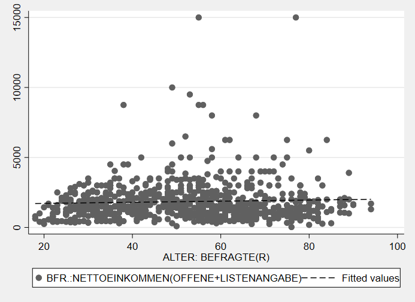
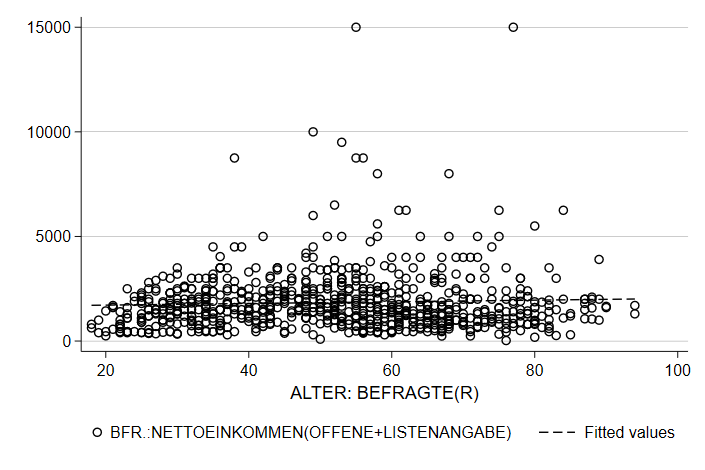

# Datenvisualisierung in Stata {#dataviz} 

```{r setup5, echo = F, message=F, warning = F}
.libPaths("D:/R-library")
knitr::opts_chunk$set(collapse = TRUE)
library(Statamarkdown)
```

Wir starten wie immer mit dem Einlesen eines Datensatzes:
```{stata load, echo = T,collectcode=TRUE}
use "D:\Studium\01_Oldenburg\Lehre\Datensaetze\Allbus_2018.dta", clear
replace inc = . if inc < 0
replace age = . if age < 0
sample 25 //25% Stichprobe aus den Daten -> läuft schneller
```

Für Grafiken gilt noch mehr als für alle anderen Aspekte in Stata: ausprobieren und sehen, was passiert! Nachdem in der Regel ja zumindest eine ungefähre Vorstellung existiert, wie die zu erstellende Grafik aussehen soll, sind Grafik-Gallerieren ein guter Startpunkt das eigene Trial & Error.

Eine Übersicht zu allen verfügbaren Visualierungen inklusive Beispielbefehlen findet sich beispielsweise [hier](https://www.stata.com/support/faqs/graphics/gph/stata-graphs/) oder [hier](https://www.stata.com/features/example-graphs/).


## Grafik-Syntax in Stata

In Anlehung an die 

Die Syntax für Graphiken in Stata unterscheidet sich vom dem bisher Kennengelernten. 

### Aufbau 
Grafik-Befehle bestehen aus zwei Teilen: dem Befehl `graph` und der Angabe eines Grafik-Typs. Im folgenden Befehl ist `box` der Grafik-Typ:  

```{stata box1, echo=1, results="hide"}
graph box inc
graph export "05_box.png", replace
```

```{r box1_plot, echo = F,out.width = "80%",fig.height= 4.5, fig.align="center"}
knitr::include_graphics("05_box.png")
```


### twoway
Beim Grafik-Typ `twoway` muss der sog. Plottyp, spezifiziert werden. Bspw. für ein Streudiagramm mit dem Befehl `scatter`:

```{stata twoway1, echo=1, results="hide"}
graph twoway scatter age inc
graph export "05_twoway1.png", replace
```

```{r twoway1_plot, echo = F,out.width = "80%",fig.height= 4.5, fig.align="center"}
knitr::include_graphics("05_twoway1.png")
```


### Kombinieren von zwei twoway-Grafiken
`twoway`-Grafiken  können übereinander gelegt werden. So können wir durch Kombination der Plottypen `scatter` und `lfit` ein Streudiagram mit einer Regressionsgerade[^51] kombinieren:
 `graph twoway (scatter age inc) (lfit age inc)`
Eine alternative Schreibweise mit `||` führt zur gleichen Grafik:
`graph twoway scatter age inc || lfit age inc`

```{stata twoway2, echo = F,results="hide",collectcode=TRUE}
graph twoway (scatter age inc) (lfit age inc)
graph export "05_line_scatter.png", replace
```

```{r twoway2_plot, echo = F,out.width = "80%",fig.height= 4.5, fig.align="center"}
knitr::include_graphics("05_line_scatter.png")
```
 
[^51]: Was genau das ist, werden wir am Donnerstag genauer besprechen. Für den Moment nur so viel: die Gerade gibt den Zusammenhangstrend beider Variablen wieder.

### Optionen
Optionen von `graph` können Unteroptionen haben oder aus einer Liste von Optionen zusammengesetzt werden. Hier zwei Beispiele: `xlabel(#20, angle(90))` oder `xscale(range(0 300) reverse alt)`.

### Vorlagen
Das Aussehen von Grafiken wird durch sog. Grafik-Schemata beeinflusst. Die Änderung des Grafik-Schemas kann dieselbe Grafik mit einem deutlich anderen Aussehen erzeugen.

```{stata theme, echo = F,results="hide",collectcode=TRUE}
graph twoway (scatter age inc) (lfit age inc), scheme(economist)
graph export "05_line_scatter_theme.png", replace
```

```{r theme_plot, echo = F,out.width = "80%",fig.height= 4.5, fig.align="center"}

```

Weitere Optionen bieten zB die [blindschemes](https://www.stata-journal.com/article.html?article=gr0070) von Daniel Bischof oder [lean2](https://www.stata-journal.com/sjpdf.html?articlenum=gr0002) von Svend Juul. Beide müssen zunächst mit `ssc install blindschemes` bzw. `net install gr0002_3, from(http://www.stata-journal.com/software/sj4-3)` installiert werden und stehen dann zur Verfügung, zB 

Hier noch ein Beispiel mit `plotplain` aus `blindschemes`:
```{stata theme2, echo = F,results="hide",collectcode=TRUE}
graph twoway (scatter age inc) (lfit age inc), scheme(plotplain)
graph export "05_line_scatter_theme2.png", replace
```

```{r theme_plot2, echo = F,out.width = "80%",fig.height= 4.5, fig.align="center"}
knitr::include_graphics("05_line_scatter_theme2.png")
```

...und `lean2`:

```{stata theme3, echo = F,results="hide",collectcode=TRUE}
graph twoway (scatter age inc) (lfit age inc), scheme(lean2)
graph export "05_line_scatter_theme3.png", replace
```

```{r theme_plot3, echo = F,out.width = "80%",fig.height= 4.5, fig.align="center"}

```

 Eine Übersicht zu 

`help schemes`

### Farben

[Instagram](https://www.instagram.com/colours.cafe/)

[ColorBrewer](https://colorbrewer2.org)

[colorhex](https://www.color-hex.com/)


## Abschließendes Beispiel
```{stata loadbp, echo=2, results="hide",collectcode=TRUE}
webuse bpwide, clear
```

```{stata fancy_bpplot, echo=2, results="hide",collectcode=TRUE}
graph box bp_before bp_after, over(agegrp) box(1, color("0 0 128"))  scheme(lean2) ytitle("{stSerif:Blutdruck}{superscript:XX}") 
title("Blutdruckdaten ({it:fiktiv})") caption("{bf:Quelle}: Stata-Daten {it:bpwide}, ein fiktives Beispiel") 
graph export "05_boxplot.png", replace
```

```{r boxplot, echo = F,out.width = "80%",fig.height= 4.5, fig.align="center"}
knitr::include_graphics("05_boxplot.png")
```


