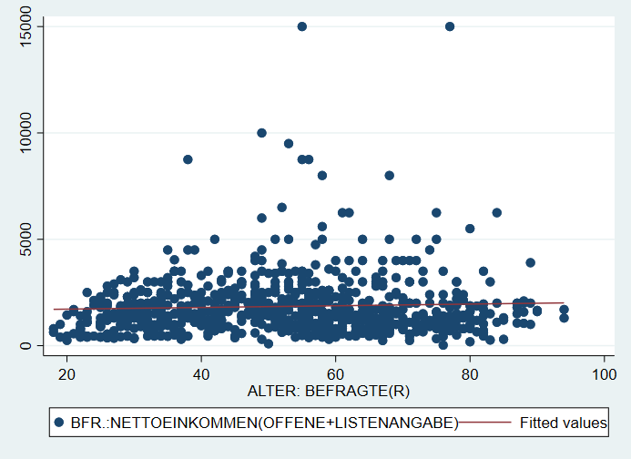

# Datenvisualisierung in Stata {#dataviz} 

```{r setup5, echo = F, message=F, warning = F}
# .libPaths("D:/R-library")
knitr::opts_chunk$set(collapse = TRUE)
library(Statamarkdown)
```

Wir starten wie immer mit dem Einlesen eines Datensatzes:
```{stata load, echo = T, eval = F}
cd "..."
use "Allbus_2018.dta", clear
replace inc = . if inc < 0
replace age = . if age < 0
sample 25 //25% Stichprobe aus den Daten -> läuft schneller
```

Für Grafiken gilt noch mehr als für alle anderen Aspekte in Stata: ausprobieren und sehen, was passiert! Nachdem in der Regel ja zumindest eine ungefähre Vorstellung existiert, wie die zu erstellende Grafik aussehen soll, sind Grafik-Gallerieren ein guter Startpunkt das eigene Trial & Error.

Eine Übersicht zu allen verfügbaren Visualierungen inklusive Beispielbefehlen findet sich beispielsweise [hier](https://www.stata.com/support/faqs/graphics/gph/stata-graphs/) oder [hier](https://www.stata.com/features/example-graphs/).


## Grafik-Syntax in Stata

In Anlehung an die 

Die Syntax für Graphiken in Stata unterscheidet sich vom dem bisher Kennengelernten. 

### Aufbau 
Grafik-Befehle bestehen aus zwei Teilen: dem Befehl `graph` und der Angabe eines Grafik-Typs. Im folgenden Befehl ist `box` der Grafik-Typ:  

```{stata box1, echo=1, results="hide", eval = F}
graph box inc
graph export "05_box.png", replace
```

```{r box1_plot, echo = F,out.width = "80%",fig.height= 4.5, fig.align="center"}
knitr::include_graphics("05_box.png")
```


### twoway
Beim Grafik-Typ `twoway` muss der sog. Plottyp, spezifiziert werden. Bspw. für ein Streudiagramm mit dem Befehl `scatter`:

```{stata twoway1, echo=1, results="hide", eval = F}
graph twoway scatter inc age
graph export "05_twoway1.png", replace
```

```{r twoway1_plot, echo = F,out.width = "80%",fig.height= 4.5, fig.align="center"}
knitr::include_graphics("05_twoway1.png")
```


### Kombinieren von zwei twoway-Grafiken
`twoway`-Grafiken  können übereinander gelegt werden. So können wir durch Kombination der Plottypen `scatter` und `lfit` ein Streudiagram mit einer Regressionsgerade[^51] kombinieren:
 `graph twoway (scatter inc age) (lfit inc age)`
Eine alternative Schreibweise mit `||` führt zur gleichen Grafik:
`graph twoway scatter inc age || lfit inc age`

```{stata twoway2, echo = F,results="hide",eval = F}
graph twoway (scatter inc age) (lfit inc age)
graph export "05_line_scatter.png", replace
```

```{r twoway2_plot, echo = F,out.width = "80%",fig.height= 4.5, fig.align="center"}

```
 
[^51]: Was das genau ist, werden wir am Donnerstag besprechen. Für den Moment nur so viel: die Gerade gibt den Zusammenhangstrend beider Variablen wieder.


### Vorlagen
Das Aussehen von Grafiken wird durch sog. Grafik-Schemata beeinflusst. Beispielsweise wird mit `, scheme(sj)`  die Grafik nach den Vorlage des Stata Journals erstellt:


```{stata theme, echo = 1,results="hide", eval = F}
graph twoway (scatter inc age) (lfit inc age), scheme(sj)
graph export "05_line_scatter_theme.png", replace
```

```{r theme_plot, echo = F,out.width = "80%",fig.height= 4.5, fig.align="center"}
knitr::include_graphics("05_line_scatter_theme.png")
```

Mit `graph query, schemes` wird eine Liste der verfügbaren Schemata angezeigt.


Weitere Optionen bieten zB die [blindschemes](https://www.stata-journal.com/article.html?article=gr0070) von Daniel Bischof oder [lean2](https://www.stata-journal.com/sjpdf.html?articlenum=gr0002) von Svend Juul. Beide müssen zunächst mit `ssc install blindschemes` bzw. `net install gr0002_3, from("http://www.stata-journal.com/software/sj4-3")` installiert werden und stehen dann zur Verfügung, zB 

Hier noch ein Beispiel mit `plotplain` aus `blindschemes`:
```{stata theme2, echo = 1,results="hide", eval = F}
graph twoway (scatter inc age) (lfit inc age), scheme(plotplain) legend(cols(2) pos(6))
graph export "05_line_scatter_theme2.png", replace
```

```{r theme_plot2, echo = F,out.width = "80%",fig.height= 4.5, fig.align="center"}
knitr::include_graphics("05_line_scatter_theme2.png")
```

...und `lean2`:

```{stata theme3, echo = 1,results="hide", eval = F}
graph twoway (scatter inc age) (lfit inc age), scheme(lean2) ///
  legend(cols(2) pos(6))
graph export "05_line_scatter_theme3.png", replace
```

```{r theme_plot3, echo = F,out.width = "80%",fig.height= 4.5, fig.align="center"}
knitr::include_graphics("05_line_scatter_theme3.png")
```


### Optionen

Darüber hinaus kann die Grafik mit Hilfe von spezifischen Optionen angepasst werden. 

+ `legend`
  + `pos`
  + labeln

+ Achsenoptionen `xlabel`, `ylabel`, `xtitle`

+ `over`

+ Darstellungstypen
  + Symbole/Linientypen
  +

+ Farboptionen `mcolor`, `lcolor`, `graphregion(color(orange))` 

Optionen von `graph` können Unteroptionen haben oder aus einer Liste von Optionen zusammengesetzt werden. Hier zwei Beispiele: `xlabel(#20, angle(90))` oder `xscale(range(0 300) reverse alt)`.

### Farben

Obwohl es um Darstellungen geht, haben wir noch sehr wenig über Farben gesprochen. 

[Instagram](https://www.instagram.com/colours.cafe/)

[ColorBrewer](https://colorbrewer2.org)

[colorhex](https://www.color-hex.com/)


### Subgruppen

```{stata colored_scatter, echo=1, results="hide", eval = F}
graph twoway  ( scatter  inc age if sex == 1 , mc("0 62 81") msymbol(o) ) ( scatter  inc age if sex == 2 , mc("254 216 128") msymbol(o)  ) ///
, scheme(lean2) legend(off) xtitle("")
```
```{stata colored_scatter_ex, echo=F, results="hide",eval = F}
graph export "05_bunter_scatter.png", replace
```

```{r colored_scatter_print, echo = F,out.width = "80%",fig.height= 4.5, fig.align="center"}
knitr::include_graphics("05_bunter_scatter.png")
```


```{stata colored_line_scatter, echo=1, results="hide", eval = F}
graph twoway  ( scatter  inc age if sex == 1 , mc("0 62 81") msymbol(o) ) ( scatter  inc age if sex == 2 , mc("254 216 128") msymbol(o)  ) ( lfit  inc age if sex == 1 , lc("black") ) ( lfit  inc age if sex == 2 , lc("orange") msymbol(o)  ) ///
, scheme(lean2) legend(off) xtitle("")
```
```{stata colored_line_scatter_ex, echo=F, results="hide",eval = F}
graph export "05_bunter_line_scatter.png", replace
```

```{r colored_line_scatter_print, echo = F,out.width = "80%",fig.height= 4.5, fig.align="center"}
knitr::include_graphics("05_bunter_line_scatter.png")
```

## Abschließende Beispiele


Hier noch ein Beispiel mit (sehr) vielen Optionen als Vorlage für eigene Anpassungen ([DoFile](#aufb1)):
```{stata fancy_bpplot, eval=F, results="hide",collectcode=F, eval = F}
graph box inc_m inc_f, over(age_c) scheme(lean1) box(1, color("0 41 93")) marker(1, mcolor("0 41 93")  msymbol("o") ) medline(lcolor("204 175 105")) box(2, color("146 143 107")) marker(2, mcolor("146 143 107")  msymbol("o") ) legend(cols(2) pos(12) region(fcolor("249 247 241") lcolor("16 74 138"))) ytitle("{stSerif:Einkommen}{superscript:2018}") b1title("Alter") title("Einkommen") caption("{bf:Quelle}: Allbus 2018 {it:eigene Berechnungen}",position(5)) plotregion(fcolor("252 251 248")) graphregion(fcolor("249 247 241")) 
```


```{r boxplot, echo = F,out.width = "80%",fig.height= 4.5, fig.align="center"}
knitr::include_graphics("05_boxplot.png")
```

Auch die Darstellung auf der Startseite dieses Skripts wurde mit als Stata-Grafik erstellt:

```{stata loadbp, echo=T, results="hide",collectcode=F}
webuse bpwide, clear
```
```{stata titelbild, eval = F}
graph twoway  (lfit bp_before bp_after) ( scatter bp_before bp_after if agegrp == 1, mc("0 62 81") msymbol(o) ) ( scatter bp_before bp_after if agegrp == 2, mc("0 125 186") msymbol(o)  ) ( scatter bp_before bp_after if agegrp == 3, mc("214 210 196") msymbol(o)  ), scheme(lean2) legend(off) xtitle("")
```

```{r titelbild_include, echo = F,out.width = "80%",fig.height= 4.5, fig.align="center"}
knitr::include_graphics("00_scatter.png")
```

## Bevölkerungspyramide

Auch eine Bevölkerungspyramide lässt sich als Stata-Grafik erstellen. 

## Abschließende Bemerkungen

Häufig ist die größte Herausforderung, die Daten so umzustellen, dass sie zum gewünschten `graph`-Befehl passen.


## Anhang


### Aufbereitung für Boxplot {#aufb1}
```{stata, eval = F, echo = T}
use "D:\Studium\01_Oldenburg\Lehre\Datensaetze\Allbus_2018.dta", clear
replace inc = . if inc < 0
replace age = . if age < 0

egen age_c = cut(age), at(20,35,50,65)
lab def agec1 20 "20-34" 35 "35-49" 50 "50-64"
lab val age_c agec1
gen inc_m = inc if sex == 1
gen inc_f = inc if sex == 2
lab var inc_m "Männer"
lab var inc_f "Frauen"
```