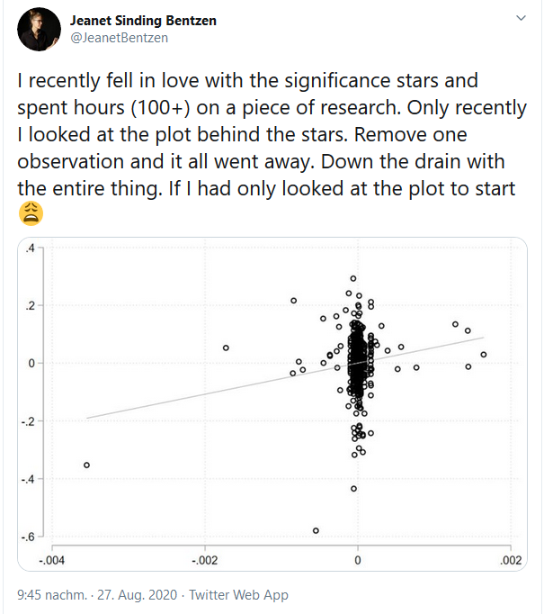
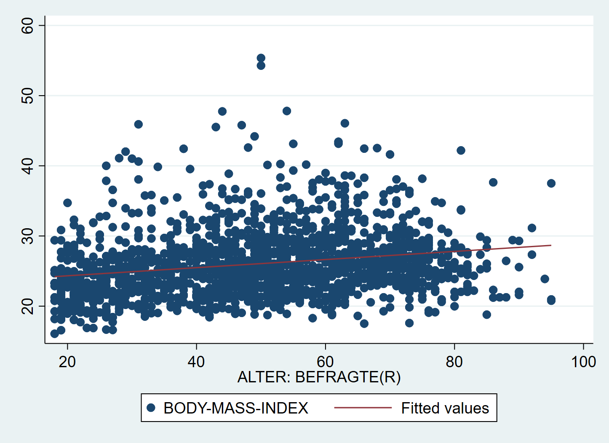
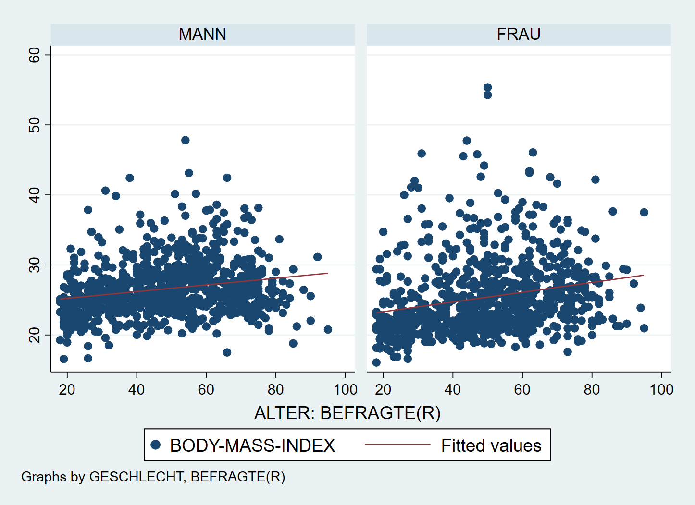
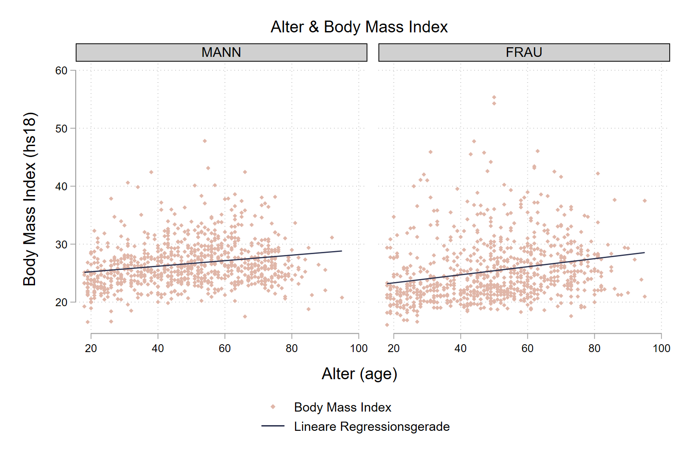
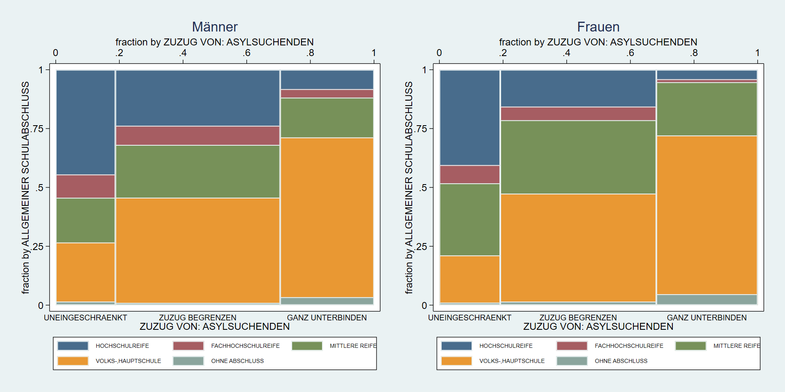
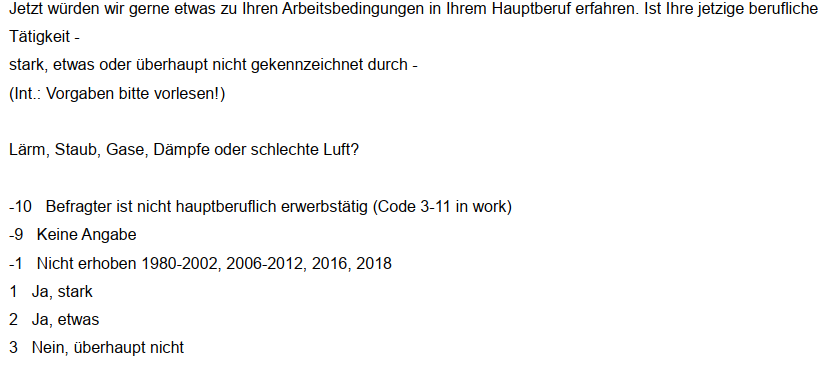
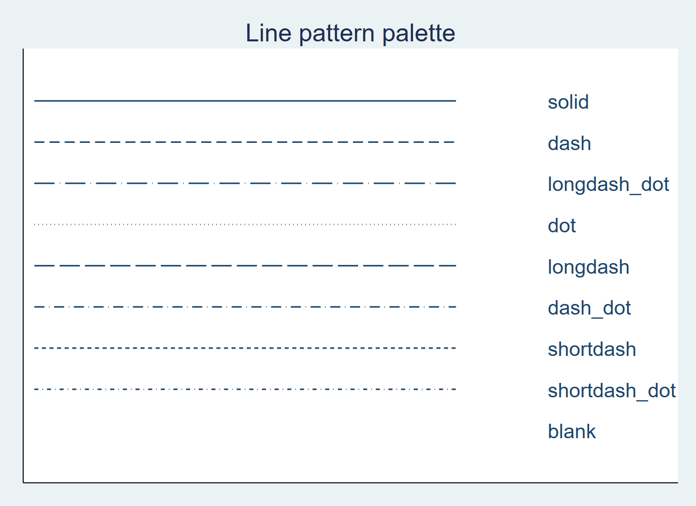

# Zusammenhänge 2 {#zshg2}

```{r setup6, echo = F, message=F, warning = F}
.libPaths("D:/R-library4")
knitr::opts_chunk$set(collapse = F)
library(Statamarkdown)
```

Wir betrachten nochmal das Beispiel aus der vorherigen Session:
```{stata readin71, eval = F}
cd ""
use  Allbus_1980-2018.dta   
keep if year == 2012
mvdecode age hs18, mv(-32 -13)
```
```{stata readin1b, echo= F}
qui cd "D:\Studium\01_Oldenburg\Lehre\Datensaetze"
qui use  "Allbus_1980-2018.dta",clear
keep if year == 2012
mvdecode age hs18, mv(-32 -13)
```

## Zusammenhänge vergleichen

Wir können die Zusammenhangsmaße auch jeweils nur für Subgruppen berechnen, indem wir mit `if` entsprechende Bedingungen anhängen. So könnten wir zB. analysieren ob der Zusammenhang zwischen dem BMI (`hs18`) und `age` für Frauen oder Männer stärker ist, indem wir an alle Variablen jeweils `if sex ==1` zur Auswahl der männlichen Befragten bzw. `if sex ==2` für Frauen anhängen:

```{stata bmiM, eval = F}
corr age hs18 if sex == 1
```

```{stata bmiM2, echo= F}
qui cd "D:\Studium\01_Oldenburg\Lehre\Datensaetze"
qui use  "Allbus_1980-2018.dta",clear
qui keep if year == 2012
qui mvdecode age hs18, mv(-32 -13)
corr age hs18 if sex == 1
```

```{stata bmiF, eval = F}
corr age hs18 if sex == 2
```

```{stata bmiF2, echo= F}
qui cd "D:\Studium\01_Oldenburg\Lehre\Datensaetze"
qui use  "Allbus_1980-2018.dta",clear
qui keep if year == 2012
qui mvdecode age hs18, mv(-32 -13)
corr age hs18 if sex == 2
```   

Der Zusammenhang zwischen Alter und BMI ist bei Frauen also (etwas) stärker als bei Männern.

Ebenso können wir `if` auch für die Regressionsbefehle verwenden:

```{stata regM, eval = F}
reg age hs18 if sex == 1, noheader
```

```{stata regM2, echo= F}
qui cd "D:\Studium\01_Oldenburg\Lehre\Datensaetze"
qui use  "Allbus_1980-2018.dta",clear
keep if year == 2012
qui mvdecode age hs18, mv(-32 -13)
reg age hs18 if sex == 1, noheader
```   

```{stata regF, eval = F}
reg age hs18 if sex == 2, noheader
```

```{stata regF2, echo= F}
qui cd "D:\Studium\01_Oldenburg\Lehre\Datensaetze"
qui use  "Allbus_1980-2018.dta",clear
keep if year == 2012
qui mvdecode age hs18, mv(-32 -13)
reg age hs18 if sex == 2, noheader
```   

Während bei Männern also mit einem zusätzlichen Lebensjahr ein um `0.9419718` höherer BMI einher geht, hat die entsprechende Regressionsgerade bei Frauen eine Steigung von `0.7281134`.


## Zusammenhänge visualisieren

Neben der Berechnung der Zusammenhangsmaße empfiehlt es sich immer, einen Blick auf die graphische Darstellung zu werfen:

```{r reg_fail, echo = F,out.width = "70%",out.height="70%", fig.align="center"}

```
[Quelle](https://twitter.com/JeanetBentzen/status/1299070496059928576)

In für metrische Zusammenhänge hilft ein Scatterplot, zusätzlich können wir mit `lfit` die Regressionsgerade einzeichnen lassen. Dazu nutzen wir die in Kap4 gezeigte Funktion der aufeinander gelegten `twoway` Grafiken:

```{stata lfit, eval = F}
graph twoway (scatter hs18 age) (lfit hs18 age)
```


```{r scatter_lfit, echo = F,out.width = "80%",out.height="80%", fig.align="center"}

```

Auch hier können wir dann mit `by(sex)` zwei Facetten erstellen um so den Vergleich des Zusammenhangs bei Männern und Frauen auch grafisch nachzuvollziehen:
```{stata scatter_bysex, eval = F}
graph twoway (scatter hs18 age) (lfit hs18 age), by(sex)
```

```{r scatter_lfit_bysex2, echo = F,out.width = "80%",out.height="80%", fig.align="center"}

```

Auch hier können wir einige Anpassungen vornehmen - die Farbe und den Stil der Geraden können wir `lcolor` und `lpattern` anpassen. Weitere Optionen für `lpattern` gibt es [hier](#lpattern).
```{stata fancy, eval = F}
graph twoway ///
	(scatter hs18 age, color("224 182 168") msize(vsmall) msymbol(d)) ///
	(lfit hs18 age, lcolor("41 48 78") lpattern(solid) ) /// 
	, by(sex,title("Alter & Body Mass Index") note("")) ///
	scheme(plotplain) ///
	ytitle("Body Mass Index (hs18)") xtitle("Alter (age)") ///
	legend(lab(1 "Body Mass Index") lab(2 "Lineare Regressionsgerade"))
```


```{r scatter_lfit_fancy, echo = F,out.width = "100%",out.height="100%", fig.align="center"}

```

Wir sehen hier also, dass die berechneten Zusammenhänge erfreulicherweise nicht auf einzelne Ausreißer zurückzuführen sind. 


***

[Übung 1](#met_vgl)

***


## Kategoriale Zusammenhänge

Auch die Zusammenhangsmaße für kategoriale und nominale Variablen können wir mit `if` vergleichen. Auch hier nochmal die Beispiele aus Kapitel 5:

### Ordinale Zusammenhangsmaße vergleichen

```{stata spearmM, eval = F}
spearman educ mi02 if sex == 1
```

```{stata spearmMT, echo = F}
qui cd "D:\Studium\01_Oldenburg\Lehre\Datensaetze"
qui use  "Allbus_1980-2018.dta",clear
qui keep if year == 1990
qui mvdecode educ, mv(-9 6 7)
qui mvdecode mi02, mv(-9 -8 -7)
spearman educ mi02 if sex== 1
```


```{stata spearmF, eval = F}
spearman educ mi02 if sex == 2
```

```{stata spearmFT, echo = F}
qui cd "D:\Studium\01_Oldenburg\Lehre\Datensaetze"
qui use  "Allbus_1980-2018.dta",clear
qui keep if year == 1990
qui mvdecode educ, mv(-9 6 7)
qui mvdecode mi02, mv(-9 -8 -7)
spearman educ mi02 if sex== 2
```

Wir finden also bei Frauen mit `-0.4027` einen stärkeren (negativen) Zusammenhang zwischen der Schulbildung der Einstellung zum Zuzug von Asylsuchenden als bei Männern mit `-0.3463`: eine höhere Schulbildung geht bei Frauen stärker mit einer positiveren Haltung gegenüber dem Zuzug von Asylsuchenden einher als bei Männern.

Dieses Bild setzt sich auch bei Kendall's $\tau$ und Goodman & Kruskal's $\gamma$ fort:
```{stata tauM, eval = F}
ktau educ mi02 if sex == 1
```
```{stata tauM2, echo = F}
set linesize 90
qui cd "D:\Studium\01_Oldenburg\Lehre\Datensaetze"
qui use  "Allbus_1980-2018.dta",clear
qui keep if year == 1990
qui mvdecode educ, mv(-9 6 7)
qui mvdecode mi02, mv(-9 -8 -7)
ktau educ mi02 if sex == 1
```
```{stata tauFxx, eval = F}
ktau educ mi02 if sex == 2
```
```{stata tauF2xx, echo = F}
set linesize 90
qui cd "D:\Studium\01_Oldenburg\Lehre\Datensaetze"
qui use  "Allbus_1980-2018.dta",clear
qui keep if year == 1990
qui mvdecode educ, mv(-9 6 7)
qui mvdecode mi02, mv(-9 -8 -7)
ktau educ mi02 if sex == 2
```


```{stata tauFM, eval = F}
tab educ mi02 if sex == 1, gamma nofreq
```
```{stata tauFM2, echo = F}
set linesize 90
qui cd "D:\Studium\01_Oldenburg\Lehre\Datensaetze"
qui use  "Allbus_1980-2018.dta",clear
qui keep if year == 1990
qui mvdecode educ, mv(-9 6 7)
qui mvdecode mi02, mv(-9 -8 -7)
tab educ mi02 if sex == 1, gamma nofreq
```


```{stata tauF, eval = F}
tab educ mi02 if sex == 2, gamma nofreq
```
```{stata tauF2, echo = F}
set linesize 90
qui cd "D:\Studium\01_Oldenburg\Lehre\Datensaetze"
qui use  "Allbus_1980-2018.dta",clear
qui keep if year == 1990
qui mvdecode educ, mv(-9 6 7)
qui mvdecode mi02, mv(-9 -8 -7)
tab educ mi02 if sex == 2, gamma nofreq
```


### Vergleich visualisieren
Zu grafischen Untersuchung empfiehlt ein Mosaikplot (`spineplot`) - leider funktioniert `by(sex)` hier nicht. Um trotzdem eine  sodass wir zwei separate Grafiken erstellen und diese dann mit `graph combine` kombinieren können. Dazu geben wir jeweils mit `names()` einen Namen für die Grafik um sie dann in `graph combine` wieder aufzurufen:

```{stata mosaik_bysex, eval = F}
spineplot educ mi02 if sex == 1, name("men", replace)   ///
  legend(pos(6) size(vsmall) rows(2)) /// legende in zwei Zeilen unten anzeigen
  xlabel(,labsize(small) axis(2) ) /// x-Achsenbeschriftung unten klein
  title("Männer") // Titel

spineplot educ mi02 if sex == 2, name("women", replace) ///
  legend(pos(6) size(vsmall) rows(2)) ///
  xlabel(,labsize(small) axis(2) ) ///
  title("Frauen")

graph combine men women, rows(1) iscale(*.95) xsize(4) ysize(2) 
```


```{r mosaik_bysex_p,echo = F,out.width = "100%",out.height="100%", fig.align="center"}

```

Hier noch eine Erklärung zu den Optionen in `graph combine`:

+ `rows(1)`  Anzahl der Zeilen
+ `iscale(*.95)` Vergrößern/Verkleinern der Schrift (hier verkleinern, da Faktor<1)
+ `xsize(4) ysize(2)`  Ausdehnung der kombinierten Grafik: hier doppelt so breit wie hoch 

***

[Übung 2](#ord_vgl)

***

### Nominale Zusammenhangsmaße vergleichen

Ebenso können wir auch nominale Maße vergleichen, indem wir zur Berechnung der Odds Ratios und $\chi^2$ separate Tabellen für Männer und Frauen verwenden. Wir sehen uns nochmal die Haushaltsgröße und den Haustierbesitz an:
```{stata, chitabM1, eval =F}
cd ""
use  "Allbus_1980-2018.dta",clear
keep if year == 2014 & dh01 > 0 & dh04 > 0 & aq03 > 0
gen aq03b = (aq03 == 4) // Dummy: Haustier ja (0) oder nein (1)
tab aq03b dh04 if sex == 1, chi
```
```{stata, chitabM2, echo =F}
set linesize 200
qui cd "D:\Studium\01_Oldenburg\Lehre\Datensaetze"
qui use  "Allbus_1980-2018.dta",clear
qui keep if year == 2014 & dh04 > 0 & aq03 > 0
qui gen aq03b = (aq03 == 4) // Dummy: Haustier ja (0) oder nein (1)
tab aq03b dh04 if sex == 1, chi wrap
```

$$\upsilon_{M} = \sqrt{\frac{\chi^2}{n*\,min(k-1,m-1)}}=\sqrt{\frac{76.7064}{1748}} = 0.20948122$$

```{stata, vcalcM, echo =T}
dis sqrt(76.7064/1748)
```


```{stata, chitabF1, eval =F}
tab aq03b dh04 if sex == 2, chi
```
```{stata, chitabF2, echo =F}
set linesize 200
qui cd "D:\Studium\01_Oldenburg\Lehre\Datensaetze"
qui use  "Allbus_1980-2018.dta",clear
qui keep if year == 2014 & dh04 > 0 & aq03 > 0
qui gen aq03b = (aq03 == 4) // Dummy: Haustier ja (0) oder nein (1)
tab aq03 dh04 if sex == 2, chi wrap
```


$$\upsilon_{F} = \sqrt{\frac{\chi^2}{n*\,min(k-1,m-1)}}=\sqrt{\frac{70.0439}{1698*3}} = 0.3517847$$

```{stata, vcalcF, echo =T}
dis sqrt( 70.0439/1698*3 )
```  

Der Zusammenhang zwischen Haustierbesitz und 1-Personenhaushalten ist also bei Frauen stärker als bei Männern - während bei Männern nur ein geringer Zusammenhang besteht, ist dieser bei Frauen mit 0.35 schon als mittlerer Zusammenhang zu bezeichnen (siehe Kap5).


***

[Übung 3](#nom_vgl)

***

## Übungen 6

### Übung 6-1 {#met_vgl}

(@) Laden Sie den kumulierten Allbus-Datensatz (`Allbus2018.dta`) und vergleichen Sie den Zusammenhang zwischen dem Alter (`age`) und dem täglichen Fernsehkonsum in Minuten (`lm02`)!
    + Vergessen Sie nicht, die Missings/negativen Werte für beide Variablen mit `mvdecode` zu überschreiben oder mit `keep`/`drop` auszuschließen.
    + Berechnen Sie Korrelation zwischen beiden Merkmalen für Männer und Frauen. Für welche Gruppe findet sich ein stärkerer Zusammenhang?
    + Berechnen Sie ebenfalls für beide Gruppen ein Regressionsmodell zur Vorhersage des Fernsehkonsums auf Basis des Alters. 
    + Welche Fernsehdauer würden Sie auf Basis dieser Modelle jeweils für 30- und 31-jährige Männer und Frauen vorhersagen?
    + Erstellen Sie einen Scatterplot für den Zusammenhang, welcher zwischen Männern und Frauen unterscheidet!
    + Fallen Ihnen Ausreißer auf, die evtl. den Zusammenhang maßgeblich beeinflussen?


### Übung 6-2 {#ord_vgl}

(@) Laden Sie den **kumulierten** Allbusdatensatz (`Allbus_1980-2018.dta`) in Stata und wählen Sie die Befragten aus dem Jahr 2016 aus! Untersuchen Sie den Zusammenhang zwischen der Bildung der Befragten `educ` und berichteten Belastung durch Lärm, Gase und schlechte Luft am Arbeitsplatz!
    + Vergessen Sie nicht, die Missings/negativen Werte für beide Variablen mit `mvdecode` zu überschreiben oder mit `keep`/`drop` auszuschließen.
    + Erstellen Sie eine Kontingenztabelle, um zu kontrollieren, ob alle negativen Werte ausgeschlossen wurden.
    + Berechnen Sie den Rangkorrelationskoeffizienten nach Spearman.
    + In welche Richtung deutet der Zusammenhang? Sind Befragte mit höherem Schulabschluss eher belastet als Befragte mit niedrigerem Bildungsabschluss?
    + Berechnen Sie die passenden Zusammenhangsmaße getrennt für Männer und Frauen!
    + Wie stark ist der Zusammenhang jeweils? 
    + Was zeigt Ihnen der Vergleich zwischen den Gruppen?
    + Erstellen Sie mit `spineplot` einen Mosaikplot für den Zusammenhang zwischen `educ` und `hw01` bei männlichen Befragten
    + Erstellen Sie mit `spineplot` einen Mosaikplot für den Zusammenhang zwischen `educ` und `hw01` bei weiblichen Befragten
    + Kombinierten Sie die beiden Plots mit `graph combine`

Hier die Frage zu `hw01` aus dem Codebuch:
```{r codebuch_hw01, echo = F,out.width = "80%",out.height="80%", fig.align="center"}

```


### Übung 6-3 {#nom_vgl}

(@) Laden Sie den kumulierten Allbus-Datensatz (`Allbus_1980-2018.dta`) und wählen Sie die Befragten aus dem Jahr 2010 aus. Untersuchen Sie den Zusammenhang zwischen dem Wohnort alte/neue Bundesländer (`eastwest`) und der Frage, ob die Befragten vor der Heirat mit ihrem späteren Partner zusammenlebten (`df01`). 
  + Denken Sie daran, für beide Variablen die negativen Werte mit `.` zu überschreiben.
  + Erstellen Sie die passende Kontingenztabelle und berechnen Sie $\chi^2$ für alle Beobachtungen.
  + Erstellen Sie dann die Tabelle separat für Befragte unter 40 (`age < 40`) und älteren Befragten (`age >= 40`)
  + Berechnen Sie Cramér's $\upsilon$ bzw- $\phi$ für beide Gruppen!
  + Wo stellen Sie einen stärkeren Zusammenhang fest? Für welche Altersgruppen finden Sie also einen stärkeren Ost/West-Unterschied? 
  + Wie würden Sie die Zusammenhänge insgesamt einschätzen - besteht ein starker oder schwacher Ost-West-Unterschied?


### Weitere Übungen Kap 6

(@) Analysieren Sie den Zusammenhang zwischen der Bearbeitungsdauer des Politikwissensquiz (`xt11`) und dem Alter der Befragten (`age`)! Laden Sie dafür den Allbus 2018.
    + Denken Sie daran, für beide Variablen die negativen Werte mit `.` zu überschreiben.
    +  Berechnen Sie Korrelation zwischen beiden Merkmalen für Männer und Frauen. Für welche Gruppe findet sich ein stärkerer Zusammenhang?
    + Berechnen Sie ebenfalls für beide Gruppen ein Regressionsmodell zur Vorhersage des Bearbeitungszeit des Politikquiz auf Basis des Alters. 
    + Welche Bearbeitungszeit des Politikquiz würden Sie auf Basis dieser Modelle jeweils für 30- und 31-jährige Männer und Frauen vorhersagen?
    + Erstellen Sie einen Scatterplot für den Zusammenhang, welcher zwischen Männern und Frauen unterscheidet!
    + Fallen Ihnen Ausreißer auf, die evtl. den Zusammenhang maßgeblich beeinflussen?

## Anhang

### Optionen für `lpattern` {#lpattern}

```{r scatter_lfit_pattern, echo = F,out.width = "80%",out.height="80%", fig.align="center"}

```


