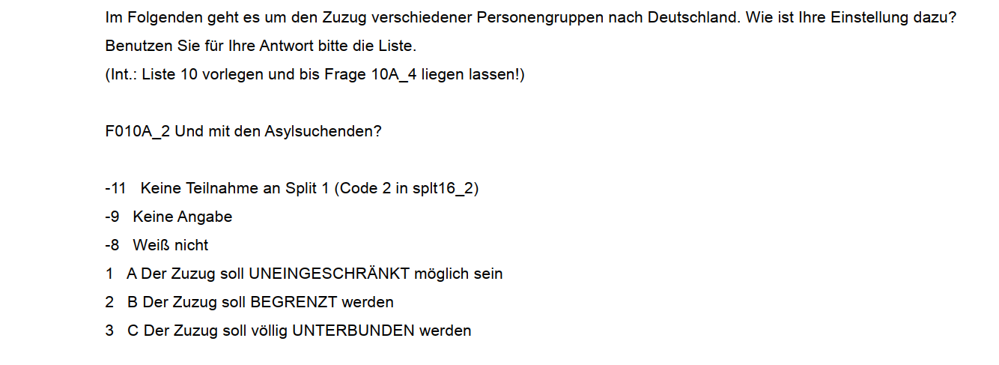

# Zusammenhangsmaße {#lin_reg}
```{r setup061, echo = F, include=FALSE}
library(patchwork)
library(tidyverse)
options(width = 200)
df <- data.frame(var1 = c(1,2,7,8),
                 var2 = c(2,4,7,6))
library(Statamarkdown)
stataexe <- "C:/Program Files (x86)/Stata13/StataSE-64.exe"
# stataexe <- "C:/Program Files/Stata16/StataSE-64.exe"
knitr::opts_chunk$set(engine.path=list(stata=stataexe))
path <- "D:/oCloud/RFS/"
ak <- readr::read_delim(paste0(path,"allbus_kumuliert_1980-2018.csv"), delim = ";", col_types = cols(.default = col_double())) %>%   mutate_all(~ifelse(.<0,NA,.))
```


## Zusammenhangsstärke für metrische Variablen

Wir sehen uns den (möglichen) Zusammenhang zwischen dem Alter und dem BMI der Befragten an. Dazu schließen wir zunächst die Missings aus:
```{stata readin1, eval = F}
cd ""
use  Allbus_1980-2018.dta   
keep if year == 2012
mvdecode age bmi, mv(-32 -13)
```
```{stata readin1b, echo= F}
use  "D:\Studium\01_Oldenburg\Lehre\Datensaetze\Allbus_1980-2018.dta",clear
keep if year == 2012
mvdecode age hs18, mv(-32 -13)
rename hs18 bmi
```


```{r s07_12, echo = F}
a12 <- ak[ak$year == 2012,] 
a12$hs18[a12$hs18<0] <- NA
a12$age[a12$age<0] <- NA
```


Zur grafischen Analyse möglicher Zusammenhänge bei metrischen Variablen empfiehlt sich ein Scatterplot:
```{r s07_15, message=F, warning=F,out.height="80%", out.width="80%", echo=F,fig.align='center'}
ggplot(a12, aes(x = age, y = hs18)) + 
  geom_point(color ="#29304E") +  
  ggthemes::theme_stata() +
  labs(title = "Alter & BMI der Befragten",
       caption = "Quelle: Allbus 2012",
       y = "BMI",
       x = "Alter")+
  theme(aspect.ratio = 1
        # , plot.background = element_rect(fill = "#f1f1ef", color = NA)
        )
```

Zur Bestimmung eines Zusammenhangs zwischen zwei metrischen Variablen empfiehlt sich der Korrelationskoeffizient nach Pearson. Dieser ist definiert als die Kovarianz dividiert durch die jeweiligen Standardabweichungen der beiden Variablen und liegt im Intervall [-1,1]. Die Standardabweichung hatten wir in Woche 5 kennengelernt, die Kovarianz erfasst die Lage der Datenpunkte relativ zu den Mittelwerten der beiden interessierenden Variablen (liegen Punkte > $\bar{x}$ auch $>\bar{y}$?):

```{r s07_15b, message=F, warning=F, out.height="80%", out.width="80%", echo=F,fig.align='center'}
eq1 <-  substitute(italic(bar(x))) # formel erstellen
eq2 <-  substitute(italic(bar(y))) # formel erstellen

ggplot(a12, aes(x = age, y = hs18)) + 
  geom_point(color ="#29304E") + 
  geom_vline(aes(xintercept = mean(age,na.rm = T)), color = "#19D4EE", size = .75) +
  geom_hline(aes(yintercept = mean(hs18,na.rm = T)),color = "#2473D5", size = .75) +
  geom_text(data = data.frame(age = 53, hs18 = 51), aes(label = as.character(as.expression(eq1)) ),
            label.size = .01, hjust = 0.5, color = prismatic::clr_darken("#19D4EE"), parse = T, size = 4.5) +
  geom_text(data = data.frame(age = 97, hs18 = 28), aes(label = as.character(as.expression(eq2)) ),
             label.size = .01, hjust = 0.5, 
             color = prismatic::clr_darken("#2473D5"), parse = T, size = 4.5) +
  ggthemes::theme_stata() +
  labs(title = "Alter & BMI der Befragten",
       caption = "Quelle: Allbus 2012",
       y = "BMI",
       x = "Alter")+
  theme(aspect.ratio = 1)
```
In Stata können wir den Korrelationskoeffizienten mit `corr` berechnen:
```{stata corr1,eval=F}
corr age bmi
```
```{stata corr1b, echo =F}
qui use  "D:\Studium\01_Oldenburg\Lehre\Datensaetze\Allbus_1980-2018.dta",clear
qui keep if year == 2012
qui mvdecode age hs18, mv(-32 -13)
qui rename hs18 bmi
corr age bmi
```

Es handelt sich also um einen schwachen Zusammenhang.


## Regression 

```{r, out.width = "80%",fig.height= 3.5, echo=F, fig.align="center" , eval = T, message=F}
ggplot(df, aes(x = var1, y = var2)) + geom_point(size = 3) +  ggthemes::theme_stata() +
  geom_smooth(method = "lm", color = "darkblue" , se = FALSE) +
  expand_limits(y=c(0,8),x=c(0,8)) +
  theme(aspect.ratio = 1)
```

Mit Regressionsmodellen können wir Zusammenhänge zwischen zwei metrischen Merkmalen untersuchen. In Stata können wir eine Regression mit dem `reg` Befehl berechnen:
```{stata, collectcode=F, echo = F}
use "regression_bsp.dta", clear
egen mean_var2 = mean(var2)
gen m_abw = var2 - mean_var2
qui reg var2 var1
predict pred_vorher, xb
gen res = var2 - pred_vorher 
gen res2 = res^2
set linesize 90
reg var2 var1
```

Hier steht jetzt eine ganze Menge an Informationen, die wir uns im Folgenden genauer ansehen werden.


### Beispieldatensatz
Zum Einstieg betrachten wir zunächst einen (fiktiven) Datensatz mit lediglich 4 Fällen und lediglich zwei Variablen: `var1` und `var2`: 
```{stata, eval = F}
use "https://github.com/filius23/Stata_Skript/raw/master/regression_bsp.dta", clear
list
```

```{r, echo = F}
df
```

```{r, fig.align="center",out.width = "80%",fig.height= 3.5, eval=T, echo=F}
library(ggplot2)
ggplot(df, aes(x = var1, y = var2)) + 
  geom_point(size = 2) + 
  ggthemes::theme_stata() +
  scale_y_continuous(breaks = seq(0,8,2)) +
  scale_x_continuous(breaks = seq(0,8,2)) +
  theme(aspect.ratio = 1)
```

## Idee einer Regression

Ziel der Regression ist es, den Zusammenhang zwischen diesen beiden Variablen zu bestimmen. Gibt es einen Trend, in dem Sinn, dass ein höherer Wert von `var1` mit einem höheren oder niedrigeren Wert von `var2` einhergeht?

Etwas anders gesagt könnte man auch fragen, welchen Wert für `var2` wir vorhersagen würden, wenn wir `var1` kennen. Ein Ausgangspunkt ist das arithmetische Mittel. Dieses können wir mit `mean` zB für `var2` berechnen.[^61] Diesen Wert fügen wir als neue Spalte `mean_var2` in den Datensatz ein:

[^61]: Mehr zu `egen` in Kapitel \@ref(egen)

```{stata, eval=F}
egen mean_var2 = mean(var2)
list
```
  
```{r,echo=F}
df$mean_var2 <- mean(df$var2)
df
```

```{r,out.width = "80%",fig.height= 3.5, echo=F, fig.align="center"}
ggplot(df, aes(x = var1, y = var2)) + 
  geom_point(size = 3) + 
  ggthemes::theme_stata() +
  scale_y_continuous(breaks = seq(0,8,2)) +
  scale_x_continuous(breaks = seq(0,8,2)) +
  geom_hline(aes(yintercept = mean_var2), color = "grey50", size = .75, linetype = "dashed") +
  geom_label(aes(y = 4, x = 5), label = "mean = 4.75", color = "grey30")+
  theme(aspect.ratio = 1)
```
Müssten wir eine Prognose für die Werte von `var2` abgeben, wäre das arith. Mittel eine gute Wahl. Die **vorhergesagten Werte** werden jeweils auf der Linie für das arith. Mittel liegen.   

```{r,out.width = "80%",fig.height= 3.5, echo=F, fig.align="center"}
ggplot(df, aes(x = var1, y = var2)) + 
  geom_point(size = 3) + 
  ggthemes::theme_stata() +
  scale_y_continuous(breaks = seq(0,8,2)) +
  scale_x_continuous(breaks = seq(0,8,2)) +
  geom_hline(aes(yintercept = mean_var2), color = "grey50", size = .75, linetype = "dashed") +
  geom_point(aes(x = var1, y = mean_var2), color = "darkorange", size = 3) +
  theme(aspect.ratio = 1)
```

## Residuen

Allerdings liegen wir mit dem arith. Mittel dann immer auch Stück daneben. Diese Abweichung zwischen dem tatsächlichen und dem vorhergesagten Wert wird als **Residuum** bezeichnet, in unserem Beispiel ist das jeweils die Differenz zwischen `var2` und `mean`:
$$Residuum = beobachteter\, Wert \; - \; vorhergesagter\,Wert$$
Als Formel wird das in der Regel wie folgt dargestellt:
$$\epsilon_{\text{i}} = \text{y}_{i} - \hat{\text{y}}_{i}$$

Wir können also die Residuen als Differenz zwischen `var2` und `mean` berechnen und in `df` ablegen:
```{stata, eval = F}
gen m_abw = var2 - mean_var2
list
```


```{r, echo = F}
df$m_abw <- df$var2 - df$mean
df
```

```{r,out.width = "80%",fig.height= 3.5, echo=F, fig.align="center" }
ggplot(df, aes(x = var1, y = var2)) + 
  geom_point(size = 3) + 
  ggthemes::theme_stata() +
  scale_y_continuous(breaks = seq(0,8,2)) +
  scale_x_continuous(breaks = seq(0,8,2)) +
  geom_hline(aes(yintercept = mean_var2), color = "grey50", size = .75, linetype = "dashed") +
  geom_point(aes(x = var1, y = mean_var2), color = "darkorange", size = 3) +
  geom_segment(aes(x = var1, xend = var1, y = var2, yend = mean_var2), 
               color = "red", size = .65, linetype = "dotted") +
  theme(aspect.ratio = 1)
```

*Was bedeutet also ein negativer oder ein positiver Wert für das Residuum?*

Die horizontale Linie für das arithm. Mittel ist aber sehr deutlich nicht die beste Methode, um die Werte für `var2` vorherzusagen. In der Graphik können wir deutlich sehen, dass die Werte "weiter links", also mit geringeren Werten für `var1`, auch geringere Werte für `var2` aufweisen. Wir könnten also unseren Vorhersagefehler bzw. das *Residuum* minimieren indem wir die Linie drehen. Die Idee der Regressionsanalyse ist es dabei, die Residuuen zu minimieren. Was würde aber passieren wenn wir die Residuen aus der Mittelwertsvorhersage aufsummieren, um Sie dann zu minimieren?

### Quadrierte Residuen

Mit `tabstat ..., s(sum)` können wir die Summe für eine Variable bilden:
```{stata, eval = F}
list
```

```{r, echo =F}
df
```

```{stata, eval=F}
tabstat m_abw, s(sum)
```

```{stata, echo=F}
use "regression_bsp.dta", clear
egen mean_var2 = mean(var2)
gen m_abw = var2 - mean_var2
tabstat m_abw, s(sum)
```


**Die Summe der Resiuden auf Basis des arith. Mittels ist immer Null!**    
Anders formuliert: die gestrichelten Linien nach oben sind in Summe genauso lang wie gestrichelten Linien nach unten.
Die Lösung ist die Residuen zu quadrieren. So ergibt sich eine Kennzahl, die wir minimieren können:
```{stata, eval=F}
gen m_abw2 = m_abw^2 
tabstat m_abw2, s(sum)
```
```{stata, echo=F}
use "regression_bsp.dta", clear
egen mean_var2 = mean(var2)
gen m_abw = var2 - mean_var2
qui reg var2 var1
predict pred_vorher, xb
gen res = var2 - pred_vorher 
gen res2 = res^2
set linesize 90
reg var2 var1
gen m_abw2 = m_abw^2 
tabstat m_abw2, s(sum)
```

```{r, echo = F}
df$m_abw2 <- df$m_abw^2 
df
```

```{r, echo = F}
m1 <- lm(var2~ var1, data = df)  
```

## Interpretation der Regression
  
Die Minimierung erledigt `reg` für uns. Hier geben wir zuerst das Merkmal an, das auf der y-Achse liegt (die *abhängige* Variable) und dann das Merkmal für die x-Achse (*unabhängige* Variable) an. Ein positiver Wert unter `var1` bedeutet, dass unsere Gerade von links nach rechts ansteigt und ein negativer eine fallende Linie bedeuten würde. Der Wert unter `var1` gibt an, um *wieviel sich die Gerade pro "Schritt nach rechts" nach oben/unten verändert*. Die Gerade steigt also pro Einheit von `var1` um `r m1$coefficients[2]`:

```{stata, eval=F}
reg var2 var1
```


```{stata, echo=F}
use "regression_bsp.dta", clear
qui egen mean_var2 = mean(var2)
qui gen m_abw = var2 - mean_var2
qui reg var2 var1
qui predict pred_vorher, xb
qui gen res = var2 - pred_vorher 
qui gen res2 = res^2
qui set linesize 90
reg var2 var1
```


In unserer Grafik sieht diese Gerade so aus:
```{r,out.width = "80%",fig.height= 3.5, echo=T, fig.align="center" , echo = F,warning=F,message=F}
ggplot(df, aes(x = var1, y = var2)) + 
  geom_point(size = 2) + 
  ggthemes::theme_stata() +
  geom_hline(aes(yintercept = mean_var2), color = "grey50", size = .75, linetype = "dashed") +
  scale_y_continuous(breaks = seq(0,8,2)) +
  scale_x_continuous(breaks = seq(0,8,2)) +
  geom_hline(aes(yintercept = mean_var2), color = "grey50", size = .75, linetype = "dashed") +
  geom_point(aes(x = var1, y = mean_var2), color = "darkorange", size = 3) +
  geom_segment(aes(x = var1, xend = var1, y = var2, yend = mean_var2), 
               color = "red", size = .65, linetype = "dotted") +
  geom_smooth(method = "lm", color = "darkblue" , se = FALSE) +
  theme(aspect.ratio = 1)
```


### Vorhergesagte Werte

Wie hoch ist nun der vorhergesagte Wert auf Basis der blauen Gerade? 
Die vohergesagten Werte aus `reg var2 var1` entsprechen einfach der Summe aus dem Wert unter `Intercept` und dem Koeffizienten neben `var1` multipliziert mit dem jeweiligen Wert für `var1`.[^62]

```{stata, eval=F}
reg var2 var1, noheader
```


```{stata, echo=F}
use "regression_bsp.dta", clear
qui egen mean_var2 = mean(var2)
qui gen m_abw = var2 - mean_var2
qui reg var2 var1
qui predict pred_vorher, xb
qui gen res = var2 - pred_vorher 
qui gen res2 = res^2
qui set linesize 90
reg var2 var1, noheader
```

Vorhergesagte Werte werden mit $\widehat{var2}$  bezeichnet - der ^ steht dabei für "vorhergesagt":

$$\widehat{var2}=\texttt{Intercept} + 0.5811 \times \texttt{var1}$$  
Für die erste Zeile ergibt sich also folgender vorhergesagter Wert: 2.1351+0.5811\*1= `r 2.1351+0.5811*1`

[^62]: Die Option `noheader` macht den Output von `reg` etwas übersichtlicher.

Also könnten wir mit `gen` die vorhergesagten Werte "manuell" berechnen:
```{stata, eval = F}
gen man_vorhers = 2.1351 + 0.5811 * var1
```


Die vorhergesagten Werte können wir auch mit `predict` berechnen und in einer neuen Variable `pred_vorher` ablegen:
```{stata, eval = F}
predict pred1, xb
```

```{r, echo=F}
df$man_vorhers = 2.1351 + 0.5811 * df$var1
df$pred_vorher <- m1$fitted.values
df
```
Die Grafik zeigt wie Vorhersagen auf Basis des Regressionsmodells aussehen: Sie entsprechen den Werten auf der blauen Geraden (der sog. Regressionsgeraden) an den jeweiligen Stellen für `var1`. 
```{r,out.width = "80%",fig.height= 3.5, echo=T, fig.align="center" , echo = F,warning=F,message=F}
ggplot(df, aes(x = var1, y = var2)) + geom_point(size = 3) + ggthemes::theme_stata() +
  scale_y_continuous(breaks = seq(0,8,2)) +
  scale_x_continuous(breaks = seq(0,8,2)) +
  geom_hline(aes(yintercept = mean_var2), color = "grey50", size = .75, linetype = "dashed") +
  geom_point(aes(x = var1, y = mean_var2), col = "darkorange", size = 3) +
  geom_segment(aes(x = var1, xend = var1, y = var2, yend = mean_var2), color = "red", size = .65, linetype = "dotted")  +
  geom_smooth(method = "lm", color = "darkblue" , se = FALSE) +
  geom_point(aes(x = var1, y = pred_vorher), color = "dodgerblue3", size = 3) +
  theme(aspect.ratio = 1)
```
Wir können erkennen, dass die hellblauen Punkte (also die Vorhersagen des Regressionsmodells) deutlich näher an den tatsächlichen Punkten liegen als die orangen Vorhersagen auf Basis des `mean`. 

### Residuen
Trotzdem sind auch die hellblauen Punkte nicht deckungsgleich mit den tatsächlichen Werten. Es gibt also auch hier wieder Residuen, also Abweichungen des beobachteten vom vorhergesagten Wert. Wir können diese per Hand berechnen als Differenz zwischen dem tatsächlichen und dem vorhergesagten Wert:
```{stata, eval = F}
gen res = var2 - pred_vorher 
```
Oder wir können Sie mit `predict neue_variable , residuals` erstellen:
```{stata, eval = F}
reg var2 var1 // zunächst nochmal die regression laufen lassen
predict p_res , residuals
list
```
```{r, echo=F}
df$res <- m1$residuals
df$p_res <- m1$residuals
df
df$p_res <- NULL
```

Hier sind die Residuen für `p_res` als hellblaue Linien eingezeichnet:
```{r,out.width = "80%",fig.height= 3.5, echo=F, fig.align="center" , eval = T, message=F}
ggplot(df, aes(x = var1, y = var2)) + geom_point(size = 3) + ggthemes::theme_stata() +
  geom_hline(aes(yintercept = mean_var2), color = "grey50", size = .75, linetype = "dashed") +
  geom_point(aes(x = var1, y = mean_var2), col = "darkorange", size = 3) +
  geom_segment(aes(x = var1, xend = var1, y = var2, yend = mean_var2), color = "red", size = .65, linetype = "dotted")  +
  geom_smooth(method = "lm", color = "darkblue" , se = FALSE) +
  geom_point(aes(x = var1, y = pred_vorher), color = "dodgerblue3", size = 3) +
  geom_segment(aes(x = var1, xend = var1, y = var2, yend = pred_vorher), color = "dodgerblue3", size = .65, linetype = 1) +
  theme(aspect.ratio = 1)
```
*Wie groß ist die Summe der Residuen für `lm`?*       

### Modellgüte

Um zu beurteilen, um wieviel besser unsere Gerade aus `reg` die Werte vorhersagt kann als der `mean` können wir die Summe der quadrierten Residuen vergleichen. Dazu quadrieren wir also die Residuen:
```{stata, eval = F}
gen res2 = res^2
list
```

```{r, echo = F}
df$res2 <- df$res^2
```

```{r, echo = F}
df
```

Dann können wir die Summen der quadierten Abweichungen aus der Mittelwertregel und dem Regressionsmodell vergleichen:

```{stata, collectcode = F, collapse = T}
dis 7.5625+0.5625+5.0625+1.5625 // abw2 aus Mittelwertsregel
```

```{stata, collectcode = F, collapse = T}
dis 0.5129657+0.4937911+0.6356830+0.6143170 // res2 aus regressionsmodell
```
Zum Beispiel können wir uns fragen, um wieviel sich die Summe der quadrierten Residuen verringert wenn wir statt des `mean` unser `reg`-Modell verwenden:
```{stata, collectcode = F, collapse = T}
dis 14.75 -  2.256757
```
Wenn wir diese Veränderung ins Verhältnis mit dem "Ausgangswert", also den Residuen aus der Mittelwertregel setzen, dann erhalten wir das $R^{2}$ für unser `reg`-Modell. Dieses gibt die prozentuale Verringerung der Residuen durch das `reg`-Modell im Vergleich zur Mittelwertregel an: 
```{stata}
dis (14.75 -  2.256757) / 14.75
```
Unser Regressionsmodell kann also 84,7\% der Streuung um den Mittelwert erklären. Dieser Wert wird auch als $R^2$ bezeichnet. Im Regressionsoutput können wir das $R^2$ oben rechts unter `R-squared` ablesen. 
```{stata, collectcode = T}
reg var2 var1
```
Außerdem sehen wir oben links in der Spalte `SS` die "Sum of Squares". Hier finden wir auch die Werte von oben wieder: unter Total ist die Summe der quadrierten Abweichungen der beobachteten Werte vom arith. Mittel angegeben (`14.75`, sozusagen die Summe der `m_abw2` von oben). Residual gibt die Summe der Abweichungsquadrate zwischen den beobachteten Werten und den vorhergesagten Werten der Regression (`2.256..`, Die Summe von `res2`). 


## Übungen


## Ordinale Merkmale

Ein klassisches ordinales Merkmal ist die Bildung (`educ`):
 
| `educ` | Schulabschluss |
|:----------|:---------------------------------------------------------------------------------|
| `1` | Schule beendet ohne Abschluss
| `2` | Volks-/Hauptschulabschluss bzw. Polytechnische Oberschule (8. oder 9. Klasse)
| `3` | Mittlere Reife, Realschulabschluss bzw. Polytechnische Oberschule (10. Klasse)
| `4` | Fachhochschulreife (Abschluss einer Fachoberschule etc.)
| `5` | Abitur bzw. Erweiterte Oberschule mit Abschluss 12. Klasse (Hochschulreife)

Wir sehen uns den Zusammenhang der Bildung der Befragten mit der Einstellung zum Zuzug von Asylsuchenden (`mi02`) an:

```{r s07_2,echo=F, out.height="80%", out.width="80%", fig.align="center"}

```

Wir sehen uns den (möglichen) Zusammenhang zwischen diesen beiden Merkmalen an. Dazu schließen wir zunächst die Missings aus. Außerdem überschreiben die wie Kategorien "noch Schüler" und "anderer Schulabschluss" mit `NA` um eine klare ordinale Rangfolge für `educ` zu erhalten (je höher,desto höher der Bildungsabschluss):  

```{stata educF, eval = F}
cd ""
use  "Allbus_1980-2018.dta",clear
keep if year == 1990
mvdecode educ, mv(-9 6 7)
mvdecode mi02, mv(-9 -8 -7)
```
```{stata educT, echo =F}
qui use  "D:\Studium\01_Oldenburg\Lehre\Datensaetze\Allbus_1980-2018.dta",clear
qui keep if year == 1990
mvdecode educ, mv(-9 6 7)
mvdecode mi02, mv(-9 -8 -7)
```

So sieht die Verteilung zunächst in einer Kreuztabelle aus:
```{stata tabF, eval = F}
tab educ mi02
```

```{stata tabT, echo = F}
set linesize 120
qui use  "D:\Studium\01_Oldenburg\Lehre\Datensaetze\Allbus_1980-2018.dta",clear
qui keep if year == 1990
qui mvdecode educ, mv(-9 6 7)
qui mvdecode mi02, mv(-9 -8 -7)
tab educ mi02
```

Zur Bestimmung eines Zusammenhangs zwischen zwei *ordinal* skalierten Variablen empfiehlt sich der Spearman-Rangkorrelationskoeffizient ($\rho$). Für den Rangkorrelationskoeffizienten werden die Werte der Variablen in Ränge überführt und dann mit diesen Rängen den Korrelationskoeffizient berechnet. Wir können den Rangkorrelationskoeffizienten mit `spearman` berechnen:
```{stata spearmF, eval = F}
spearman educ mi02
```

```{stata spearmT, echo = F}
qui use  "D:\Studium\01_Oldenburg\Lehre\Datensaetze\Allbus_1980-2018.dta",clear
qui keep if year == 1990
qui mvdecode educ, mv(-9 6 7)
qui mvdecode mi02, mv(-9 -8 -7)
spearman educ mi02
```

Es zeigt sich also mit einem Korrelationskoeffizienten von 0.37 ein negativer Zusammenhang, der jedoch noch als schwach einzustufen ist. Das negative Vorzeichen des Zusammenhangs deutet darauf hin, dass mit einer höheren Ausprägung von `educ` tendenziell niedrigere Werte für  `mi02` einher gehen: eine höhere Schulbildung geht mit einer positiveren Haltung gegenüber dem Zuzug von Asylsuchenden einher.

Ein weiteres Zusammenhangsmaß für ordinale Variablen sind Konkordanzmaße wie Kendall's $\tau$. Hierfür die Werteverhältnisse gezählt, zur Berechnung in Stata können wir wieder `ktau` verwenden:
```{stata tauF, eval = F}
ktau educ mi02
```
```{stata tauT, echo = F}
qui use  "D:\Studium\01_Oldenburg\Lehre\Datensaetze\Allbus_1980-2018.dta",clear
qui keep if year == 1990
qui mvdecode educ, mv(-9 6 7)
qui mvdecode mi02, mv(-9 -8 -7)
ktau educ mi02
```
Auch hier zeigt sich eine Zusammenhangsstärke in der gleichen Größenordnung wie beim Rangkorrelationskoeffizienten. Zudem ist auch hier das Vorzeichen negativ: `educ` korreliert negativ mit  `mi02`. Der etwas geringere Wert ist auf die unterschiedliche Behandlung der Bindungen bei Kendall's $\tau_b$ im Vergleich zum Rangkorrelationskoeffizienten zurückzuführen. Für Kendall's $\tau_b$ werden die Paarvergleiche im Nenner ausgeschlossen, die auf beiden Variablen eine Bindung haben. 
Der Wert ist deutlich niedriger als von Kendall's $\tau_b$, da hier der Nenner durch die Berücksichtigung *aller* möglichen Paarvergleiche größer wird, der Zähler aber für beide Varianten von Kendall's $\tau$ gleich definiert ist. 


Insgesamt ist also von einem substantiellen Zusammenhang zwischen `educ` und `mi02` auszugehen. 


## Übungen


## Nominal skalierte Variablen

Uns Beispiel für nominal skalierte Variablen dreht sich um die Frage: *Haben allein lebende Befragte eher ein Haustier als Befragte, die mit weiteren Personen zusammenleben?*
  
Dazu betrachten wir die Variablen `aq03` und `dh01`, später auch noch `dh04`:
  
|  |  |
|:----------|:---------------------------------------------------------------------------------|
| `aq03` | Haben Sie einen Hund oder eine Katze in Ihrem Haushalt? \newline `1` Ja, Hund \newline `2` Ja, Katze \newline `3` Ja, beides \newline `4` Nein, keines von beiden
| `dh01` | Wohnen außer ihnen noch weitere Personen in diesem Haushalt? \newline `1` Ja \newline `2` Nein, ich lebe allein
| `dh04` | Gesamtzahl der Personen im Haushalt

```{r , echo = F, message =F}
a14 <- readr::read_delim(paste0(path,"allbus_kumuliert_1980-2018.csv"), delim = ";", col_types = cols(.default = col_double())) %>%filter(year==2014) %>%  mutate_all(~ifelse(.<0,NA,.))
```

```{stata nomF, eval = F}
cd ""
use  "Allbus_1980-2018.dta",clear
keep if year == 2014
mvdecode aq03 dh01 dh04, mv(-32 -9)
```
```{stata nomT, echo =F}
qui use  "D:\Studium\01_Oldenburg\Lehre\Datensaetze\Allbus_1980-2018.dta",clear
keep if year == 2014
mvdecode aq03 dh01 dh04, mv(-32 -9)
```

Ausgangspunkt der Zusammenhangsmaße für nominale Merkmale ist die Kontingenztabelle der beiden Variablen:
```{stata ntbF, eval = F}
tab aq03 dh01
```
```{stata ntabT, echo=F}
qui use  "D:\Studium\01_Oldenburg\Lehre\Datensaetze\Allbus_1980-2018.dta",clear
qui keep if year == 2014
qui mvdecode aq03 dh01 dh04, mv(-32 -9)
tab aq03 dh01
```


Um diese Tabelle für den Einstieg noch etwas übersichtlicher zu halten, fassen wir die Hunde- und Katzenbesitzer\*innen zusammen. Das geht mit `gen`: wir formulieren darin eine Bedingung und wenn diese zutrifft wird der erste Wert eingesetzt, wenn nicht wird der zweite Wert eingesetzt. Hier fragen wir also ab, ob `aq03` gleich `4` ist - dann wird eine `0` eingesetzt, ansonsten eine `1`:
```{stata gen_nomF, eval = F}
gen aq03b = (aq03 == 4) if !missing(aq03)
list aq03 aq03b in 1/10, nol
```
```{r, echo = F}
a14$aq03b <- ifelse(a14$aq03 == 4, 0,1)
data.frame(a14[1:10,c("aq03","aq03b")])
```
Die daraus resultierende Kontingenztabelle ist schön übersichtlich:
```{stata, crstabF, eval =F}
tab aq03b dh01
```

```{stata, crstabT, echo =F}
qui use  "D:\Studium\01_Oldenburg\Lehre\Datensaetze\Allbus_1980-2018.dta",clear
qui keep if year == 2014
qui mvdecode aq03 dh01 dh04, mv(-32 -9)
qui gen aq03b = (aq03 == 4)
tab aq03b dh01
```

$\rightarrow$ Wie viele Personen leben also allein und haben kein Haustier?   
  
  
## Odds Ratio

Die Odds Ratio geben das Verhältnis der bedingten Häufigkeiten an. Wir berechnen in beiden Spalten (also getrennt nach Haushaltsgröße) jeweils die Odds, dass ein\*e Befragte\*r ein Haustier besitzt (also `aq03b = 1`). Odds sind dabei immer das Verhältnis $\frac{interessierende\;Ausprägung}{alle\;anderen\;Ausprägungen}$. Dann setzen wir die Chancen ins Verhältnis zueinander:
  
```{r, echo = F}
odds_ht_mpHH <- 973/1792 # linke spalte 
odds_ht_allein <- 115/579 # rechte spalte
# odds_ht_allein / odds_ht_mpHH
# odds_ht_mpHH / odds_ht_allein 
```

  
$$\text{Odds Haustier in MP-HH} = \frac{973}{1792} = 0.5429688$$
$$\text{Odds Haustier allein} = \frac{115}{579} = 0.1986183$$
$$\text{Odds Ratio Haustier MP vs. allein} = \frac{0.5429688}{0.1986183} = 2.73373$$
$$\text{Odds Ratio Haustier allein vs. MP HH} = \frac{0.1986183}{0.5429688}=0.3658006$$
**Interpretation:**   
  
+ Alleinlebende Befragte haben im Vergleich zu Befragten, die mit anderen Personen zusammen wohnen, die `r round(odds_ht_allein / odds_ht_mpHH,3)`-fache Chance Haustiere zu haben.
+ Befragte, die mit anderen Personen zusammen wohnen, haben im Vergleich zu alleinlebenden Befragten die `r round(odds_ht_mpHH / odds_ht_allein,3)`-fache Chance Haustiere zu haben.


Odds Ratios sind aber auch aus "größeren" Tabellen berechenbar - zB können wir auch die exakte Haushaltsgröße `dh04` sowie die detaillierten Kategorien zum Haustierbesitz (`aq03`) verwenden:
```{stata gtabtabF, eval = F}
tab aq03 dh04
```
```{stata, gtabtabT, echo =F}
set linesize 200
qui use  "D:\Studium\01_Oldenburg\Lehre\Datensaetze\Allbus_1980-2018.dta",clear
qui keep if year == 2014
qui mvdecode aq03 dh01 dh04, mv(-32 -9)
tab aq03 dh04, wrap
```
Jetzt könnten wir den Odds Ratio für Haustierbesitz von allein Lebenden im Vergleich zu Befragten mit einer HH-Größe von `2` berechnen. Dazu setzen wir für die jeweiligen Spalten (weil die HH-Größe `dh04` in den Spalten steht) die Häufigkeiten ins Verhältnis. Der Hauptunterschied ist aber, dass wir die Haustierkategorien (`aq03 = 1-3`) addieren müssen:
```{r, echo =F}
odds_ht_HH1 <- (41 +65 +9 )/579 # allein
odds_ht_HH2 <- (153+250+43)/938 # zu zweit
# odds_ht_HH1/odds_ht_HH2
# odds_ht_HH2/odds_ht_HH1
```

$$\text{Odds Haustier in 2P-HH} = \frac{153+250+43}{938} = 0.4754797$$
$$\text{Odds Haustier allein} = \frac{41 +65 +9 }{579} = 0.1986183$$
$$\text{Odds Ratio Haustier 2P-HH vs. allein} = \frac{0.4754797}{0.1986183} = 2.393937$$
$$\text{Odds Ratio Haustier allein vs. 2P HH} = \frac{0.1986183}{0.4754797}=0.4177219$$


**Interpretation:**   
  
+ Allein lebende Befragte haben im Vergleich zu zweit lebenden Befragten die `r round(odds_ht_HH1/odds_ht_HH2,3)`-fache Chance ein Haustier im Haushalt zu haben. 
+ Zu zweit lebende Befragte haben im Vergleich zu allein lebenden Befragten die `r round(odds_ht_HH2/odds_ht_HH1,3)`-fache Chance ein Haustier im Haushalt zu haben. 

$\rightarrow$ Haben allein lebende Befragte eher Katzen als Befragte in einem Haushalt mit 4 Personen?  (`aq03` = 2 & 3 sind Katzenbesitzer\*innen)


## Chi²-basierte Maße

$\chi^2$  basiert auf dem Vergleich der beobachteten Häufigkeit mit einer (theoretischen) Verteilung, welche statistische Unabhängigkeit abbildet (Indifferenztabelle). Wir bleiben bei `aq03` und `dh01`. Den $\chi^2$-Wert für diese Häufigkeitstabelle bekommen wir mit `, chi2`:
  
```{r, echo=F}
tab1 <- xtabs(~ aq03 + dh01, data = a14)
tx <- chisq.test(tab1)
```

```{stata, chitabF, eval =F}
tab aq03 dh01, chi
```
```{stata, chitabT, echo =F}
qui use  "D:\Studium\01_Oldenburg\Lehre\Datensaetze\Allbus_1980-2018.dta",clear
qui keep if year == 2014
qui mvdecode aq03 dh01 dh04, mv(-32 -9)
tab aq03 dh01, chi
```
### Cramer's $\upsilon$
Auf Basis dieses $\chi^2$-Werts von `r round(as.numeric(tx$statistic),3)` können wir Cramer's $\upsilon$ berechnen. Dieses ist definiert als der Quotient aus dem $\chi^2$-Wert und der Fallzahl multipliziert mit dem Minimum der Zeilen- und Spaltenzahl. `n`, erkennen wir aus dem `Total` rechts unten in der Tabelle

$$ Cramer's\,\,\upsilon = \sqrt{\frac{\chi^2}{n*\,min(k-1,m-1)}}=\sqrt{\frac{90.401}{3459*1}} = 0.162$$
  
  Dieser Wert für Cramer's $\upsilon$ legt einen geringen Zusammenhang nahe (vgl. S.25 Vorlesung  6b).


### Indifferenztabelle

$\chi^2$ ergibt sich wie gesagt aus der Differenz zwischen der Indifferenztabelle und den beobachteten Häufigkeiten. Die Indifferenztabelle können wir mit `,expected` aufrufen (mit `nofreq` blenden wir die tatsächlichen Häufigkeiten aus):
```{stata indtabF, eval =F}
tab  aq03  dh01, expected nofreq
```
```{stata, indtabT, echo =F}
qui use  "D:\Studium\01_Oldenburg\Lehre\Datensaetze\Allbus_1980-2018.dta",clear
qui keep if year == 2014
qui mvdecode aq03 dh01 dh04, mv(-32 -9)
tab aq03 dh01, expected nofreq
```

Ausgangspunkt für diese Indifferenztabelle sind die relativen Häufigkeiten der tatsächlich beoachteten Werte:
```{stata indtab2F, eval =F}
tab  aq03  dh01, cell nofreq
```
```{stata, indtab2T, echo =F}
qui use  "D:\Studium\01_Oldenburg\Lehre\Datensaetze\Allbus_1980-2018.dta",clear
qui keep if year == 2014
qui mvdecode aq03 dh01 dh04, mv(-32 -9)
tab aq03 dh01,cell nofreq
```

```{r, echo = F}
rel_tab1 <- prop.table(tab1)
abs_tab1 <- addmargins(tab1)
rand_tab1 <- addmargins(rel_tab1)
```
`r round(rand_tab1[3,2],4)*100` \% der Befragten wohnen alleine (`dh01` = 2) und haben einen Hund und eine Katze (`aq03`=3).    
Uns interessieren hier nur die Randverteilungen aus `Sum`: `r round(rand_tab1[3,"Sum"],4)*100` \% der Befragten haben einen Hund und eine Katze (`aq03`=3). `r round(rand_tab1["Sum",2],4)*100` \% der Befragten wohnen alleine (`dh01` = 2).

```{r, echo=F, warning=F, message=F}
rand_tab2 <- addmargins(rel_tab1)
rand_tab2[1:4,1:2] <- LETTERS[1:length(unlist(rand_tab2[1:4,1:2]))]
rand_tab2["Sum",] <- rand_tab2["Sum",] %>% as.numeric(.) %>% round(.,4)
rand_tab2[,"Sum"] <- rand_tab2[,"Sum"] %>% as.numeric(.) %>% round(.,4)
rownames(rand_tab2) <- c("HUND","KATZE","BEIDES","KEINES VON BEIDEM","Total")
colnames(rand_tab2) <- c("MEHRPERSO","EINPERSON","Total")
library(kableExtra)
kable(rand_tab2) %>% kable_styling(bootstrap_options = "condensed", full_width = F)
```
Wären beide Merkmale unabhängig voneinander, würden wir erwarten, dass die Wahrscheinlichkeit für das Auftreten einer Merkmalskombination dem Produkt der Einzelwahrscheinlichkeiten entspricht (das ist die "Indifferenz"): $P(A\cup B) = P(A) \times P(B)$. Bspw. ergibt sich der erwartete Wert für die Zellen dann aus der relativen Randverteilung multipliziert mit der Gesamtfallzahl:

+ für Zelle  `B`: `0.1642` $\times$ `0.7994` $\times$ `r sum(tab1)` = `r round(addmargins(rel_tab1)[5]*addmargins(rel_tab1)[12]*sum(tab1),4)`.

+ für Zelle  `C`: `0.0364` $\times$ `0.7994` $\times$ `r sum(tab1)` = `r round(addmargins(rel_tab1)[5]*addmargins(rel_tab1)[13]*sum(tab1),4)`.

+ für Zelle  `H`: `0.6855` $\times$ `0.2006` $\times$ `r sum(tab1)` = `r round(addmargins(rel_tab1)[10]*addmargins(rel_tab1)[14]*sum(tab1),4)`.

$\chi^2$ ist dann die summierte Differenz zwischen dieser Indifferenztabelle (also der erwarteten Verteilung bei Unabhängigkeit beider Merkmale) und den beobachteten Häufigkeiten: je größer die Differenz, desto unwahrscheinlicher ist es, dass beide Merkmale unabhängig sind.   


### $\phi$

Eine Variante von Cramer's $\upsilon$ für 2x2-Tabellen ist $\phi$. Dies wäre das passende Maß für die zusammengefasste Variable aller Haustierbesitzer\*innen `aq03b` von oben und `dh01`:

```{stata phitabF, eval = F}
tab aq03b dh01, chi
```


```{stata, phitabT, echo =F}
qui use  "D:\Studium\01_Oldenburg\Lehre\Datensaetze\Allbus_1980-2018.dta",clear
qui keep if year == 2014
qui mvdecode aq03 dh01 dh04, mv(-32 -9)
qui gen aq03b = (aq03 == 4)
tab aq03b dh01, chi
```

$$\phi= \sqrt{\frac{\chi^2}{n}}=\sqrt{\frac{88.34}{3459}} = 0.1598$$ 

