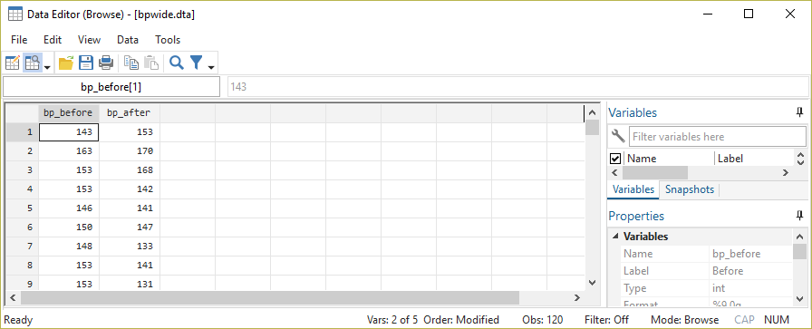

# t-Tests {#inf2}

```{r setup8, include=F}
.libPaths("D:/R-library4") 
library(tidyverse)
library(ggplot2)
library(LaCroixColoR)
library(patchwork)
library(Statamarkdown)
stataexe <- "C:/Program Files (x86)/Stata13/StataSE-64.exe"
knitr::opts_chunk$set(engine.path=list(stata=stataexe))
knitr::opts_chunk$set(collapse = F)
```

Vergangene Session hatten wir aus Stichproben Aussagen über Parameter in einer Grundgesamtheit getroffen. Eigentliches Ziel statistischer Auswertungen ist aber häufig, Entscheidungen über allgemeine Hypothesen zu treffen.

Ausgangsszenario: wir betrachten ein (annähernd) normal-verteiltes Merkmal und möchten durch eine Stichprobe überprüfen, ob der Mittelwert mit unserer Vermutung übereinstimmt bzw. größer/kleiner ist. Testen wir auf Übereinstimmung, verwenden wir einen sog. beidseitigen Test, bei einem einseitigen Test testen wir ob der Stichprobenwert signifikant größer bzw. kleiner als der vermutete Populationswert ist.

Wir möchten einen Hypothesentest zu den durchschnittlichen Mietkosten von Studierenden in Oldenburg durchführen. Eine Zeitung behauptet, Studierende würden im Schnitt 320 Euro für Miete ausgeben. Wir machen eine Umfrage unter 40 Studierenden und kommen auf folgende Werte:
```{stata input1, echo=T}
input miete
301
291
304
324
356
384
407
306
310
230
307
252
306
355
194
320
233
265
214
319
320
256
234
346
223
344
294
253
383
360
305
378
270
327
360
310
345
300
361
253
end
tabstat miete, s(mean sd)
```

Die Antworten haben also ein arithmetisches Mittel von 305 Euro und eine Standardabweichung von 53.5 Euro. Der *Punktschätzer* aus der Stichprobe legt uns also nahe, dass die Mieten in Oldenburg in der Tat unter 320 EUR liegen. Wie wir letzte Woche gesehen haben, sollten wir uns nicht allein auf den Punktschätzer verlassen, sondern auch die Streuung in der Stichprobe mitberücksichtigen. Dies leisten die Hypothesentests. Dabei werden immer zwei sich widersprechende Hypothesen formuliert, die sog. $H_0$ - die Nullhypothese und die $H_A$ - die Alternativhypothese. Die $H_0$ beschreibt dabei immer den bisherigen Kenntnisstand und die $H_A$ formuliert die zu testende Aussage. Die Hypothesen unterscheiden sich dann je nachdem ob wir einen gerichteten oder einen ungerichteten Test durchführen: 

Zunächst müssen wir uns entscheiden ob wir eine gerichtete oder ungerichtete Hypothese testen möchten:    

+ ungerichtete Hypothese: "die wahren Mietausgaben der Studierenden in Oldenburg sind ungleich 320 Euro"
+ gerichtete Hypothese: "die wahren Mietausgaben der Studierenden in Oldenburg sind **kleiner**/**größer** als 320 Euro"   

Formal werden die Hypothesen dann wie folgt festgehalten:

+ ungerichtete Hypothesen: $H_0: \mu = 320 Euro$ und $H_A: \mu \neq 320 Euro$  
+ gerichtete Hypothesen:
  + rechtsseitig  $H_0: \mu \leqslant 320 Euro$ und $H_A: \mu > 320 Euro$  
  $\Rightarrow$ die $H_A$ hält fest, dass der wahre Wert **größer** als der Wert aus der $H_0$ ist
  + linksseitig   $H_0: \mu \geqslant 320 Euro$ und $H_A: \mu < 320 Euro$  
  $\Rightarrow$ die $H_A$ hält fest, dass der wahre Wert **kleiner** als der Wert aus der $H_0$ ist

Die grundlegende Idee des Hypothesentests ist, dass wir uns nur dann für die Alternativhypothese entscheiden, wenn wir eine ausreichend große Abweichung von dem in der $H_0$ postulierten Wert feststellen. Dazu berechnen wir den $t$-Wert für den SP-Mittelwert entsprechend der Formel von letzter Woche:  

$$t = \frac{\bar{x}-\mu_{0}}{\frac{\sigma}{\sqrt{n}}} = \frac{\bar{x}-\mu_{0}}{\frac{s_{x}}{\sqrt{n}}}$$
```{r, fig.align='center', echo=F, out.width="100%", fig.height= 7.1, warning=F}
data1 <- data.frame(z = seq(-4,4,.01)) ## dataframe erstellen mit Zahlenfolge zwischen -4 & 4
data1$nv_density <- dnorm(x=data1$z,mean = 0 ,sd =  1) ## Dichtefunktion der Std-NV
eq2 <- as.expression(substitute(mu[0])) ## µ0 für Grafiken

both <-
ggplot(data = data1, aes(x=z, y =nv_density)) + 
  theme_minimal(base_size = 11,base_family = "serif") +
  labs(y = "Häufigkeitsdichte", title = "ungerichtete Hypothese",x = "t", 
       subtitle = bquote(H[0]~wird~verworfen~","~wenn~t~weit~genug~von~mu[0]~bold(entfernt)~liegt)
       ) +
  geom_segment(data = filter(data1,z==0),aes(xend = 0,yend = 0), size = .2 ) +
  geom_label(data = filter(data1,z==0),aes(y=.2,label = as.character( eq2 ) ), 
             label.size = .01, hjust = 0.5, color = "navy", parse = T, size = 4.5) +
  geom_ribbon(data=filter(data1,z <= -1.959964), aes(ymin=0, ymax = nv_density), fill = "#aaaaaa", alpha = .5 ) +
  geom_segment(data = data.frame(z = -1.959964,y1 = dnorm(x=-1.959964,mean = 0 ,sd =  1)) , 
               aes(x=z,y=y1,xend = z, yend = 0), color = "#404040", size = .35, linetype = 2) + ## linke grenze
  geom_ribbon(data=filter(data1,z >= 1.959964), aes(ymin=0, ymax = nv_density), fill = "#aaaaaa", alpha = .5 ) +
  geom_segment(data = data.frame(z = 1.959964,y1 = dnorm(x=1.959964,mean = 0 ,sd =  1)) , 
               aes(x=z,y=y1,xend = z, yend = 0), color = "#404040", size = .35, linetype = 2) + ## rechte grenze
  geom_line(color = "navy")  +   
  scale_x_continuous(breaks = seq(-3,3,1),minor_breaks = seq(-3,3,1))+
  theme(aspect.ratio = 1, 
        plot.title.position = "plot",
        plot.subtitle = element_text(size = rel(.75)),
        panel.grid = element_line(size = .5), 
        panel.grid.minor = element_blank(),
        panel.grid.major.x = element_blank()) 

left <-
ggplot(data = data1, aes(x=z, y =nv_density)) + 
  theme_minimal(base_size = 11,base_family = "serif") +
  labs(y = "Häufigkeitsdichte", title = "gerichtete, linkssseitige Hypothese", x = "t", 
       subtitle = bquote(H[0]~wird~verworfen~","~wenn~t~weit~genug~bold(links)~von~mu[0]~liegt)
  ) +
  geom_segment(data = filter(data1,z==0),aes(xend = 0,yend = 0), size = .2 ) +
  geom_label(data = filter(data1,z==0),aes(y=.2,label = as.character( eq2 ) ), 
             label.size = .01, hjust = 0.5, color = "navy", parse = T, size = 4.5) +
  geom_ribbon(data=filter(data1,z <= -1.644854), aes(ymin=0, ymax = nv_density), fill = "#c5b358", alpha = .5 ) +
  geom_segment(data = data.frame(z = -1.644854,y1 = dnorm(x=-1.644854,mean = 0 ,sd =  1)) , 
               aes(x=z,y=y1,xend = z, yend = 0), color = "#404040", size = .35, linetype = 2) +
  geom_line(color = "navy")  +   
  scale_x_continuous(breaks = seq(-3,3,1),minor_breaks = seq(-3,3,1)) +
  theme(aspect.ratio = 1,
        plot.title.position = "plot",
        plot.subtitle = element_text(size = rel(.75)),
        panel.grid = element_line(size = .5), 
        panel.grid.minor = element_blank(),
        panel.grid.major.x = element_blank()) 


right <-
  ggplot(data = data1, aes(x=z, y =nv_density)) + 
  theme_minimal(base_size = 11,base_family = "serif") +
  labs(y = "Häufigkeitsdichte", title = "gerichtete, rechtsseitige Hypothese", x = "t", 
       subtitle = bquote(H[0]~wird~verworfen~","~wenn~t~weit~genug~bold(rechts)~von~mu[0]~liegt)
  ) +
  geom_segment(data = filter(data1,z==0),aes(xend = 0,yend = 0), size = .2 ) +
  geom_label(data = filter(data1,z==0),aes(y=.2,label = as.character( eq2 ) ), 
             label.size = .01, hjust = 0.5, color = "navy", parse = T, size = 4.5) +
  geom_ribbon(data=filter(data1,z >= 1.644854), aes(ymin=0, ymax = nv_density), fill = "#FF3200", alpha = .5 ) +
  geom_segment(data = data.frame(z = 1.644854,y1 = dnorm(x=1.644854,mean = 0 ,sd =  1)) , 
               aes(x=z,y=y1,xend = z, yend = 0), color = "#404040", size = .35, linetype = 2) +
  geom_line(color = "navy")  +   
  scale_x_continuous(breaks = seq(-3,3,1),minor_breaks = seq(-3,3,1)) +
  theme(aspect.ratio = 1, 
        plot.title.position = "plot",
        plot.subtitle = element_text(size = rel(.75)),
        panel.grid = element_line(size = .5), 
        panel.grid.minor = element_blank(),
        panel.grid.major.x = element_blank()) 


## cowplot::plot_grid(both,NA, left , right, nrow = 2, labels = c("1",NA,"2", "3"))
both + wrap_elements(grid::textGrob("") ) +
left + right + 
plot_layout(ncol = 2)
```

## t-Test per Hand und in Stata

Wir berechnen also den t-Wert und gleichen diesen dann mit `ttail` mit der kumulierten Verteilung der t-Verteilung ab. Das Ergebnis von `ttail` gibt uns dann an, mit welcher Irrtumswahrscheinlichkeit wir die $H_0$ verwerfen können. Anders formuliert: wie wahrscheinlich ist es, das $\bar{x}$ in einer Stichprobe zu erhalten obwohl $\mu_0$ in der Grundgesamtheit richtig ist?

In der Wissenschaft hat sich als Konvention etabliert, von einem signifikanten Unterschied zu sprechen wenn die Irrtumswahrscheinlichkeit unter 5% liegt. Das bedeutet:

> *Assuming that the null hypothesis is true and the study is repeated an infinite number times by drawing random samples from the same populations(s), less than 5% of these results will be more extreme than the current result.*[^1]

[^1]: [Failing Grade: 89% of Introduction-to-Psychology Textbooks That Define or Explain Statistical Significance Do So Incorrectly. Advances in Methods and Practices in Psychological Science, 2515245919858072.](https://doi.org/10.1177/2515245919858072)

### beiseitiger t-Test

Ein **beid**seitiger Test testet die $H_0$ im Vergleich zur folgenden Aussage der $H_A$: "die wahren Mietausgaben der Studierenden in Oldenburg sind *ungleich* 320 Euro". Dazu formalisieren wir zunächst die $H_0$ und $H_A$:

$H_0: \mu = 320 Euro \qquad H_A: \mu \neq 320 Euro$  

Für die Entscheidung hinsichtlich der Hypothesen ist beim beidseitigen Test wichtig, dass hier jeweils das Ergebnis aus `pt()` **verdoppelt** werden muss! $\Rightarrow$ hier testen wir auf "größer oder kleiner" und `invttail` gibt uns die Wahrscheinlichkeit dafür, einen t-Wert größer als den eingetragenen zu erhalten:

```{stata}
display (305-320)/(52.053/sqrt(40))
```

Fläche links von -1.822533 (`ttail` gibt immer rechte Fläche an, daher 1-`ttail` um Fläche links zu erhalten):
```{stata}
display 1-ttail(40-1,-1.8225334) 
```
Wir müssen aber die "rechte Seite" mitberücksichtigen, daher $\times2$:
```{stata}
display (1-ttail(40-1,-1.8225334)) *2
```
Das Ergebnis liegt also deutlich über 0,05. Wir würden also die $H_0$ nicht verwerfen.

Neben der händischen Berechnung können wir in Stata die Funktion `ttest` nutzen, diese nimmt auch die Anpassung des p-Wertes beim beidseitigen Test vor. Neben den zu testenden Werten geben wir mit `mu` den in der Nullhypothese festgehaltenen Mittelwert an und wählen mit `two.sided` einen beiseitigen Test aus:
```{stata, eval = F}
ttest miete==320
```
```{stata, echo = F}
set linesize 200
input miete
301
291
304
324
356
384
407
306
310
230
307
252
306
355
194
320
233
265
214
319
320
256
234
346
223
344
294
253
383
360
305
378
270
327
360
310
345
300
361
253
end
ttest miete==320
```

Hier werden auch gleich die Ergebnisse für den linksseitigen und rechtsseitigen Test angezeigt. Diese sehen uns noch


### linksseitiger t-Test

Ein **links**seitiger Test testet die $H_0$ im Vergleich zu folgender Aussage: "die wahren Mietausgaben der Studierenden in Oldenburg sind *kleiner* als 320 Euro". Formal sehen die $H_0$ und $H_A$ so aus:

$H_0:\, \mu \geqslant 320Euro \qquad H_A:\, \mu < 320 Euro$

Hier würden wir also nur die Fläche links vom berechneten t-Wert nachsehen:
```{stata}
display (305-320)/(52.053/sqrt(40))
```

```{stata}
display 1-ttail(40-1,-1.8225334) // Fläche links
```

Der Wert `r round(pt(q = -1.8225334, df = 40-1),4)` ist kleiner als 0,05, dementsprechend würden wir auf Basis eines linksseitigen Hypothesentests die $H_0$ verwerfen.

### rechtsseitiger t-Test 

Ein **rechts**seitiger Test testet die $H_0$ im Vergleich zu folgender Aussage: "die wahren Mietausgaben der Studierenden in Oldenburg sind *größer* als 320 Euro". Formal sehen die $H_0$ und $H_A$ so aus:

$H_0: \mu \leqslant 320 Euro \qquad H_A: \mu > 320 Euro$

```{stata}
display (305-320)/(52.053/sqrt(40))  
```


```{stata}
display ttail(40-1,-1.822533)  // Fläche rechts
```

Wir sehen hier dass der Wert `1-pt(q = -1.822533, df = 40-1)=``r round(1-pt(q = -1.822533, df = 40-1),4)` deutlich größer als 0,05 ist - dementsprechend würden wir auf Basis eines rechtsseitigen Hypothesentests die $H_0$ **nicht** verwerfen.

All das haben wir eben auch schon in `ttest` gesehen:
```{stata, eval = F}
ttest miete==320
```

```{stata, echo = F}
set linesize 200
input miete
301
291
304
324
356
384
407
306
310
230
307
252
306
355
194
320
233
265
214
319
320
256
234
346
223
344
294
253
383
360
305
378
270
327
360
310
345
300
361
253
end
ttest miete==320
```

***
[Übung 1](#tvsmu)
***

## Mittelwertvergleiche mit dem t-Test

Diese Testlogik können wir auch dazu verwenden, Kennzahlen für verschiedene Gruppen zu vergleichen. 

### Unverbundener t-Test
Eine häufige Frage zielt darauf ab zu analysieren, ob sich die Durchschnittswerte eines Merkmals zwischen zwei Gruppen unterscheiden. Wir hatten bereits gesehen, dass wir zB. auf  Basis des Allbus von 2014 die durchschnittliche Körpergröße von Männern und Frauen in Deutschland vergleichen können. Dazu lesen wir zunächst den Datensatz ein und wählen dann nur die Angaben für das Jahr 2014 aus, die für `hs16` nicht missing, also `>0` sind:
```{stata, eval = F}
cd "..."
use Allbus_1980-2018.dta, clear
keep  if year == 2014 & hs16>0
```

Auch für Gruppenvergleich müssen zunächst Hypothesen aufgestellt werden. 

+ Für einen beidseitigen Test ist die Alternativhypothese, dass es einen Gruppenunterschied gibt:  

    $H_0: \mu_1 - \mu_2 = 0 \qquad H_A: \mu_1 - \mu_2 \neq 0$
 
+ Ein linksseitiger Test hätte entsprechend die Alternativhypothese, dass der Gruppenunterschied *kleiner* als 0 ist:  

    $H_0: \mu_1 - \mu_2 \geqslant 0 \qquad H_A: \mu_1 - \mu_2 < 0$

+ Ein rechtssseitiger Test hätte entsprechend die Alternativhypothese, dass der Gruppenunterschied *größer* als 0 ist:  

    $H_0: \mu_1 - \mu_2 \leqslant 0 \qquad H_A: \mu_1 - \mu_2 > 0$


Wir vergleichen nun die Körpergrößen für Frauen und Männer im Allbus 2014 mit Hilfe folgender Hypothesen:

+ ungerichtete Hypothese: $H_0: size_{m} - size_{f} = 0 \qquad H_A: size_{m} - size_{f} \neq 0$
+ linksseitige Hypothese: $H_0: size_{m} - size_{f} \geqslant 0 \qquad H_A: size_{m} - size_{f} < 0$
+ rechtsseitige Hypothese: $H_0: size_{m} - size_{f} \leqslant 0 \qquad H_A: size_{m} - size_{f} > 0$


Wenn wir nun die beiden Mittelwerte für Männer und Frauen vergleichen, bezieht sich das natürlich wieder nur auf die *Punkt*schätzer für die Stichprobe:
```{stata, eval = F}
tabstat hs16,s(mean) by(sex) // Körpergröße nach Geschlecht
```

```{stata}
dis 178.7179 - 165.8881
```

Aber ist diese, in der Stichprobe festgestellte Differenz auch bezogen auf die **Grundgesamtheit** von Bedeutung? Dazu greifen wieder auf den `ttest` zurück, aber hier geben wir anstelle von `== XYZ` mit `by(sex)` die Gruppenvariable an:
```{stata, eval = F}
ttest hs16, by(sex) unequal
```
```{stata, echo=F}
qui cd "D:\Studium\01_Oldenburg\Lehre\Datensaetze"
qui use  "Allbus_1980-2018.dta",clear
keep  if year == 2014 & hs16>0
ttest hs16, by(sex) unequal
```

Da der p-Wert für den beiseitigen Test (unter `Ha: diff != 0`) deutlich unter 0,05 liegt, können wir hier die $H_0$ verwerfen und gehen von signifikanten Größenunterschieden aus.  
Für einen rechtsseitigen Test achten wir auf `Ha: diff > 0`- Männer sind also signifikant *größer* als Frauen.
Für einen linksseitigen Test ist hingegen `Ha: diff < 0` ausschlaggebend: Männer sind also nicht signifikant *kleiner* als Frauen.

### Verbundener t-Test

Möchten wir Werte vergleichen, welche in einer Verbindung zueinander stehen, ist der verbundene t-Test die richtige Wahl. Beispiele für verbundene Stichproben
Das obige Beispiel 


## Varianten für `ttest`

Außerdem gibt es zwei Aspekte, anhand derer sich t-Tests allgemein unterscheiden:

+ Die Varianz der Messwerte in den verglichenen Gruppen ist ...
  + gleich: $\Rightarrow$ `ttest testvariable, by(gruppenvariable)` 
  + verschieden: $\Rightarrow$ `ttest testvariable, by(gruppenvariable) unequal` (wie oben)
  
+ 	Verbundene oder unverbundene Stichprobe?
  +  Sind die einzelnen Messwerte voneinander unabhängig? D.h. ein Messwert steht in keinem direkten Zusammenhang mit einem anderen $\Rightarrow$ `ttest testvariable, by(gruppenvariable)` für eine unverbundene Stichprobe (mit ggf. `unequal`)
  +  Stehen die einzelnen Messwerte in einem Zusammenhang? D.h. ein Messwert steht in einem direkten Zusammenhang mit einem anderen $\Rightarrow$ Werte für beide Variablen sollten "nebeneinander" abgelegt sein (*wide*-Format)
```{r bpwide_shot, echo = F,out.width = "100%",out.height="100%", fig.align="center"}

```
  Hier könnten wir dann mit `ttest `
  `paired = T` für eine verbundene Stichprobe, zB. ähneln sich bei wiederholten Messungen die Messwerte für die gleiche Person (Vorher-/Nachhermessungen)
    


## Übungen 8-1 {#tvsmu}

(Nutzen Sie für die Aufgaben 1 & 2 jeweils die Methode "per Hand" als auch `ttest()`, um beide Berechnungswege zu verstehen)

(@) Sie betrachten die Körpergröße von Menschen und fragen sich, ob diese sich von 172cm signifikant unterscheidet. Sie gehen davon aus, dass die Körpergröße eine normalverteilte Variable ist. In einer Stichprobe von 50 Personen finden Sie einen arithmetischen Mittelwert von 170cm und einer Standardabweichung von 9.26 cm. Sie können sich die Daten wie folgt erstellen:
```{stata, eval = F}
clear
set seed 0441
set obs 50
gen height_sample =  rnormal(170,9.26)
```

 + Wie lauten die Hypothesen?
 + Berechnen Sie den t-Wert und die Irrtumswahrscheinlichkeit, mit der die $H_0$ verworfen werden kann
 + Wie lautet Ihre Entscheidung hinsichtlich der Hypothesen?
 + Wenn Sie die vorherige Fragestellung mit einer gerichteten Hypothese: "sind Menschen im Mittel signifikant größer als 172cm?" untersuchen würden - was würde sich ändern?     

## Übungen 8-2 {#tgroup}

(@) Haben Haustierbesitzer\*innen ein höheres Einkommen als Nicht-Haustierbesitzer? 
  + Verwenden Sie den Datensatz aus Aufgabe 1.
  + Wie lauten die Hypothesen zu dieser Fragestellung?
  + Auf Basis der Ergebnisse aus Aufgabe 1: müssen Sie `var.equal = T` oder `var.equal = F` setzen?
  + Führen Sie den entsprechenden Test durch!
  + Wie lautet Ihre Entscheidung hinsichtlich der Hypothesen?


## weitere Übungen Kap 8
(@) Sie erheben erneut eine Stichprobe mit 50 Personen und erhalten einen Mittelwert von 173cm und eine Standardabweichung von 6.15.

+ Wie hoch ist die Irrtumswahrscheinlichkeit für die Hypothese, dass der wahre Wert der Körpergröße in der Grundpopulation größer als 172cm ist? Stellen Sie die passenden formalen Hypothesen auf!

+ Sie können sich auch diese Daten wie folgt erstellen:
```{stata, eval = F}
clear
set seed 0441
set obs 50
gen height_sample2 =  rnormal(173,6.15)
```


(@) Die Schätzung eines Experten ergab, dass das mittlere logarithmierte Einkommen von Vollzeiterwerbstätigen in Deutschland für das Jahr 2018 bei 7,6 log(EUR) liegt.[^072] Sie vermuten, dass sich die wahren Werte davon signifikant unterscheiden. Überprüfen Sie diese These! (*Berechnen Sie die p-Werte jeweils mit `ttest` und per Hand!*)

  + Laden Sie den kumulierten Allbus (`Allbus_1980-2018.dta`).  Wählen Sie alle Befagten für das Jahr 2018 aus, die Vollzeit arbeiten (`work == 1`) und ein Einkommen größer als 0 EUR angeben. (siehe *Hinweise* am Ende) 
  + Denken Sie daran, die Missings mit `.` zu überschreiben! (Siehe Hinweise für Hilfe beim Einlesen und Aufbereiten des Datensatzes!)
  + Vergleichen Sie die Angaben des logarithmierten Einkommens der Befragten (`log_inc`) mit der Aussage des Experten.
  + Formulieren Sie die Hypothesen!
  + Führen Sie den passenden Test durch!
  + Was müssten Sie verändern, wenn Sie vermuten dass die wahren Werte signifikant *höher* sind?
  + Formulieren Sie auch für diese Variante die Hypothesen und führen Sie den entsprechenden Test durch! Berechnen Sie den Test neben `ttest` auch "per Hand"! Kommen Sie auf das selbe Ergebnis?  

[^072]: Durch die Logarithmierung sind die Einkommensangaben (annähernd) normalverteilt.

## Profi-Übungen 8

Für alle, die noch etwas mehr machen möchten:

(@) Eine Umfrage von 15 zufällig ausgewählten Betrieben ergab, dass im Durchschnitt an 5,25 Tagen im vergangenen Jahr gestreikt wurde. Die Standardabweichung in der Stichprobe beträgt 0.25 Tage. Ein Experte behauptet, es wären im arithmetischen Mittel 7 Streiktage für das vergangene Jahr gewesen. Liegt der Wert aus der Stichprobe signifikant darunter?   

  + Formulieren Sie die Hypothesen!
  + Berechnen Sie die Irrtumswahrscheinlichkeit für die Ablehnung von $H_0$!
  + Wie lautet Ihre Entscheidung hinsichtlich der Hypothesen?


(@) Allgemein wird angenommen, dass Studierende ihrem Studium pro Tag durchschnittlich 3,5 Stunden widmen.  Sie machen eine Umfrage unter 6000 Studierenden und kommen auf ein arithmetisches Mittel von 5 Stunden und eine Varianz $s^2= 4$. Daher vermuten Sie nun, dass die Lerndauer signifikant über 3.5 Stunden liegt.    
  + Formulieren Sie die Hypothesen!
  + Berechnen Sie die Irrtumswahrscheinlichkeit für die Ablehung von $H_0$!
  + Wie lautet Ihre Entscheidung hinsichtlich der Hypothesen?
  


## Hinweise
### Auswahl der in Vollzeit beschäftigten Befragten
```{stata readin8auf, eval = F}
// wo liegt der Datensatz?
cd "..."
// einlesen
use Allbus_1980-2018.dta, clear

// missings als NA:
replace inc = . if inc <0 

keep if year == 2018  & work == 1 & inc > 0

// logarithmieren des Einkommens:
gen log_inc = log(inc)
```

<!-- ### Plot der Körpergrößenangaben -->
<!-- ```{r,echo =F} -->
<!-- library(dplyr) -->
<!-- library(ggplot2) -->
<!-- a14gr1 <- filter(ak, year == 2014, !is.na(hs16)) %>%  -->
<!--   mutate( sex = factor(sex, levels =c(1,2), labels = c("Männer", "Frauen")))  -->

<!-- ggplot(a14gr1, aes(x = hs16, color = sex)) +  -->
<!--   geom_density(bw = 2) + -->
<!--   geom_vline(data = a14gr1 %>% group_by(sex) %>% summarise(mean = mean(hs16,na.rm = T)), -->
<!--              aes(xintercept = mean), color = c("#29304E","#2473D5"), size = .75 ) + -->
<!--   scale_color_manual(values = c("#29304E","#2473D5")) + -->
<!--   labs(x = "Körpergröße (cm)", y = "Häufigkeitsdichte", -->
<!--        fill = "", color = "", -->
<!--        title = "Körpergröße der Befragten im Allbus 2014") + -->
<!--   ggthemes::theme_stata()   -->
<!-- ``` -->