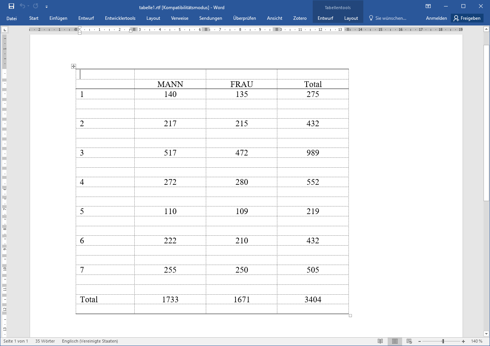

# Ergebnisexport & weitere Tipps {#export1}

```{r setup10, include=F}
.libPaths("D:/R-library4") 
library(tidyverse)
library(ggplot2)
library(LaCroixColoR)
library(patchwork)
library(Statamarkdown)
stataexe <- "C:/Program Files (x86)/Stata13/StataSE-64.exe"
knitr::opts_chunk$set(engine.path=list(stata=stataexe))
knitr::opts_chunk$set(collapse = F)
```

## log file

Mit log-Files können wir alles mitprotokollieren, was im Outputfenster passiert. Wir starten ein log-File mit `log using dateiname`. Ab dann wird alles in dieser Datei mitgeschrieben, was wir uns im Outputfenster anzeigen lassen:
```{stata s100, eval = F}
log using "logfile.txt", text replace // mit replace wird die Datei ggf überschrieben
cd D:\oCloud\Home-Cloud\Lehre\Methodenseminar
use "Allbus2018.dta", clear
mvdecode gkpol, mv(-34)
tab gkpol sex
mvdecode age, mv(-32)
su age
log close
```

```{r logfile, echo = F,out.width = "100%",out.height="100%", fig.align="center"}
knitr::include_graphics("10_logfile.png")
```


## Tabellenexport mit `esttab`


`esttab` und `estout` sind von Ben Jann erstellte Funktionen, um Tabellen aus Stata zu exportieren. Hier zwei Beispiele für den Export in eine `.rtf`-Datei, die mit Word weiterverarbeitet werden kann. Mehr Infos und ausführliche Anleitungen [hier](https://www.ssc.wisc.edu/sscc/pubs/stata_tables.htm) (nach unten scrollen für Tabellen) und [hier](http://repec.org/bocode/e/estout/esttab.html).

### Kontingenztabellen
```{stata s101, eval = F}
ssc install esttab
// Tabellen exportieren mit esttab
cd D:\oCloud\Home-Cloud\Lehre\Methodenseminar
use "Allbus2018.dta", clear
mvdecode gkpol, mv(-34)
tab gkpol sex
```


```{stata s102, eval = F}
ssc install esttab
// Tabellen exportieren mit esttab
cd D:\oCloud\Home-Cloud\Lehre\Methodenseminar
use "Allbus2018.dta", clear
mvdecode gkpol, mv(-34)
tab gkpol sex
```

```{stata s103, echo = F}
set linesize 200
qui cd D:\oCloud\Home-Cloud\Lehre\Methodenseminar
qui use "Allbus2018.dta", clear
qui mvdecode gkpol, mv(-34)
tab gkpol sex
```

Zunächst müssen wir mit `estpost` die Tabelle ablegen und mit `eststo` unter einem Namen ablegen:
```{stata s104, eval = F}
estpost tab  gkpol sex
eststo tabelle1 // unter tabelle1 ablegen
```

Mit `esttab` können wir die Tabelle wieder aufrufen und mit `unstack noobs nonumbers nonotes` Unnötiges ausblenden:
```{stata s106, eval = F}
esttab tabelle1, unstack noobs nonumbers nonotes
```
```{stata s105, echo = F}
set linesize 200
qui cd D:\oCloud\Home-Cloud\Lehre\Methodenseminar
qui use "Allbus2018.dta", clear
qui mvdecode gkpol, mv(-34)
qui estpost tab  gkpol sex
qui eststo tabelle1 // unter tabelle1 ablegen
esttab tabelle1,unstack noobs nonumbers nonotes
```

Mit `using dateiname.rtf` können wir die Tabelle ablegen (ggf. mit `cd` den Speicherort vorher wählen)
```{stata s106b, eval = F}
esttab tabelle1, unstack noobs nonumbers nonotes
cd "...."
esttab tabelle1 using tabelle1.rtf, unstack noobs nonumbers replace
```

```{r tab1_word, echo = F,out.width = "100%",out.height="100%", fig.align="center"}

```

Zellen-, Spalten- oder Zeilenprozente nicht in tab angeben, sondern erst in esttab:
```{stata s107, eval = F}
esttab tabelle1, cell(pct) unstack noobs nonumbers nonotes // -> Zellenprozente
esttab tabelle1, cell(colpct) unstack noobs nonumbers nonotes // Spaltenprozt
esttab tabelle1, cell(rowpct) unstack noobs nonumbers nonotes   // Zeilenprozt
esttab tabelle1, cell(rowpct) unstack noobs nonumbers nonotes collabels(none) label  // kein "rowpct" in den Spalten
```

Abschließendes Beispiel:
```{stata s108, eval = F}
esttab tabelle1 using tabelle1_zeilenprozente.rtf, cell(rowpct) unstack noobs nonumbers nonotes collabels(none) replace 
```

```{r tab2_word, echo = F,out.width = "100%",out.height="100%", fig.align="center"}
knitr::include_graphics("10_tab2.png")
```

### tabstat 

```{stata s109, eval = F}
cd D:\oCloud\Home-Cloud\Lehre\Methodenseminar
use "Allbus2018.dta", clear
mvdecode age inc lm02, mv(-50/-1)
tabstat  age inc lm02, s(mean sd p50 count)
```


```{stata s110, echo = F}
set linesize 200
qui cd D:\oCloud\Home-Cloud\Lehre\Methodenseminar
qui use "Allbus2018.dta", clear
qui mvdecode age inc lm02, mv(-50/-1)
tabstat  age inc lm02, s(mean sd p50 count)
```

Auch hier bereiten wir mit `estpost` den Output vor und speichern ihn mit `eststo` als "tabstat1" ab:
```{stata s111, eval = F}
estpost tabstat  age inc lm02,  statistics(mean sd p50 count) listwise  columns(statistics)
eststo tabstat1
```

Mit `esttab` können wir die Tabelle dann in Stata wieder anzeigen lassen:
```{stata s111a, eval = F}
esttab tabstat1, cells(mean sd) // kennzahlen untereinander
```

```{stata s111a1, echo = F}
set linesize 200
qui cd D:\oCloud\Home-Cloud\Lehre\Methodenseminar
qui use "Allbus2018.dta", clear
qui mvdecode age inc lm02, mv(-50/-1)
qui estpost tabstat  age inc lm02,  statistics(mean sd p50 count) listwise  columns(statistics)
qui eststo tabstat1
esttab tabstat1, cells(mean sd) // kennzahlen untereinander
```


```{stata s111b, eval = F}
esttab tabstat1, cells("mean p50 sd count") // nebeneinander mit ""
```
```{stata s111b1, echo = F}
set linesize 200
qui cd D:\oCloud\Home-Cloud\Lehre\Methodenseminar
qui use "Allbus2018.dta", clear
qui mvdecode age inc lm02, mv(-50/-1)
qui estpost tabstat  age inc lm02,  statistics(mean sd p50 count) listwise  columns(statistics)
qui eststo tabstat1
esttab tabstat1, cells("mean p50 sd count") // nebeneinander mit ""
```

Mit `label()` können wir auch noch Titel angeben:
```{stata s111c, eval = F}
esttab tabstat1, cells("mean(label(arith. Mittel)) sd count") noobs nonumber nomtitle  
```

```{stata s111c1, echo = F}
set linesize 200
qui cd D:\oCloud\Home-Cloud\Lehre\Methodenseminar
qui use "Allbus2018.dta", clear
qui mvdecode age inc lm02, mv(-50/-1)
qui estpost tabstat  age inc lm02,  statistics(mean sd p50 count) listwise  columns(statistics)
qui eststo tabstat1
esttab tabstat1, cells("mean(label(arith. Mittel)) sd count") noobs nonumber nomtitle  
```

Auch hier können wir mit `using xxx.rtf` dann wieder ein Word-Dokument erstellen:
```{stata s112, eval = F}
esttab tabstat1 using summary1.rtf, cells("mean(label(arith. Mittel)) sd count") noobs nonumber nomtitle  replace
```


```{r tabstat_word, echo = F,out.width = "100%",out.height="100%", fig.align="center"}
knitr::include_graphics("10_tabstat.png")
```

### t-test

```{stata s113, eval= F}
cd D:\oCloud\Home-Cloud\Lehre\Methodenseminar\ // wo liegt der Datensatz?
use  "Allbus2018.dta",clear
keep if work == 1 & inc > 0	
ttest inc, by(sex)

estpost ttest inc, by(sex)
est store ttest1
esttab ttest1 using ttest.rtf, nonumber nomtitle noobs ///
 cells("b(label(Differenz) star) t p N_1(label(N(Männer))) N_2(label(N(Frauen)))") nonumber  replace
```


```{r ttest_word, echo = F,out.width = "100%",out.height="100%", fig.align="center"}

```


