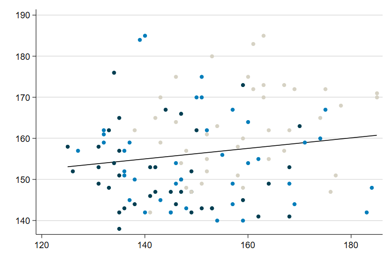

--- 
title: "GESIS Methodenseminar 2020"
subtitle: "Skript zur Stata-Übung"
author: "Andreas Filser"
date: "Stand: `r format(Sys.time(), '%d.%m.%Y')`"
site: bookdown::bookdown_site
output: bookdown::html_book
documentclass: book
bibliography: [book.bib]
biblio-style: apalike
link-citations: yes
description: "Dies ist das Begleitskript für die Stata-Übungen zum GESIS Methodenseminar 2020"
---

```{r setup, echo = F, message=F, warning = F}
if(Sys.getenv("USERNAME") == "Filser" ) .libPaths("D:/R-library4")  # set library
list.of.packages <- c("tidyr","dplyr","readr","haven","rmarkdown","bookdown","devtools","tidyverse","knitr") # Pakete eintragen
new.packages <- list.of.packages[!(list.of.packages %in% installed.packages()[,"Package"])]
if(length(new.packages)) install.packages(new.packages)
knitr::opts_chunk$set(collapse = TRUE)
knitr::opts_chunk$set(echo = T)
# knitr::opts_chunk$set(dpi=400)
# devtools::install_github("hemken/Statamarkdown")
stataexe <- "C:/Program Files (x86)/Stata13/StataSE-64.exe"
knitr::opts_chunk$set(engine.path=list(stata=stataexe))
library(Statamarkdown)
```
# Herzlich Willkommen! {-}

```{r index_illustration, echo = F,out.width = "80%",fig.height= 3.5, fig.align="center"}

```


-----

Hier entsteht das Begleitskript zum GESIS Methodenseminar "Uni- und bivariate Statistik mit Stata" von und mit Sebastian Schnettler und Andreas Filser vom 14.09 bis zum 18.09.2020. 

Weitere Informationen zum Methodenseminar, den Link zur Anmeldung und alles weitere finden Sie [hier](https://training.gesis.org/?site=pDetails&child=full&pID=0x387DA6358EF341928F67355388570B76&subID=0x0BFDFA4D3CA1443E9E87F9FFDF305FB3)

Los geht's mit dem [Einstieg](#Stata1)

